---  
title: URBA Top 13 Status  
date:   
categories: model review projection  
---
# URBA Top 13 Status

## Completed Match Review

| Match                                         |   Result |   Lineup Prediction |   Minutes Prediction |   Club Prediction |
|:----------------------------------------------|---------:|--------------------:|---------------------:|------------------:|
| Atlético del Rosario V Belgrano on 2023/03/25 |      -24 |                 nan |                  nan |               1.9 |
| SIC V Alumni on 2023/03/25                    |       -1 |                 nan |                  nan |               7   |
| Pucara V CUBA on 2023/03/25                   |      -37 |                 nan |                  nan |              -3.8 |
| La Plata V San Luis on 2023/03/25             |      -23 |                 nan |                  nan |               6.3 |
| Hindu V Buenos Aires on 2023/03/25            |        9 |                 nan |                  nan |              15.3 |
| CASI V Newman on 2023/03/25                   |      -16 |                 nan |                  nan |              -8   |
| ------ | ------ | ------ | ------ | ------ |
| Average Error |       - | nan | nan | 18.4 |
| Correct Winner |       - | nan% | nan% | 50.0% |

## Current Standings

| Club                 |   Wins |   Point Differential |   Losing Bonus Points |   Try Bonus Points |   Competition Points |
|:---------------------|-------:|---------------------:|----------------------:|-------------------:|---------------------:|
| CUBA                 |      1 |                   37 |                     0 |                nan |                    4 |
| Belgrano             |      1 |                   24 |                     0 |                nan |                    4 |
| San Luis             |      1 |                   23 |                     0 |                nan |                    4 |
| Newman               |      1 |                   16 |                     0 |                nan |                    4 |
| Hindu                |      1 |                    9 |                     0 |                nan |                    4 |
| Alumni               |      1 |                    1 |                     0 |                nan |                    4 |
| SIC                  |      0 |                   -1 |                     1 |                nan |                    1 |
| Buenos Aires         |      0 |                   -9 |                     0 |                nan |                    0 |
| CASI                 |      0 |                  -16 |                     0 |                nan |                    0 |
| La Plata             |      0 |                  -23 |                     0 |                nan |                    0 |
| Atlético del Rosario |      0 |                  -24 |                     0 |                nan |                    0 |
| Pucara               |      0 |                  -37 |                     0 |                nan |                    0 |
## Projected Remaining Table

| Club                 |   Wins |   Point Differential |   Losing Bonus Points |   Try Bonus Points |   Competition Points |
|:---------------------|-------:|---------------------:|----------------------:|-------------------:|---------------------:|
| Hindu                |   17.8 |                191   |                   2.3 |                8.9 |                 83.3 |
| Newman               |   15.9 |                140.4 |                   3.6 |                7.1 |                 74.9 |
| CUBA                 |   14.6 |                105.8 |                   4.3 |                7   |                 70.4 |
| SIC                  |   14.2 |                 96.6 |                   4.4 |                6.9 |                 68.9 |
| Alumni               |   14   |                 86   |                   4.5 |                6.7 |                 68.1 |
| Belgrano             |   13.9 |                 87.3 |                   4.5 |                6.2 |                 67.1 |
| Buenos Aires         |    9   |                -19.7 |                   6.5 |                4.5 |                 47.8 |
| Atlético del Rosario |    7.7 |                -55.2 |                   6.1 |                5.5 |                 43.1 |
| San Luis             |    6.5 |                -81.5 |                   6.5 |                3.3 |                 36.5 |
| Pucara               |    4.5 |               -138.3 |                   5.9 |                3.2 |                 27.9 |
| CASI                 |    3.5 |               -163.3 |                   5.9 |                3.3 |                 24   |
| La Plata             |    2.1 |               -249.1 |                   4.4 |                2.6 |                 16.1 |
## Total Table

| Club                 |   Wins |   Point Differential |   Losing Bonus Points |   Try Bonus Points |   Competition Points |
|:---------------------|-------:|---------------------:|----------------------:|-------------------:|---------------------:|
| Hindu                |   18.8 |                200   |                   2.3 |                nan |                 87.3 |
| Newman               |   16.9 |                156.4 |                   3.6 |                nan |                 78.9 |
| CUBA                 |   15.6 |                142.8 |                   4.3 |                nan |                 74.4 |
| Alumni               |   15   |                 87   |                   4.5 |                nan |                 72.1 |
| Belgrano             |   14.9 |                111.3 |                   4.5 |                nan |                 71.1 |
| SIC                  |   14.2 |                 95.6 |                   5.4 |                nan |                 69.9 |
| Buenos Aires         |    9   |                -28.7 |                   6.5 |                nan |                 47.8 |
| Atlético del Rosario |    7.7 |                -79.2 |                   6.1 |                nan |                 43.1 |
| San Luis             |    7.5 |                -58.5 |                   6.5 |                nan |                 40.5 |
| Pucara               |    4.5 |               -175.3 |                   5.9 |                nan |                 27.9 |
| CASI                 |    3.5 |               -179.3 |                   5.9 |                nan |                 24   |
| La Plata             |    2.1 |               -272.1 |                   4.4 |                nan |                 16.1 |
## Future Club-Level Match Predictions

### Week 2

#### Pucara V Hindu on 2023/04/01

Average Margin: Hindu by 11.6

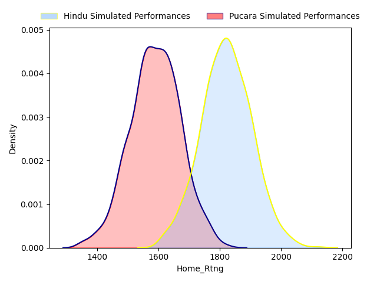

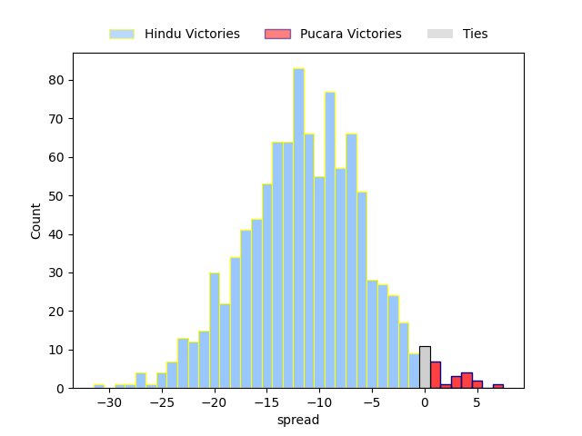

#### CUBA V CASI on 2023/04/01

Average Margin: CUBA by 15.1

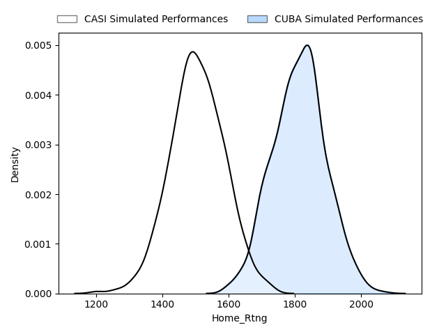

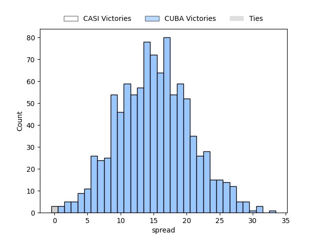

#### Newman V Atlético del Rosario on 2023/04/01

Average Margin: Newman by 12.0

#### Belgrano V La Plata on 2023/04/01

Average Margin: Belgrano by 18.8

#### Alumni V Buenos Aires on 2023/04/01

Average Margin: Alumni by 8.2

#### San Luis V SIC on 2023/04/01

Average Margin: SIC by 4.5

### Week 3

#### Hindu V Alumni on 2023/04/15

Average Margin: Hindu by 8.3

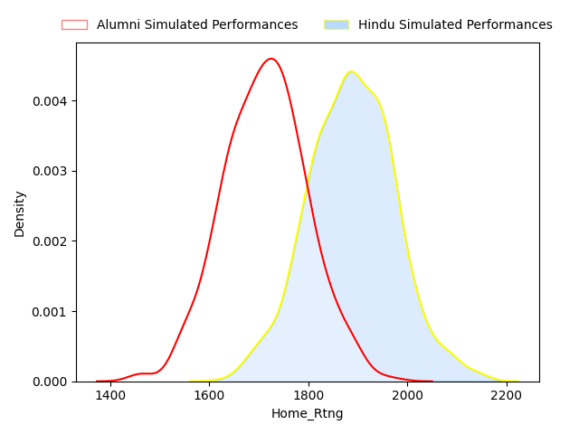

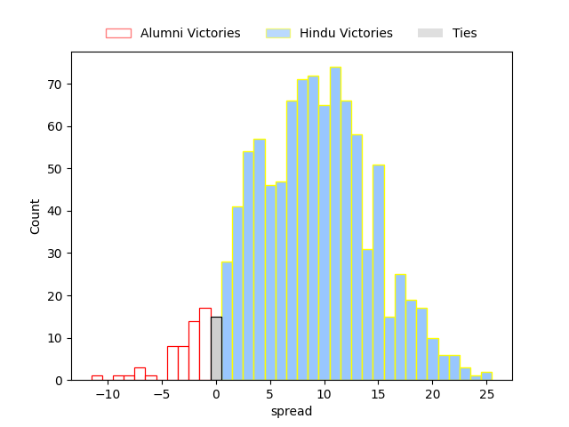

#### Buenos Aires V San Luis on 2023/04/15

Average Margin: Buenos Aires by 5.1

#### SIC V Belgrano on 2023/04/15

Average Margin: SIC by 3.9

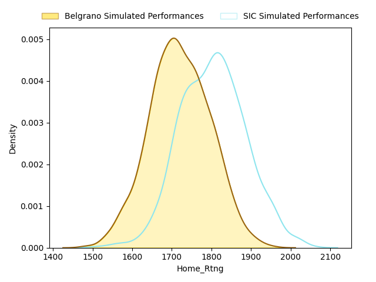

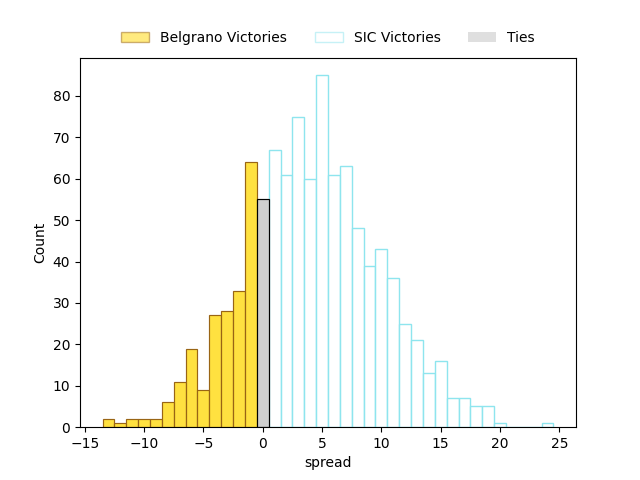

#### La Plata V Newman on 2023/04/15

Average Margin: Newman by 14.9

#### Atlético del Rosario V CUBA on 2023/04/15

Average Margin: CUBA by 4.0

#### CASI V Pucara on 2023/04/15

Average Margin: CASI by 2.1

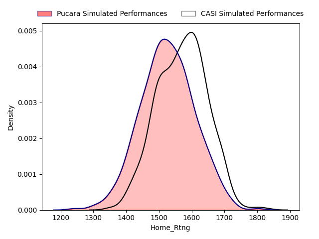

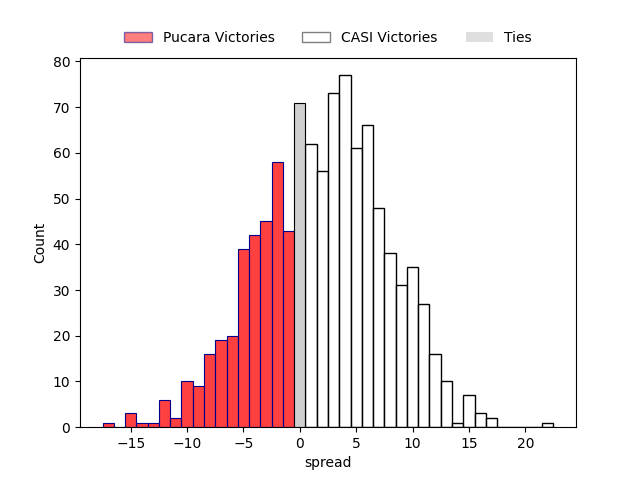

### Week 4

#### CASI V Hindu on 2023/04/22

Average Margin: Hindu by 12.8

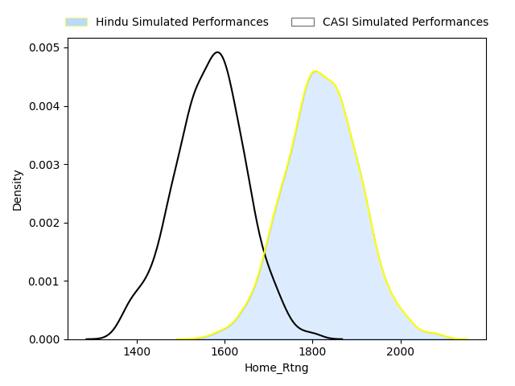

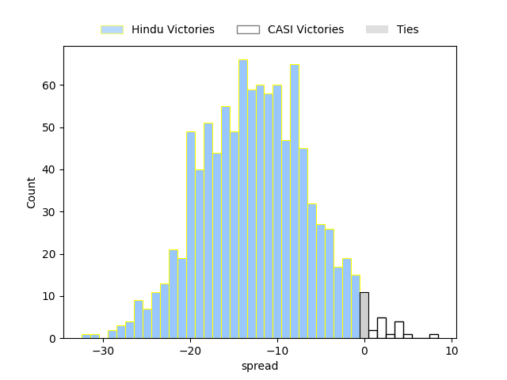

#### Pucara V Atlético del Rosario on 2023/04/22

Average Margin: Atlético del Rosario by 0.3

#### CUBA V La Plata on 2023/04/22

Average Margin: CUBA by 20.3

#### Newman V SIC on 2023/04/22

Average Margin: Newman by 5.7

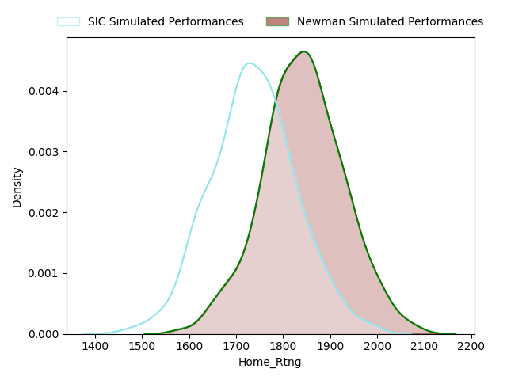

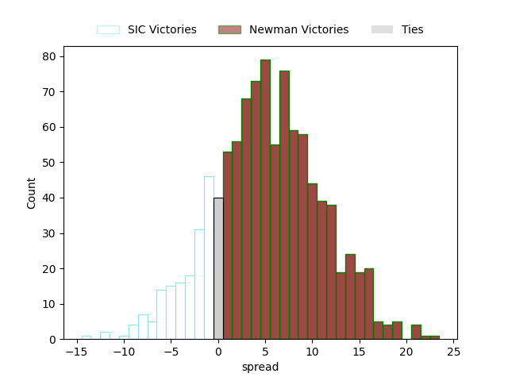

#### San Luis V Alumni on 2023/04/22

Average Margin: Alumni by 3.5

#### Belgrano V Buenos Aires on 2023/04/22

Average Margin: Belgrano by 8.3

### Week 5

#### Alumni V Belgrano on 2023/04/29

Average Margin: Alumni by 3.1

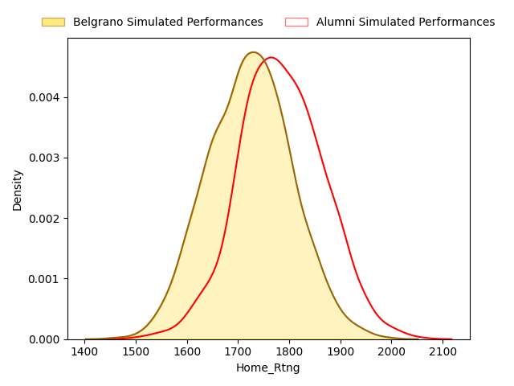

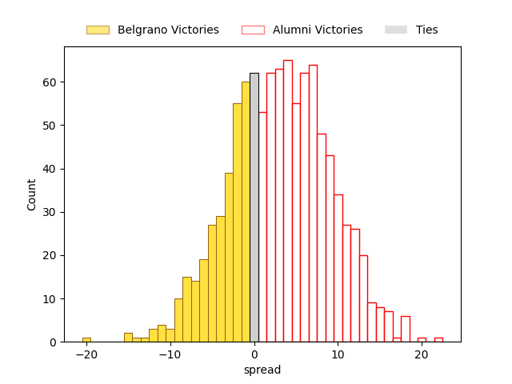

#### Hindu V San Luis on 2023/04/29

Average Margin: Hindu by 15.5

#### Buenos Aires V Newman on 2023/04/29

Average Margin: Newman by 4.3

#### SIC V CUBA on 2023/04/29

Average Margin: SIC by 2.9

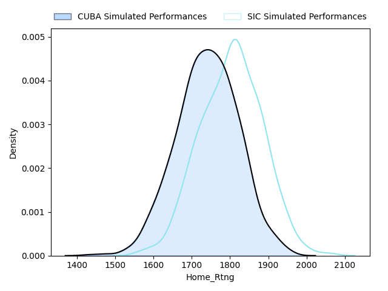

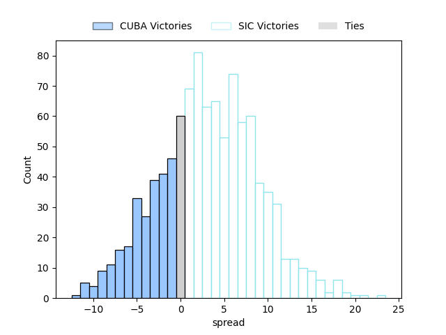

#### Atlético del Rosario V CASI on 2023/04/29

Average Margin: Atlético del Rosario by 8.4

#### La Plata V Pucara on 2023/04/29

Average Margin: Pucara by 2.2

### Week 6

#### Atlético del Rosario V Hindu on 2023/05/06

Average Margin: Hindu by 7.9

#### CASI V La Plata on 2023/05/06

Average Margin: CASI by 7.4

#### Pucara V SIC on 2023/05/06

Average Margin: SIC by 7.1

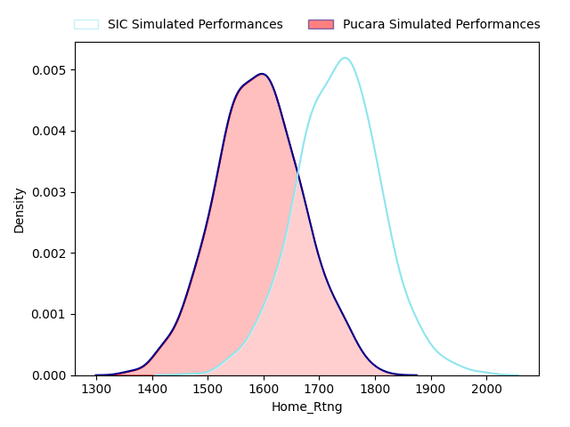
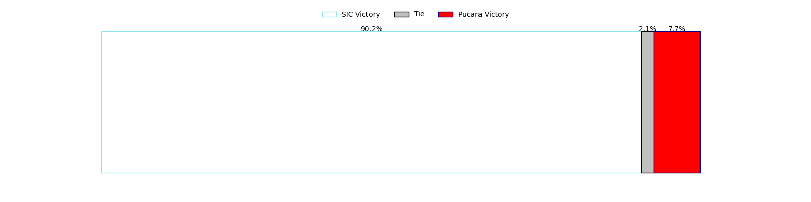
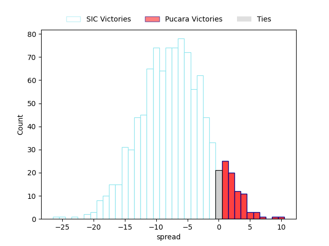

#### CUBA V Buenos Aires on 2023/05/06

Average Margin: CUBA by 9.4

#### Newman V Alumni on 2023/05/06

Average Margin: Newman by 6.3

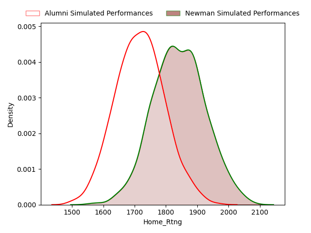

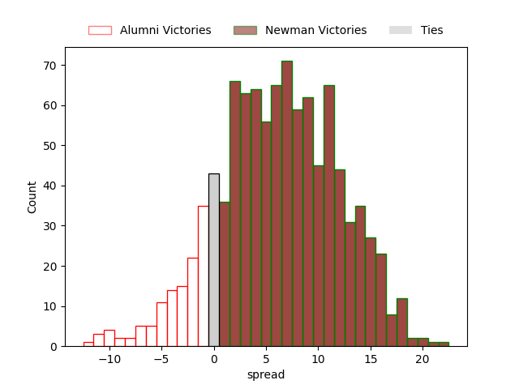

#### Belgrano V San Luis on 2023/05/06

Average Margin: Belgrano by 10.1

### Week 7

#### Hindu V Belgrano on 2023/05/13

Average Margin: Hindu by 8.0

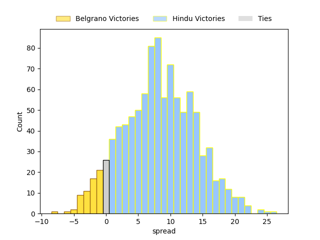

#### San Luis V Newman on 2023/05/13

Average Margin: Newman by 5.8

#### Alumni V CUBA on 2023/05/13

Average Margin: Alumni by 2.1

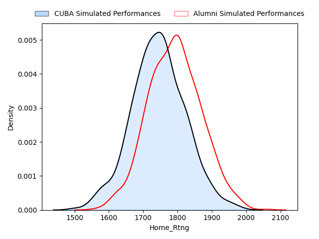

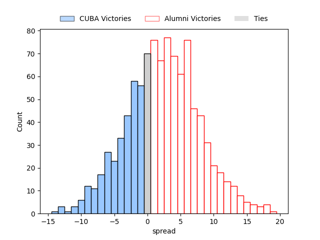

#### Buenos Aires V Pucara on 2023/05/13

Average Margin: Buenos Aires by 8.2

#### SIC V CASI on 2023/05/13

Average Margin: SIC by 14.8

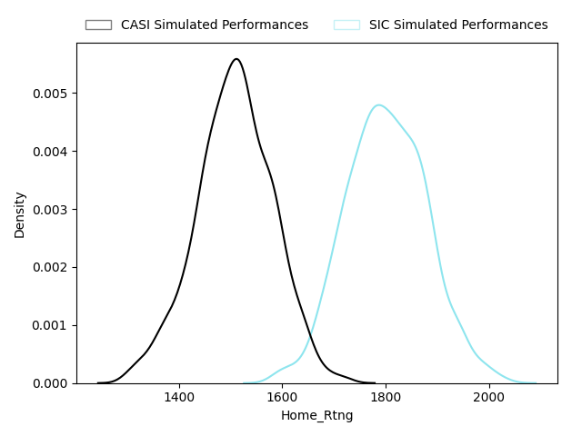

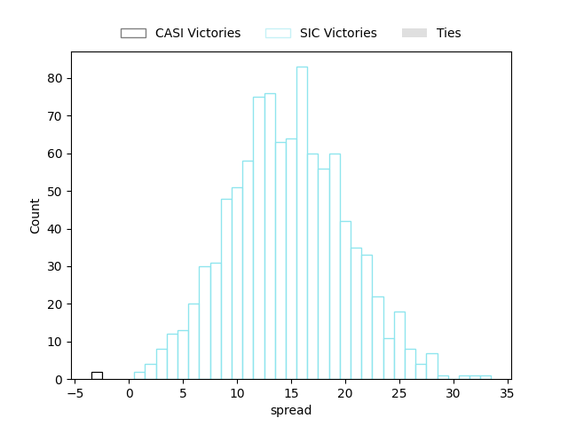

#### La Plata V Atlético del Rosario on 2023/05/13

Average Margin: Atlético del Rosario by 5.2

### Week 8

#### La Plata V Hindu on 2023/05/20

Average Margin: Hindu by 15.9

#### Atlético del Rosario V SIC on 2023/05/20

Average Margin: SIC by 3.2

#### Pucara V Alumni on 2023/05/20

Average Margin: Alumni by 6.3

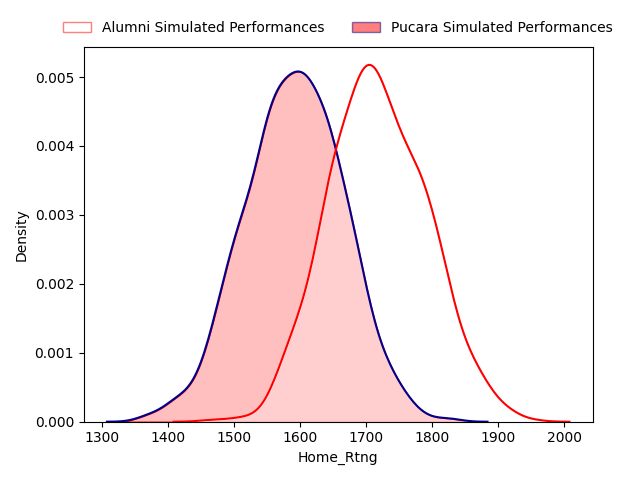
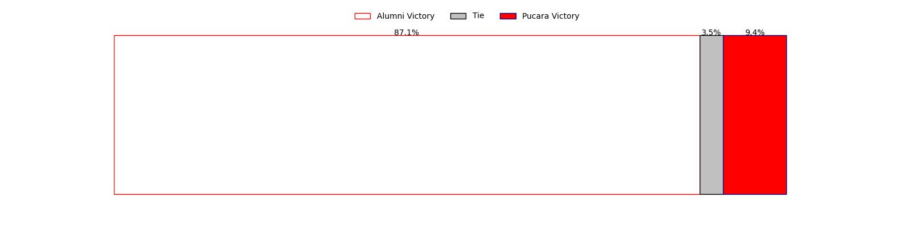

#### CASI V Buenos Aires on 2023/05/20

Average Margin: Buenos Aires by 2.9

#### Newman V Belgrano on 2023/05/20

Average Margin: Newman by 5.7

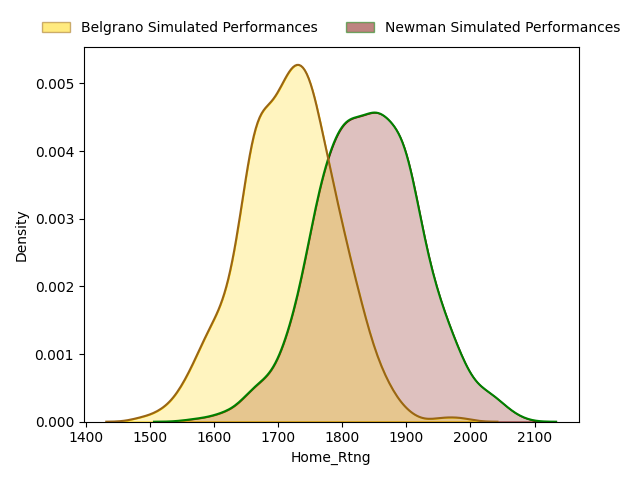

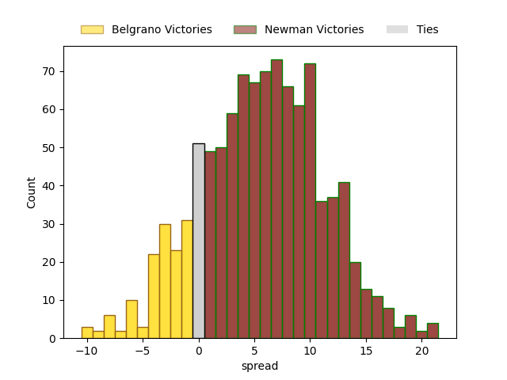

#### CUBA V San Luis on 2023/05/20

Average Margin: CUBA by 11.3

### Week 9

#### Hindu V Newman on 2023/06/03

Average Margin: Hindu by 5.9

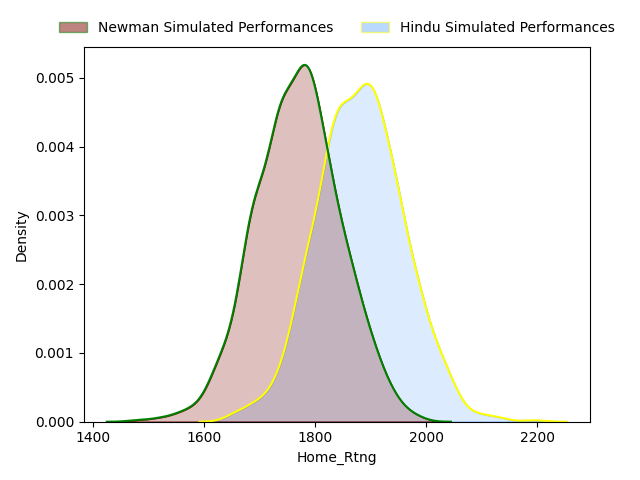

#### Belgrano V CUBA on 2023/06/03

Average Margin: Belgrano by 2.4

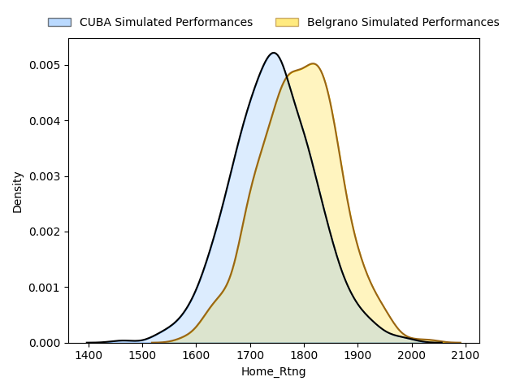

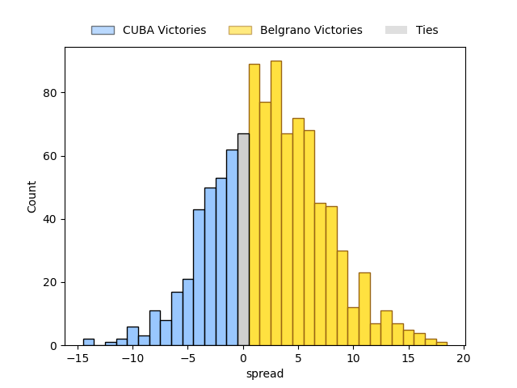

#### Alumni V CASI on 2023/06/03

Average Margin: Alumni by 14.3

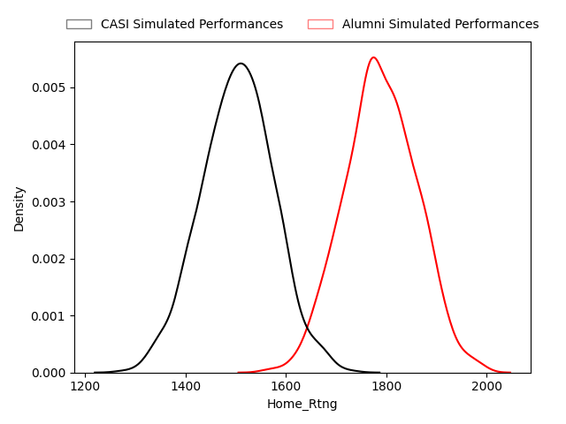

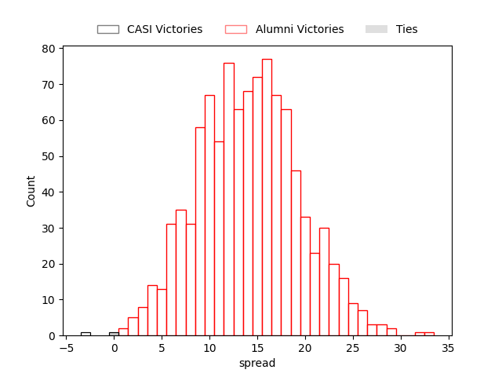

#### San Luis V Pucara on 2023/06/03

Average Margin: San Luis by 6.0

#### Buenos Aires V Atlético del Rosario on 2023/06/03

Average Margin: Buenos Aires by 4.4

#### SIC V La Plata on 2023/06/03

Average Margin: SIC by 17.8

### Week 10

#### SIC V Hindu on 2023/06/10

Average Margin: Hindu by 0.9

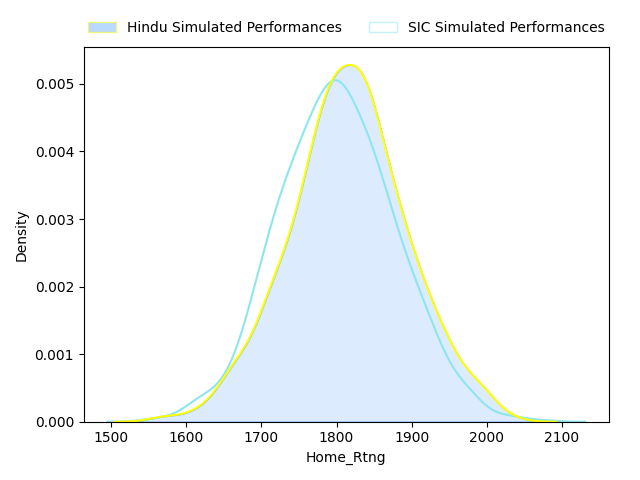

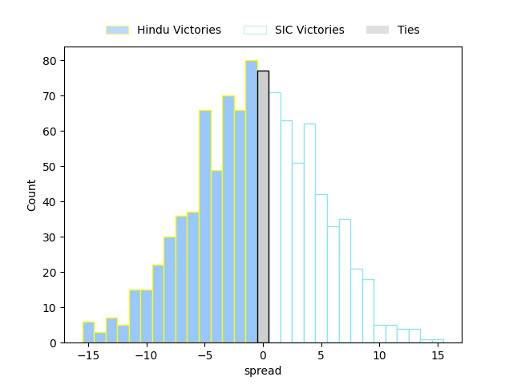

#### La Plata V Buenos Aires on 2023/06/10

Average Margin: Buenos Aires by 5.8

#### Atlético del Rosario V Alumni on 2023/06/10

Average Margin: Alumni by 2.3

#### CASI V San Luis on 2023/06/10

Average Margin: San Luis by 0.7

#### Pucara V Belgrano on 2023/06/10

Average Margin: Belgrano by 6.6

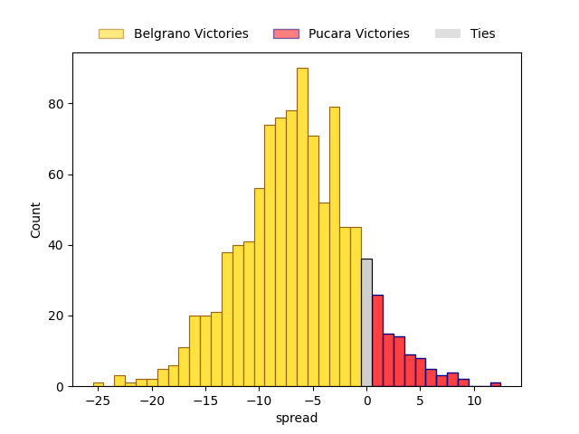

#### CUBA V Newman on 2023/06/10

Average Margin: CUBA by 1.7

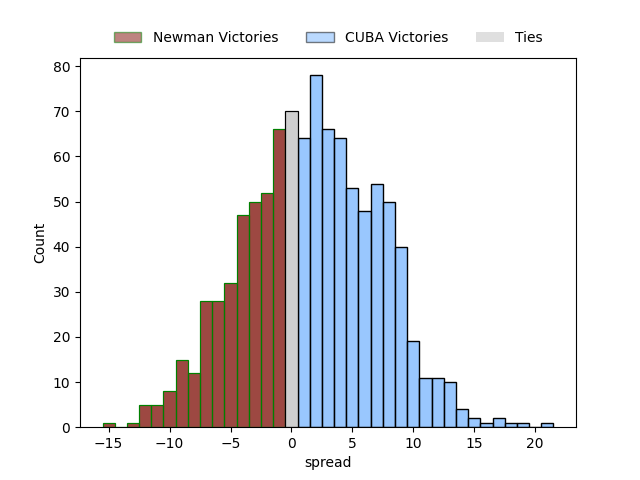

### Week 11

#### Hindu V CUBA on 2023/06/24

Average Margin: Hindu by 7.3

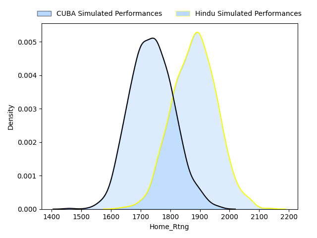

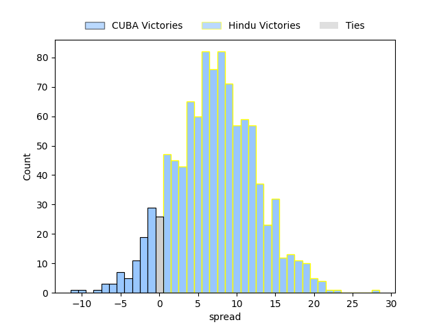

#### Newman V Pucara on 2023/06/24

Average Margin: Newman by 15.9

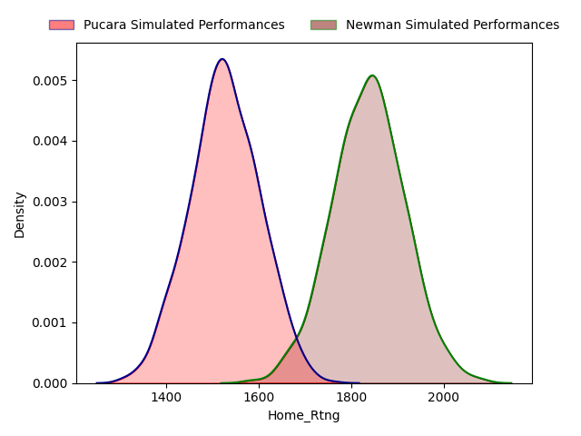

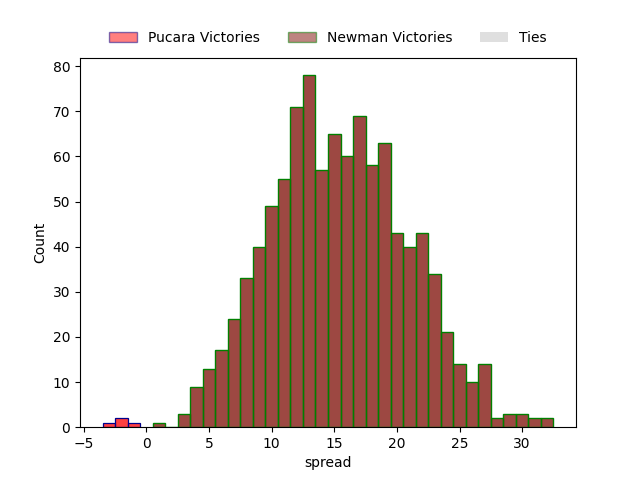

#### Belgrano V CASI on 2023/06/24

Average Margin: Belgrano by 14.5

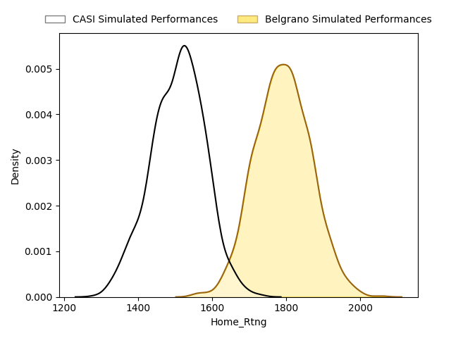

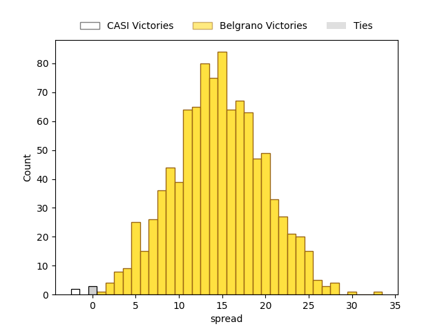

#### San Luis V Atlético del Rosario on 2023/06/24

Average Margin: San Luis by 2.4

#### Alumni V La Plata on 2023/06/24

Average Margin: Alumni by 17.6

#### Buenos Aires V SIC on 2023/06/24

Average Margin: SIC by 2.2

### Week 12

#### Alumni V SIC on 2023/07/01

Average Margin: Alumni by 2.7

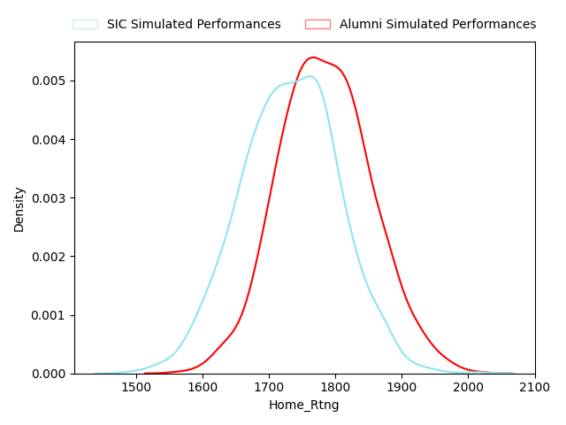

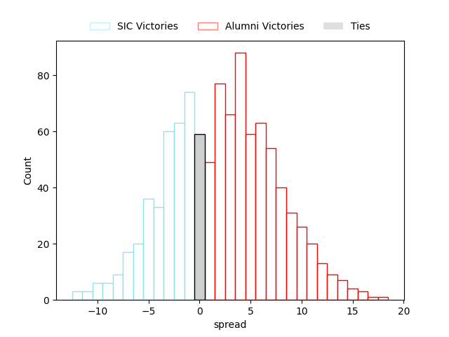

#### Buenos Aires V Hindu on 2023/07/01

Average Margin: Hindu by 6.5

#### San Luis V La Plata on 2023/07/01

Average Margin: San Luis by 10.2

#### Belgrano V Atlético del Rosario on 2023/07/01

Average Margin: Belgrano by 9.5

#### Newman V CASI on 2023/07/01

Average Margin: Newman by 16.7

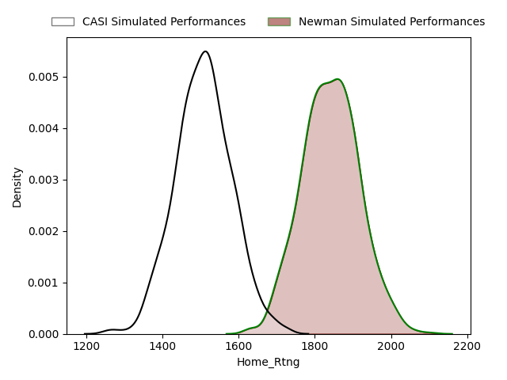


#### CUBA V Pucara on 2023/07/01

Average Margin: CUBA by 14.0


### Week 13

#### Hindu V Pucara on 2023/07/15

Average Margin: Hindu by 17.9


#### CASI V CUBA on 2023/07/15

Average Margin: CUBA by 8.6


#### Atlético del Rosario V Newman on 2023/07/15

Average Margin: Newman by 5.1

#### La Plata V Belgrano on 2023/07/15

Average Margin: Belgrano by 10.5

#### Buenos Aires V Alumni on 2023/07/15

Average Margin: Alumni by 1.3

#### SIC V San Luis on 2023/07/15

Average Margin: SIC by 10.8

### Week 14

#### Alumni V Hindu on 2023/07/22

Average Margin: Hindu by 1.7


#### San Luis V Buenos Aires on 2023/07/22

Average Margin: San Luis by 1.6

#### Belgrano V SIC on 2023/07/22

Average Margin: Belgrano by 2.6


#### Newman V La Plata on 2023/07/22

Average Margin: Newman by 19.8

#### CUBA V Atlético del Rosario on 2023/07/22

Average Margin: CUBA by 10.4

#### Pucara V CASI on 2023/07/22

Average Margin: Pucara by 4.5


### Week 15

#### Hindu V CASI on 2023/08/12

Average Margin: Hindu by 18.9


#### Atlético del Rosario V Pucara on 2023/08/12

Average Margin: Atlético del Rosario by 7.0

#### La Plata V CUBA on 2023/08/12

Average Margin: CUBA by 11.3

#### SIC V Newman on 2023/08/12

Average Margin: SIC by 1.5


#### Alumni V San Luis on 2023/08/12

Average Margin: Alumni by 9.9

#### Buenos Aires V Belgrano on 2023/08/12

Average Margin: Belgrano by 1.7

### Week 16

#### Belgrano V Alumni on 2023/08/19

Average Margin: Belgrano by 3.5


#### San Luis V Hindu on 2023/08/19

Average Margin: Hindu by 8.2

#### Newman V Buenos Aires on 2023/08/19

Average Margin: Newman by 11.0

#### CUBA V SIC on 2023/08/19

Average Margin: CUBA by 3.8


#### CASI V Atlético del Rosario on 2023/08/19

Average Margin: Atlético del Rosario by 1.3

#### Pucara V La Plata on 2023/08/19

Average Margin: Pucara by 7.3

### Week 17

#### Hindu V Atlético del Rosario on 2023/08/26

Average Margin: Hindu by 14.2

#### La Plata V CASI on 2023/08/26

Average Margin: La Plata by 0.6

#### SIC V Pucara on 2023/08/26

Average Margin: SIC by 13.8


#### Buenos Aires V CUBA on 2023/08/26

Average Margin: CUBA by 2.8

#### Alumni V Newman on 2023/08/26

Average Margin: Alumni by 0.4


#### San Luis V Belgrano on 2023/08/26

Average Margin: Belgrano by 3.5

### Week 18

#### Belgrano V Hindu on 2023/09/02

Average Margin: Hindu by 1.3


#### Newman V San Luis on 2023/09/02

Average Margin: Newman by 12.6

#### CUBA V Alumni on 2023/09/02

Average Margin: CUBA by 4.3


#### Pucara V Buenos Aires on 2023/09/02

Average Margin: Buenos Aires by 1.2

#### CASI V SIC on 2023/09/02

Average Margin: SIC by 7.9


#### Atlético del Rosario V La Plata on 2023/09/02

Average Margin: Atlético del Rosario by 10.9

### Week 19

#### Hindu V La Plata on 2023/09/16

Average Margin: Hindu by 21.5

#### SIC V Atlético del Rosario on 2023/09/16

Average Margin: SIC by 9.9

#### Alumni V Pucara on 2023/09/16

Average Margin: Alumni by 12.9


#### Buenos Aires V CASI on 2023/09/16

Average Margin: Buenos Aires by 9.0

#### Belgrano V Newman on 2023/09/16

Average Margin: Belgrano by 0.9


#### San Luis V CUBA on 2023/09/16

Average Margin: CUBA by 4.4

### Week 20

#### Newman V Hindu on 2023/09/23

Average Margin: Newman by 1.4


#### CUBA V Belgrano on 2023/09/23

Average Margin: CUBA by 4.4


#### CASI V Alumni on 2023/09/23

Average Margin: Alumni by 7.1


#### Pucara V San Luis on 2023/09/23

Average Margin: Pucara by 0.6

#### Atlético del Rosario V Buenos Aires on 2023/09/23

Average Margin: Atlético del Rosario by 2.1

#### La Plata V SIC on 2023/09/23

Average Margin: SIC by 10.8

### Week 21

#### Hindu V SIC on 2023/09/30

Average Margin: Hindu by 7.6


#### Buenos Aires V La Plata on 2023/09/30

Average Margin: Buenos Aires by 12.1

#### Alumni V Atlético del Rosario on 2023/09/30

Average Margin: Alumni by 9.2

#### San Luis V CASI on 2023/09/30

Average Margin: San Luis by 7.5

#### Belgrano V Pucara on 2023/09/30

Average Margin: Belgrano by 13.2


#### Newman V CUBA on 2023/09/30

Average Margin: Newman by 4.7


### Week 22

#### CUBA V Hindu on 2023/10/21

Average Margin: Hindu by 0.4


#### Pucara V Newman on 2023/10/21

Average Margin: Newman by 8.7


#### CASI V Belgrano on 2023/10/21

Average Margin: Belgrano by 7.5


#### Atlético del Rosario V San Luis on 2023/10/21

Average Margin: Atlético del Rosario by 4.2

#### La Plata V Alumni on 2023/10/21

Average Margin: Alumni by 9.6

#### SIC V Buenos Aires on 2023/10/21

Average Margin: SIC by 8.8

