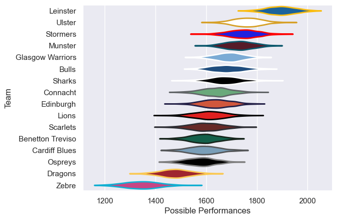

---  
title: "United Rugby Championship Status"  
date: 2023-04-28 6:00:00 -0500  
categories: model review projection  
layout: article  
aside:  
    toc: true  
---
# Current Team Rankings

# Standings

## Current Standings

| Club             |   Played |   Wins |   Point Differential |   Losing Bonus Points |   Try Bonus Points |   Competition Points |
|:-----------------|---------:|-------:|---------------------:|----------------------:|-------------------:|---------------------:|
| Leinster         |       18 |     16 |                  217 |                     0 |                 13 |                   79 |
| Ulster           |       18 |     13 |                  176 |                     4 |                 12 |                   68 |
| Stormers         |       18 |     13 |                  140 |                     3 |                 13 |                   68 |
| Glasgow Warriors |       18 |     13 |                   95 |                     0 |                 11 |                   63 |
| Munster          |       18 |     10 |                  113 |                     4 |                  9 |                   55 |
| Bulls            |       18 |     10 |                  165 |                     2 |                 11 |                   53 |
| Connacht         |       18 |     10 |                   30 |                     3 |                  7 |                   50 |
| Sharks           |       18 |      9 |                    6 |                     2 |                  8 |                   48 |
| Lions            |       18 |      9 |                  -84 |                     2 |                  7 |                   45 |
| Cardiff Blues    |       18 |      9 |                  -45 |                     2 |                  6 |                   44 |
| Benetton Treviso |       18 |      8 |                  -93 |                     1 |                  8 |                   41 |
| Edinburgh        |       18 |      6 |                   -1 |                     6 |                  8 |                   38 |
| Scarlets         |       18 |      6 |                  -71 |                     3 |                nan |                   34 |
| Ospreys          |       18 |      6 |                 -114 |                     5 |                nan |                   34 |
| Dragons          |       18 |      4 |                 -143 |                     3 |                  5 |                   24 |
| Zebre            |       18 |      0 |                 -391 |                     5 |                  6 |                   11 |

## Projected Playoff Results

|                  | Reach Quarterfinals   | Reach Semifinals   | Reach Final   | Win Final   |
|:-----------------|:----------------------|:-------------------|:--------------|:------------|
| Leinster         | 100.0 %               | 100.0 %            | 100.0 %       | 99.6 %      |
| Ulster           | 100.0 %               | 99.6 %             | 86.5 %        | 0.2 %       |
| Stormers         | 100.0 %               | 95.6 %             | 13.3 %        | 0.2 %       |
| Munster          | 100.0 %               | 41.0 %             | 0.2 %         | 0.0 %       |
| Glasgow Warriors | 100.0 %               | 59.0 %             | 0.0 %         | 0.0 %       |
| Bulls            | 100.0 %               | 4.4 %              | 0.0 %         | 0.0 %       |
| Connacht         | 100.0 %               | 0.4 %              | 0.0 %         | 0.0 %       |
| Sharks           | 100.0 %               | 0.0 %              | 0.0 %         | 0.0 %       |

# Completed Match Review

| Model | Percent Correct Predictions | Spread Error |
| ------ | ------ | ------ |
| Club Level | 71.5% | 11.8 |
| Player Level: Lineup | 63.9% | 14.1 |
| Player Level: Minutes | 63.2% | 14.4 |

