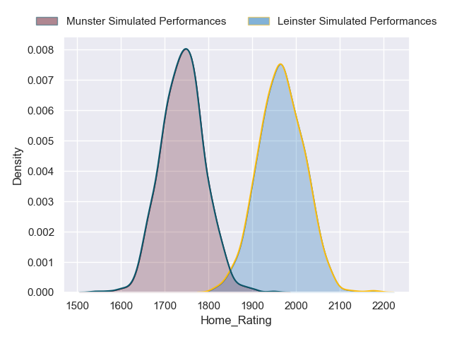
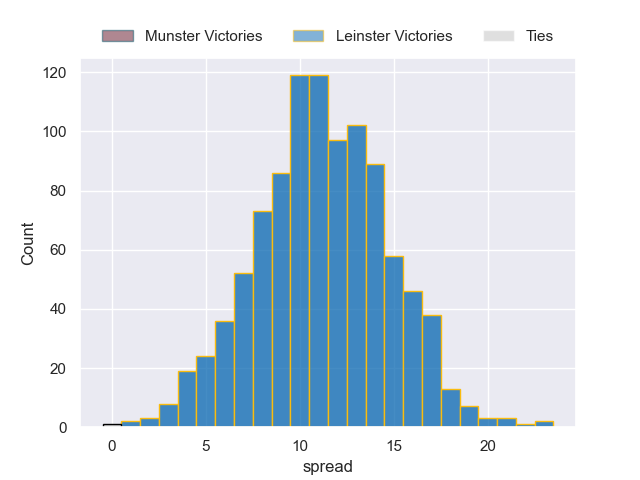
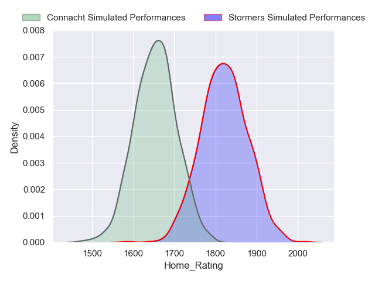
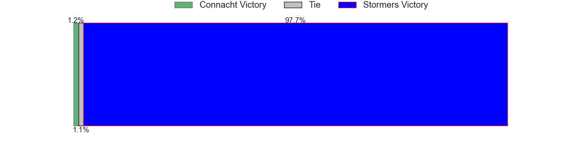
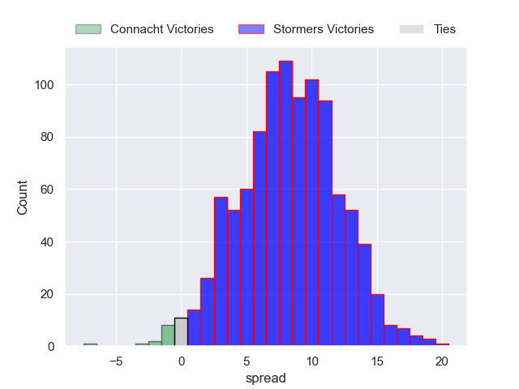

---  
title: "United Rugby Championship 2022 Status"  
date: 2023-05-11 6:00:00 -0500  
categories: model review projection  
layout: article  
aside:  
    toc: true  
---
# Standings

## Current Standings

| Club             |   Played |   Wins |   Point Differential |   Losing Bonus Points |   Try Bonus Points |   Competition Points |
|:-----------------|---------:|-------:|---------------------:|----------------------:|-------------------:|---------------------:|
| Leinster         |       19 |     17 |                  247 |                     0 |                 14 |                   84 |
| Stormers         |       19 |     14 |                  152 |                     3 |                 13 |                   72 |
| Ulster           |       19 |     13 |                  171 |                     5 |                 12 |                   69 |
| Glasgow Warriors |       19 |     13 |                   86 |                     0 |                 11 |                   63 |
| Munster          |       19 |     11 |                  122 |                     4 |                  9 |                   59 |
| Connacht         |       19 |     11 |                   35 |                     3 |                  7 |                   54 |
| Bulls            |       19 |     10 |                  153 |                     2 |                 11 |                   53 |
| Sharks           |       19 |      9 |                  -24 |                     2 |                  8 |                   48 |
| Lions            |       18 |      9 |                  -84 |                     2 |                  7 |                   45 |
| Cardiff Blues    |       18 |      9 |                  -45 |                     2 |                  6 |                   44 |
| Benetton Treviso |       18 |      8 |                  -93 |                     1 |                  8 |                   41 |
| Edinburgh        |       18 |      6 |                   -1 |                     6 |                  8 |                   38 |
| Scarlets         |       18 |      6 |                  -71 |                     3 |                nan |                   34 |
| Ospreys          |       18 |      6 |                 -114 |                     5 |                nan |                   34 |
| Dragons          |       18 |      4 |                 -143 |                     3 |                  5 |                   24 |
| Zebre            |       18 |      0 |                 -391 |                     5 |                  6 |                   11 |

## Projected Playoff Results

|          | Reach Semifinals   | Reach Final   | Win Final   |
|:---------|:-------------------|:--------------|:------------|
| Leinster | 100.0 %            | 100.0 %       | 99.9 %      |
| Stormers | 100.0 %            | 98.8 %        | 0.1 %       |
| Connacht | 100.0 %            | 1.2 %         | 0.0 %       |
| Munster  | 100.0 %            | 0.0 %         | 0.0 %       |

# Completed Match Review

| Model | Percent Correct Predictions | Spread Error |
| ------ | ------ | ------ |
| Club Level | 70.9% | 11.8 |
| Player Level: Lineup | 67.6% | 13.3 |
| Player Level: Minutes | 64.9% | 13.7 |

# Future Predictions

## Semifinal

### Leinster V Munster on 2023/05/13

Average Margin: Leinster by 11.2

### Stormers V Connacht on 2023/05/13

Average Margin: Stormers by 8.3

