---  
title: "United Rugby Championship Status"  
date: 2023-04-21 6:00:00 -0500  
categories: model review projection  
layout: article  
aside:  
    toc: true  
---
# Current Team Rankings

# Standings

## Current Standings

| Club             |   Played |   Wins |   Point Differential |   Losing Bonus Points |   Try Bonus Points |   Competition Points |
|:-----------------|---------:|-------:|---------------------:|----------------------:|-------------------:|---------------------:|
| Leinster         |       14 |     13 |                  237 |                     0 |                 12 |                   66 |
| Ulster           |       14 |     11 |                  163 |                     2 |                 11 |                   57 |
| Stormers         |       14 |     10 |                   89 |                     2 |                 10 |                   52 |
| Glasgow Warriors |       14 |      9 |                   73 |                     0 |                  8 |                   44 |
| Bulls            |       14 |      8 |                  132 |                     2 |                  9 |                   43 |
| Munster          |       14 |      8 |                   83 |                     3 |                  8 |                   43 |
| Connacht         |       14 |      9 |                   51 |                     1 |                  6 |                   43 |
| Lions            |       14 |      8 |                  -10 |                     2 |                  6 |                   40 |
| Sharks           |       14 |      7 |                  -36 |                     2 |                  6 |                   36 |
| Cardiff Blues    |       14 |      7 |                  -58 |                     0 |                  4 |                   32 |
| Edinburgh        |       14 |      5 |                   19 |                     4 |                  7 |                   31 |
| Benetton Treviso |       14 |      5 |                 -135 |                     1 |                  6 |                   27 |
| Scarlets         |       14 |      4 |                  -56 |                     3 |                  5 |                   26 |
| Ospreys          |       14 |      4 |                 -115 |                     4 |                  5 |                   25 |
| Dragons          |       14 |      3 |                 -124 |                     2 |                  4 |                   18 |
| Zebre            |       14 |      0 |                 -313 |                     4 |                  5 |                    9 |

## Projected Remaining Table

| Club             |   Matches Remaining |   Wins |   Point Differential |   Losing Bonus Points |   Try Bonus Points |   Competition Points |
|:-----------------|--------------------:|-------:|---------------------:|----------------------:|-------------------:|---------------------:|
| Lions            |                   1 |    1   |                 17.1 |                   0   |                1   |                  5   |
| Stormers         |                   1 |    1   |                 10.8 |                   0   |                1   |                  5   |
| Ulster           |                   1 |    1   |                  9.3 |                   0   |                1   |                  5   |
| Leinster         |                   1 |    1   |                  8.3 |                   0   |                1   |                  4.9 |
| Glasgow Warriors |                   1 |    0.9 |                  5.3 |                   0.1 |                0.9 |                  4.7 |
| Scarlets         |                   1 |    0.9 |                  4.4 |                   0.1 |                0.8 |                  4.5 |
| Ospreys          |                   1 |    0.7 |                  2.4 |                   0.3 |                0.7 |                  3.9 |
| Sharks           |                   1 |    0.5 |                  0.4 |                   0.4 |                0.5 |                  3.1 |
| Munster          |                   1 |    0.5 |                 -0.4 |                   0.5 |                0.4 |                  2.7 |
| Cardiff Blues    |                   1 |    0.3 |                 -2.4 |                   0.6 |                0.2 |                  1.9 |
| Dragons          |                   1 |    0.1 |                 -4.4 |                   0.6 |                0.1 |                  1.1 |
| Connacht         |                   1 |    0.1 |                 -5.3 |                   0.6 |                0   |                  0.8 |
| Bulls            |                   1 |    0   |                 -8.3 |                   0.3 |                0   |                  0.4 |
| Edinburgh        |                   1 |    0   |                 -9.3 |                   0.2 |                0   |                  0.2 |
| Benetton Treviso |                   1 |    0   |                -10.8 |                   0.1 |                0   |                  0.2 |
| Zebre            |                   1 |    0   |                -17.1 |                   0   |                0   |                  0   |

## Projected Total Table

| Club             |   Total Matches |   Wins |   Point Differential |   Losing Bonus Points |   Try Bonus Points |   Competition Points |
|:-----------------|----------------:|-------:|---------------------:|----------------------:|-------------------:|---------------------:|
| Leinster         |              15 |   14   |                245.3 |                   0   |               13   |                 70.9 |
| Ulster           |              15 |   12   |                172.3 |                   2   |               12   |                 62   |
| Stormers         |              15 |   11   |                 99.8 |                   2   |               11   |                 57   |
| Glasgow Warriors |              15 |    9.9 |                 78.3 |                   0.1 |                8.9 |                 48.7 |
| Munster          |              15 |    8.5 |                 82.6 |                   3.5 |                8.4 |                 45.7 |
| Lions            |              15 |    9   |                  7.1 |                   2   |                7   |                 45   |
| Connacht         |              15 |    9.1 |                 45.7 |                   1.6 |                6   |                 43.8 |
| Bulls            |              15 |    8   |                123.7 |                   2.3 |                9   |                 43.4 |
| Sharks           |              15 |    7.5 |                -35.6 |                   2.4 |                6.5 |                 39.1 |
| Cardiff Blues    |              15 |    7.3 |                -60.4 |                   0.6 |                4.2 |                 33.9 |
| Edinburgh        |              15 |    5   |                  9.7 |                   4.2 |                7   |                 31.2 |
| Scarlets         |              15 |    4.9 |                -51.6 |                   3.1 |                5.8 |                 30.5 |
| Ospreys          |              15 |    4.7 |               -112.6 |                   4.3 |                5.7 |                 28.9 |
| Benetton Treviso |              15 |    5   |               -145.8 |                   1.1 |                6   |                 27.2 |
| Dragons          |              15 |    3.1 |               -128.4 |                   2.6 |                4.1 |                 19.1 |
| Zebre            |              15 |    0   |               -330.1 |                   4   |                5   |                  9   |

## Projected Playoff Results

|                  | Reach Quarterfinals   | Reach Semifinals   | Reach Final   | Win Final   |
|:-----------------|:----------------------|:-------------------|:--------------|:------------|
| Leinster         | 100.0 %               | 100.0 %            | 99.9 %        | 99.8 %      |
| Ulster           | 100.0 %               | 98.4 %             | 90.2 %        | 0.2 %       |
| Stormers         | 100.0 %               | 95.1 %             | 9.5 %         | 0.0 %       |
| Munster          | 100.0 %               | 23.3 %             | 0.3 %         | 0.0 %       |
| Glasgow Warriors | 100.0 %               | 73.6 %             | 0.1 %         | 0.0 %       |
| Lions            | 100.0 %               | 5.1 %              | 0.0 %         | 0.0 %       |
| Bulls            | 100.0 %               | 2.5 %              | 0.0 %         | 0.0 %       |
| Connacht         | 100.0 %               | 2.0 %              | 0.0 %         | 0.0 %       |

# Completed Match Review

| Model | Percent Correct Predictions | Spread Error |
| ------ | ------ | ------ |
| Club Level | 72.3% | 11.8 |
| Player Level: Lineup | 65.2% | 13.4 |
| Player Level: Minutes | 66.1% | 13.3 |

# Future Predictions

## Week 8

### Ulster V Edinburgh on 2023/04/21

Average Margin: Ulster by 9.9

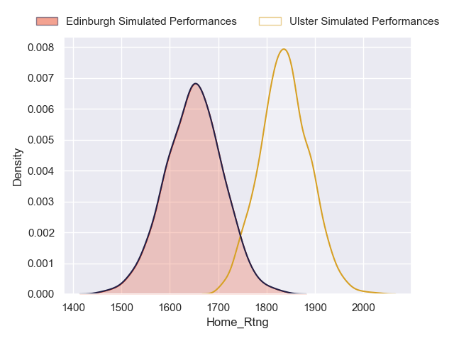
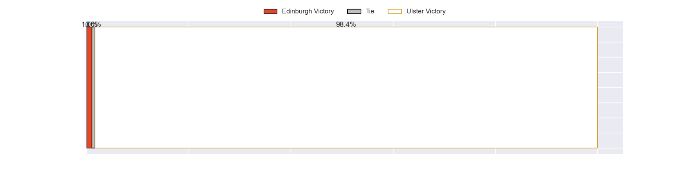
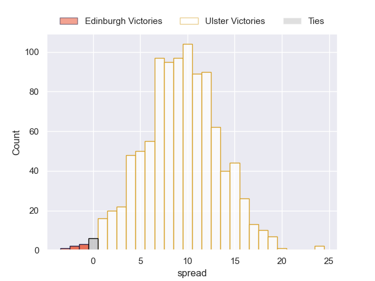

### Stormers V Benetton Treviso on 2023/04/21

Average Margin: Stormers by 11.3

### Bulls V Leinster on 2023/04/22

Average Margin: Leinster by 8.8

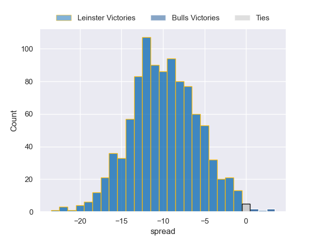

### Lions V Zebre on 2023/04/22

Average Margin: Lions by 17.6

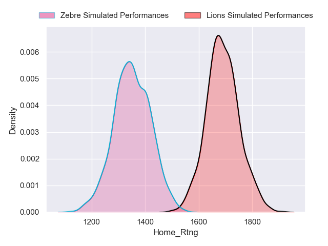
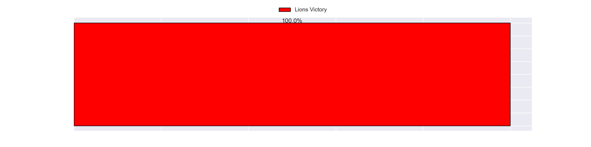
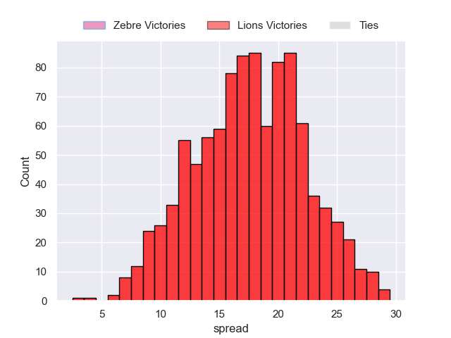

### Dragons V Scarlets on 2023/04/22

Average Margin: Scarlets by 4.8

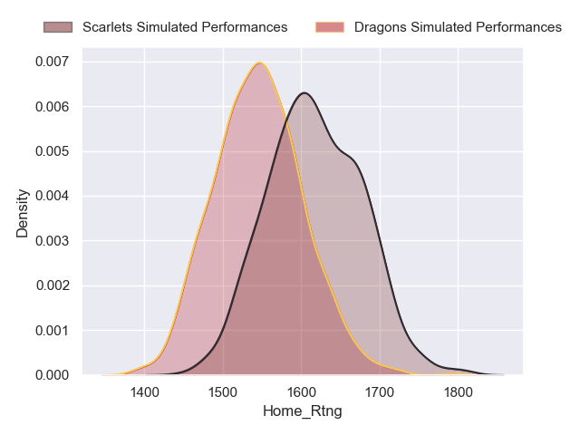

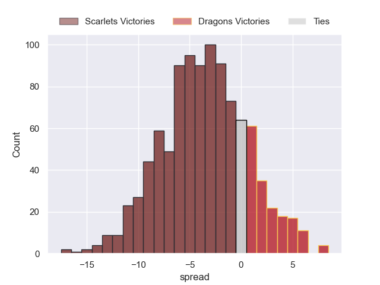

### Ospreys V Cardiff Blues on 2023/04/22

Average Margin: Ospreys by 2.6

### Glasgow Warriors V Connacht on 2023/04/22

Average Margin: Glasgow Warriors by 5.7

### Sharks V Munster on 2023/04/22

Average Margin: Sharks by 0.4

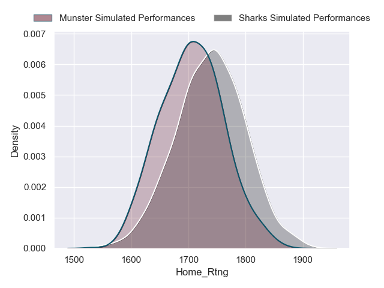
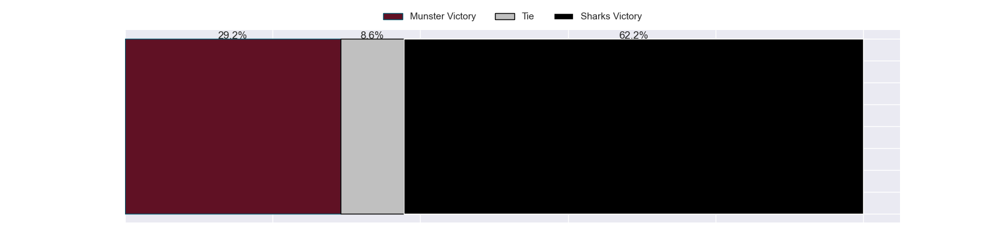
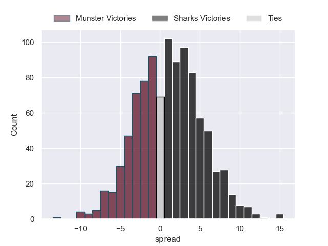

