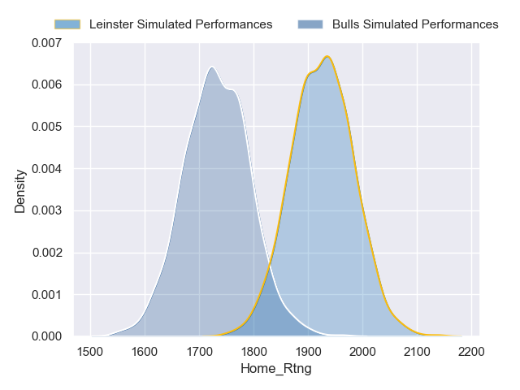
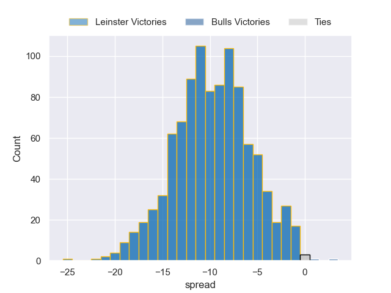
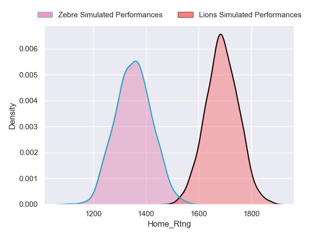
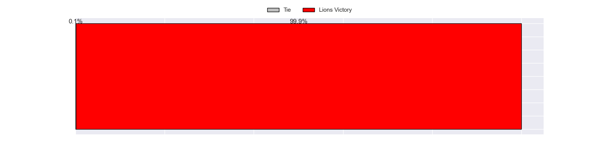
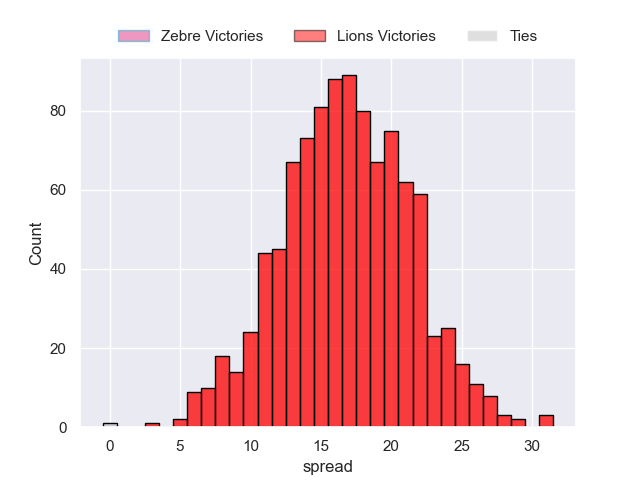
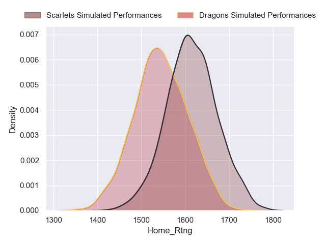
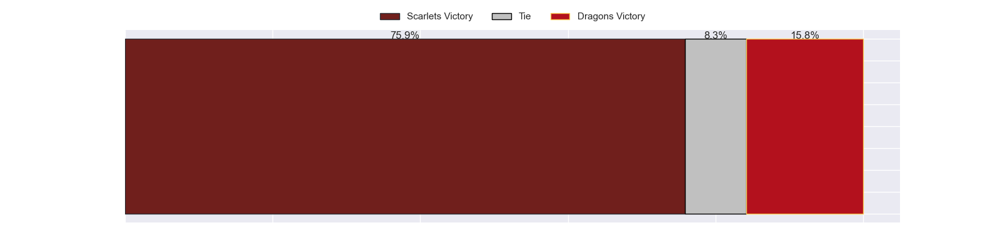
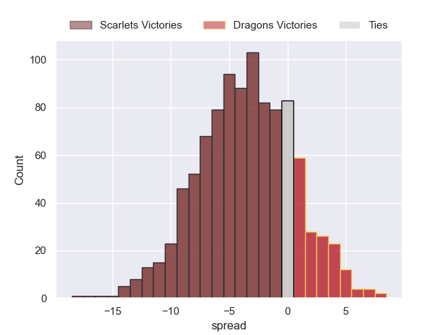
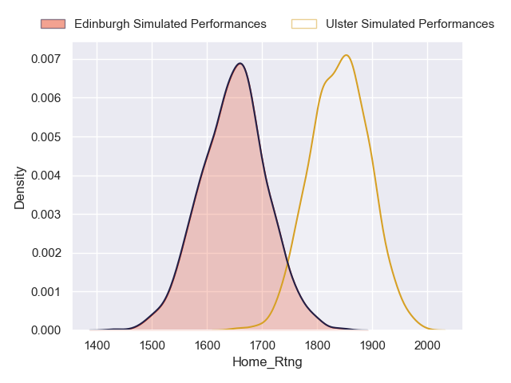
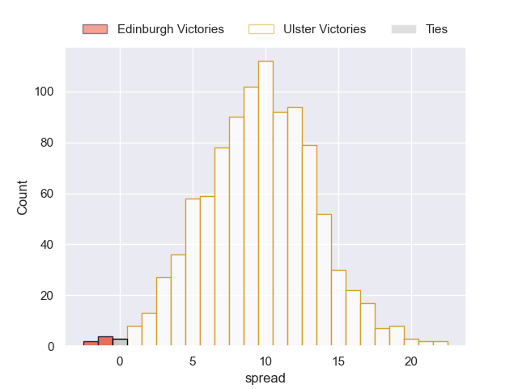

---  
title: "United Rugby Championship Status"  
date: 2023-04-19 6:00:00 -0500  
categories: model review projection  
layout: article  
aside:  
    toc: true  
---
# Team Rankings

# Standings

## Current Standings

| Club             |   Played |   Wins |   Point Differential |   Losing Bonus Points |   Try Bonus Points |   Competition Points |
|:-----------------|---------:|-------:|---------------------:|----------------------:|-------------------:|---------------------:|
| Leinster         |       13 |     12 |                  234 |                     0 |                 11 |                   61 |
| Ulster           |       13 |     10 |                  142 |                     2 |                 10 |                   52 |
| Stormers         |       13 |     10 |                   91 |                     1 |                  9 |                   50 |
| Glasgow Warriors |       13 |      8 |                   70 |                     0 |                  8 |                   40 |
| Munster          |       13 |      7 |                   81 |                     3 |                  7 |                   38 |
| Bulls            |       13 |      7 |                   66 |                     2 |                  8 |                   38 |
| Connacht         |       13 |      8 |                   32 |                     1 |                  5 |                   38 |
| Lions            |       13 |      8 |                   -7 |                     1 |                  5 |                   38 |
| Cardiff Blues    |       13 |      7 |                  -39 |                     0 |                  4 |                   32 |
| Sharks           |       13 |      6 |                  -46 |                     2 |                  5 |                   31 |
| Edinburgh        |       13 |      4 |                   -5 |                     4 |                  6 |                   26 |
| Benetton Treviso |       13 |      5 |                 -125 |                     1 |                  5 |                   26 |
| Scarlets         |       13 |      4 |                  -53 |                     2 |                  5 |                   25 |
| Ospreys          |       13 |      4 |                  -91 |                     4 |                  5 |                   25 |
| Dragons          |       13 |      3 |                 -103 |                     2 |                  4 |                   18 |
| Zebre            |       13 |      0 |                 -247 |                     4 |                  5 |                    9 |

## Projected Remaining Table

| Club             |   Matches Remaining |   Wins |   Point Differential |   Losing Bonus Points |   Try Bonus Points |   Competition Points |
|:-----------------|--------------------:|-------:|---------------------:|----------------------:|-------------------:|---------------------:|
| Lions            |                   1 |    1   |                 16.8 |                   0   |                0.8 |                  4.8 |
| Leinster         |                   1 |    1   |                  9.7 |                   0   |                0.9 |                  4.8 |
| Stormers         |                   1 |    1   |                 11.8 |                   0   |                0.7 |                  4.7 |
| Ulster           |                   1 |    1   |                  9.6 |                   0   |                0.4 |                  4.4 |
| Glasgow Warriors |                   1 |    0.9 |                  5.9 |                   0   |                0.2 |                  4   |
| Scarlets         |                   1 |    0.8 |                  3.5 |                   0.2 |                0.2 |                  3.5 |
| Ospreys          |                   1 |    0.8 |                  3.2 |                   0.2 |                0.2 |                  3.5 |
| Sharks           |                   1 |    0.6 |                  1.3 |                   0.3 |                0.1 |                  2.9 |
| Munster          |                   1 |    0.3 |                 -1.3 |                   0.5 |                0.1 |                  2.1 |
| Cardiff Blues    |                   1 |    0.2 |                 -3.2 |                   0.6 |                0.1 |                  1.5 |
| Dragons          |                   1 |    0.2 |                 -3.5 |                   0.6 |                0.1 |                  1.5 |
| Connacht         |                   1 |    0   |                 -5.9 |                   0.6 |                0.1 |                  0.9 |
| Edinburgh        |                   1 |    0   |                 -9.6 |                   0.3 |                0.1 |                  0.4 |
| Bulls            |                   1 |    0   |                 -9.7 |                   0.3 |                0.1 |                  0.4 |
| Benetton Treviso |                   1 |    0   |                -11.8 |                   0.1 |                0.1 |                  0.3 |
| Zebre            |                   1 |    0   |                -16.8 |                   0   |                0.1 |                  0.2 |

## Projected Total Table

| Club             |   Total Matches |   Wins |   Point Differential |   Losing Bonus Points |   Try Bonus Points |   Competition Points |
|:-----------------|----------------:|-------:|---------------------:|----------------------:|-------------------:|---------------------:|
| Leinster         |              14 |   13   |                243.7 |                   0   |               11.9 |                 65.8 |
| Ulster           |              14 |   11   |                151.6 |                   2   |               10.4 |                 56.4 |
| Stormers         |              14 |   11   |                102.8 |                   1   |                9.7 |                 54.7 |
| Glasgow Warriors |              14 |    8.9 |                 75.9 |                   0   |                8.2 |                 44   |
| Lions            |              14 |    9   |                  9.8 |                   1   |                5.8 |                 42.8 |
| Munster          |              14 |    7.3 |                 79.7 |                   3.5 |                7.1 |                 40.1 |
| Connacht         |              14 |    8   |                 26.1 |                   1.6 |                5.1 |                 38.9 |
| Bulls            |              14 |    7   |                 56.3 |                   2.3 |                8.1 |                 38.4 |
| Sharks           |              14 |    6.6 |                -44.7 |                   2.3 |                5.1 |                 33.9 |
| Cardiff Blues    |              14 |    7.2 |                -42.2 |                   0.6 |                4.1 |                 33.5 |
| Scarlets         |              14 |    4.8 |                -49.5 |                   2.2 |                5.2 |                 28.5 |
| Ospreys          |              14 |    4.8 |                -87.8 |                   4.2 |                5.2 |                 28.5 |
| Edinburgh        |              14 |    4   |                -14.6 |                   4.3 |                6.1 |                 26.4 |
| Benetton Treviso |              14 |    5   |               -136.8 |                   1.1 |                5.1 |                 26.3 |
| Dragons          |              14 |    3.2 |               -106.5 |                   2.6 |                4.1 |                 19.5 |
| Zebre            |              14 |    0   |               -263.8 |                   4   |                5.1 |                  9.2 |

# Completed Match Review

| Match                                             |   Result |   Lineup Prediction |   Minutes Prediction |   Club Prediction |
|:--------------------------------------------------|---------:|--------------------:|---------------------:|------------------:|
| Benetton Treviso V Glasgow Warriors on 2022/09/16 |       22 |                -3.9 |                 -3.4 |              -1.5 |
| Lions V Bulls on 2022/09/17                       |      -16 |                 2.2 |                  0.9 |              -4.7 |
| Zebre V Leinster on 2022/09/17                    |       -4 |               -13   |                -11.8 |             -21   |
| Cardiff Blues V Munster on 2022/09/17             |        7 |                 8   |                  5.7 |              -9.2 |
| Scarlets V Ospreys on 2022/09/17                  |        0 |                 6.3 |                  8.2 |               5   |
| Edinburgh V Dragons on 2022/09/17                 |       38 |                27   |                 25.4 |              15.9 |
| Ulster V Connacht on 2022/09/17                   |       26 |                12.2 |                 11.5 |              12.4 |
| Zebre V Sharks on 2022/09/23                      |       -5 |                 2.5 |                  0.8 |             -12.1 |
| Glasgow Warriors V Cardiff Blues on 2022/09/23    |       28 |                14.2 |                 10.4 |              12.5 |
| Leinster V Benetton Treviso on 2022/09/23         |       32 |                20.2 |                 27.2 |              22.1 |
| Scarlets V Ulster on 2022/09/24                   |      -16 |               -11.4 |                -10.2 |              -4.5 |
| Bulls V Edinburgh on 2022/09/24                   |        2 |                -8.3 |                 -7.8 |               7.2 |
| Stormers V Connacht on 2022/09/24                 |       23 |                17.8 |                 15.9 |              11.5 |
| Ospreys V Lions on 2022/09/24                     |       -1 |                 6.1 |                  3.3 |               5.7 |
| Dragons V Munster on 2022/09/25                   |        6 |               -18.1 |                -12.9 |             -10.8 |
| Bulls V Connacht on 2022/09/30                    |       14 |                26.7 |                 25.2 |              11   |
| Cardiff Blues V Lions on 2022/09/30               |      -13 |                 2.7 |                  2   |               1.2 |
| Ulster V Leinster on 2022/09/30                   |       -7 |                 1.8 |                 -2.6 |              -1.2 |
| Stormers V Edinburgh on 2022/10/01                |       16 |                -4.5 |                 -4.6 |               7.5 |
| Ospreys V Glasgow Warriors on 2022/10/01          |       15 |                 0.7 |                 -0   |               1.5 |
| Munster V Zebre on 2022/10/01                     |       16 |                 8.4 |                 10.3 |              20.6 |
| Benetton Treviso V Scarlets on 2022/10/01         |       11 |                 3.8 |                  1.7 |               3.8 |
| Dragons V Sharks on 2022/10/01                    |       -1 |                -8.5 |                 -6.5 |              -6.5 |
| Connacht V Munster on 2022/10/07                  |        9 |               -14.5 |                 -8.4 |              -2.2 |
| Edinburgh V Lions on 2022/10/07                   |       -3 |                 2.4 |                  8.8 |              10.6 |
| Zebre V Stormers on 2022/10/08                    |      -17 |               -15.2 |                -16.6 |             -13.3 |
| Leinster V Sharks on 2022/10/08                   |       20 |                25   |                 21   |              13.8 |
| Scarlets V Cardiff Blues on 2022/10/08            |       -6 |                -2.9 |                  5.3 |               8.6 |
| Glasgow Warriors V Bulls on 2022/10/08            |       14 |                 7.3 |                  4.3 |              -1.2 |
| Ulster V Ospreys on 2022/10/08                    |       30 |                20.4 |                 19.2 |              14.6 |
| Benetton Treviso V Dragons on 2022/10/09          |       20 |                12.5 |                 15   |               8.4 |
| Connacht V Leinster on 2022/10/14                 |      -10 |                -7.8 |                 -9.8 |              -9.9 |
| Ospreys V Stormers on 2022/10/14                  |        0 |                -8.1 |                 -6.1 |              -4.6 |
| Lions V Ulster on 2022/10/15                      |       -2 |                -3.8 |                 -0.2 |              -5.6 |
| Sharks V Glasgow Warriors on 2022/10/15           |       28 |                -0.9 |                  0.9 |               7.4 |
| Cardiff Blues V Dragons on 2022/10/15             |       17 |                12.3 |                 14   |               5   |
| Edinburgh V Benetton Treviso on 2022/10/15        |       45 |                23.6 |                 24.1 |              11.8 |
| Munster V Bulls on 2022/10/15                     |       14 |                 2.7 |                  0.2 |               3.2 |
| Scarlets V Zebre on 2022/10/15                    |       24 |                19.3 |                 19.1 |              12.7 |
| Benetton Treviso V Bulls on 2022/10/21            |      -22 |                -3.2 |                 -4.6 |              -5.4 |
| Connacht V Scarlets on 2022/10/21                 |       22 |                 8.5 |                  3.5 |               5.7 |
| Zebre V Edinburgh on 2022/10/22                   |      -19 |                -2.8 |                 -5.2 |             -10.3 |
| Leinster V Munster on 2022/10/22                  |       14 |                18.9 |                 16.5 |              12.2 |
| Cardiff Blues V Stormers on 2022/10/22            |        6 |                -9.5 |                -13.7 |              -9.2 |
| Dragons V Ospreys on 2022/10/23                   |        7 |                -2   |                 -2.2 |              -0.6 |
| Glasgow Warriors V Benetton Treviso on 2022/10/28 |       37 |                 6   |                  8.8 |               8.7 |
| Scarlets V Leinster on 2022/10/28                 |      -30 |               -12   |                 -7.2 |             -11.1 |
| Lions V Stormers on 2022/10/29                    |       -9 |                 1.9 |                  4.1 |              -4.6 |
| Dragons V Zebre on 2022/10/29                     |       40 |                18.9 |                 16.2 |               8.1 |
| Munster V Ulster on 2022/10/29                    |       -1 |                 5.4 |                  4   |               1.8 |
| Ospreys V Connacht on 2022/10/29                  |       -3 |               -27.3 |                -23.3 |               3.8 |
| Bulls V Sharks on 2022/10/30                      |       13 |                 6.6 |                  6.6 |               7.3 |
| Cardiff Blues V Edinburgh on 2022/10/30           |       -8 |                 7.1 |                  9.8 |              -6.1 |
| Stormers V Scarlets on 2022/11/25                 |       17 |                28.9 |                 19.8 |              15.8 |
| Ulster V Zebre on 2022/11/25                      |       21 |                19.8 |                 24   |              25.1 |
| Benetton Treviso V Edinburgh on 2022/11/26        |        7 |                -1.4 |                 -1.1 |              -3.4 |
| Bulls V Ospreys on 2022/11/26                     |       17 |                25.4 |                 25.7 |              12.9 |
| Leinster V Glasgow Warriors on 2022/11/26         |       35 |                17.3 |                 14.4 |              17.2 |
| Munster V Connacht on 2022/11/26                  |        7 |                 6.9 |                 12.5 |               9   |
| Lions V Dragons on 2022/11/27                     |        8 |                13.1 |                  9.4 |              10.2 |
| Sharks V Cardiff Blues on 2022/11/27              |      -35 |                10.3 |                  6   |              12.2 |
| Sharks V Ospreys on 2022/12/02                    |       15 |                 9.3 |                 14.6 |               8.1 |
| Edinburgh V Munster on 2022/12/02                 |      -21 |                10.9 |                 15.4 |               2.9 |
| Stormers V Dragons on 2022/12/03                  |        8 |                12.7 |                 14.7 |              17.7 |
| Zebre V Glasgow Warriors on 2022/12/03            |      -28 |                -1.6 |                 -0.4 |              -8.6 |
| Connacht V Benetton Treviso on 2022/12/03         |       19 |                 6.3 |                  0.9 |               8.5 |
| Bulls V Cardiff Blues on 2022/12/03               |       36 |                16.9 |                 16.6 |              13   |
| Leinster V Ulster on 2022/12/03                   |        9 |                13.8 |                 13.3 |              10.2 |
| Lions V Scarlets on 2022/12/04                    |       17 |                 3.1 |                  2.5 |               8.2 |
| Scarlets V Bulls on 2023/01/27                    |        9 |                -3   |                  3.5 |              -4.1 |
| Ulster V Stormers on 2023/01/27                   |       30 |                 7.2 |                  6.1 |               5.3 |
| Benetton Treviso V Munster on 2023/01/28          |      -10 |                -2.9 |                 -0.2 |              -4   |
| Dragons V Glasgow Warriors on 2023/01/28          |      -14 |                 4.1 |                  4.2 |              -3   |
| Leinster V Cardiff Blues on 2023/01/28            |       24 |                 2.2 |                  6.9 |              19.9 |
| Edinburgh V Sharks on 2023/01/28                  |       -3 |                -7.4 |                -10.3 |               4.5 |
| Connacht V Lions on 2023/01/28                    |       19 |                -2.4 |                 -1.5 |               6.4 |
| Zebre V Ospreys on 2023/01/29                     |       -4 |                 4.7 |                 -0.3 |              -6.2 |
| Sharks V Stormers on 2023/02/04                   |      -27 |                 7.4 |                  7.1 |               2.2 |
| Glasgow Warriors V Ulster on 2023/02/17           |        6 |                -2.9 |                 -0.1 |              -1   |
| Munster V Ospreys on 2023/02/17                   |       55 |                 7.7 |                  8.8 |              11.3 |
| Lions V Sharks on 2023/02/18                      |      -22 |                10.9 |                 10.9 |              -0.6 |
| Bulls V Stormers on 2023/02/18                    |       -4 |                -5.1 |                 -4.2 |               2.6 |
| Zebre V Connacht on 2023/02/18                    |      -23 |                -8.3 |                 -9   |              -9.4 |
| Cardiff Blues V Benetton Treviso on 2023/02/18    |       17 |                 0.5 |                  3.9 |               5.9 |
| Scarlets V Edinburgh on 2023/02/18                |       28 |                 9.8 |                 10.3 |              -0.4 |
| Leinster V Dragons on 2023/02/18                  |       29 |                22.5 |                 22   |              26.2 |
| Sharks V Ulster on 2023/02/25                     |       -7 |                 5.9 |                  3.4 |               0.9 |
| Lions V Glasgow Warriors on 2023/02/25            |       11 |               -12.7 |                -15.8 |               1.4 |
| Glasgow Warriors V Zebre on 2023/03/03            |       42 |                15.4 |                 18.1 |              19.3 |
| Munster V Scarlets on 2023/03/03                  |        7 |                18   |                 13.3 |              11.4 |
| Stormers V Sharks on 2023/03/04                   |        6 |                 8.5 |                 11.5 |               9.1 |
| Bulls V Lions on 2023/03/04                       |       -4 |                 5.1 |                  4.1 |              10   |
| Edinburgh V Leinster on 2023/03/04                |      -20 |                -7.1 |                 -6.7 |              -8.5 |
| Ospreys V Benetton Treviso on 2023/03/04          |       -1 |                16.1 |                 16.9 |               5.9 |
| Cardiff Blues V Ulster on 2023/03/04              |      -22 |                -0.3 |                 -3.2 |              -3.4 |
| Dragons V Connacht on 2023/03/04                  |       -2 |               -16.1 |                -17.6 |              -3.4 |
| Zebre V Cardiff Blues on 2023/03/24               |       -4 |                -2.8 |                 -1.2 |              -8   |
| Leinster V Stormers on 2023/03/24                 |        0 |                13.9 |                 19.4 |              12.4 |
| Benetton Treviso V Lions on 2023/03/25            |       -4 |                 2.4 |                 -5.9 |               3.4 |
| Ospreys V Dragons on 2023/03/25                   |       19 |                 1.5 |                  1.3 |               9.4 |
| Connacht V Edinburgh on 2023/03/25                |       15 |                 7.9 |                  4.9 |               3.6 |
| Scarlets V Sharks on 2023/03/25                   |       12 |                13.3 |                 12.5 |               0.8 |
| Munster V Glasgow Warriors on 2023/03/25          |      -12 |                 8.7 |                  9.2 |               9   |
| Ulster V Bulls on 2023/03/25                      |        9 |                33.2 |                 29.6 |               8.1 |
| ------ | ------ | ------ | ------ | ------ |
| Average Error |       - | 13.3 | 13.0 | 11.8 |
| Correct Winner |       - | 65.4% | 68.3% | 71.2% |

# Future Predictions

## Week 7

### Stormers V Benetton Treviso on 2023/04/22

Average Margin: Stormers by 11.8

### Glasgow Warriors V Connacht on 2023/04/22

Average Margin: Glasgow Warriors by 5.9

### Bulls V Leinster on 2023/04/22

Average Margin: Leinster by 9.7

### Lions V Zebre on 2023/04/22

Average Margin: Lions by 16.8

### Ospreys V Cardiff Blues on 2023/04/22

Average Margin: Ospreys by 3.2

### Dragons V Scarlets on 2023/04/22

Average Margin: Scarlets by 3.5

### Ulster V Edinburgh on 2023/04/22

Average Margin: Ulster by 9.6

### Sharks V Munster on 2023/04/22

Average Margin: Sharks by 1.3

