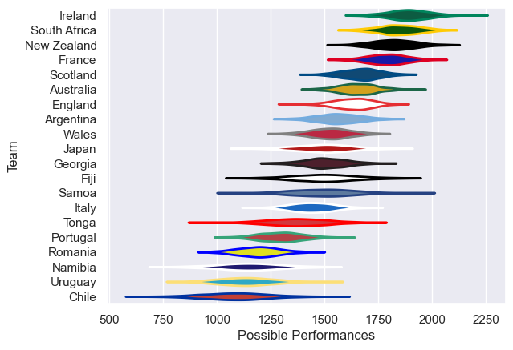
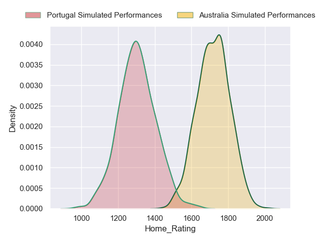
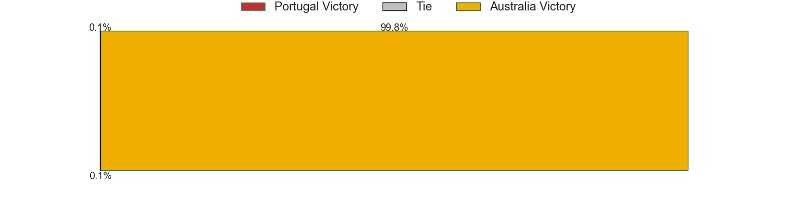
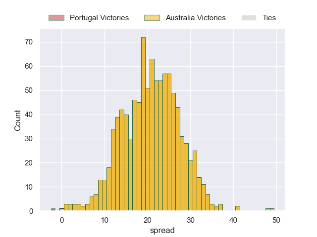

---  
title: "World Cup 2023 Predictions"  
date: 2023-05-11 6:00:00 -0500  
categories: model projection  
layout: article  
aside:  
    toc: true  
---
# Team Rankings

# Projected Pool Results

## Pool A

|    | Club        |   Played |   Wins |   Point Differential |   Losing Bonus Points |   Try Bonus Points |   Competition Points |
|---:|:------------|---------:|-------:|---------------------:|----------------------:|-------------------:|---------------------:|
|  0 | France      |        4 |  3.602 |               95.657 |                 0.308 |              3.551 |               18.267 |
|  2 | New Zealand |        4 |  3.398 |               94.528 |                 0.371 |              3.37  |               17.333 |
|  1 | Italy       |        4 |  1.971 |               -5.058 |                 0.057 |              1.968 |                9.909 |
|  3 | Uruguay     |        4 |  0.618 |              -90.174 |                 0.303 |              0.608 |                3.383 |
|  4 | Namibia     |        4 |  0.411 |              -94.953 |                 0.344 |              0.396 |                2.384 |

## Pool B

|    | Club         |   Played |   Wins |   Point Differential |   Losing Bonus Points |   Try Bonus Points |   Competition Points |
|---:|:-------------|---------:|-------:|---------------------:|----------------------:|-------------------:|---------------------:|
|  1 | South Africa |        4 |  3.537 |               76.189 |                 0.338 |              3.437 |               17.923 |
|  0 | Ireland      |        4 |  3.413 |               80.87  |                 0.412 |              3.36  |               17.424 |
|  2 | Scotland     |        4 |  2.038 |               19.225 |                 0.297 |              2.032 |               10.481 |
|  3 | Tonga        |        4 |  0.942 |              -62.684 |                 0.121 |              0.926 |                4.815 |
|  4 | Romania      |        4 |  0.07  |             -113.6   |                 0.179 |              0.096 |                0.555 |

## Pool C

|    | Club      |   Played |   Wins |   Point Differential |   Losing Bonus Points |   Try Bonus Points |   Competition Points |
|---:|:----------|---------:|-------:|---------------------:|----------------------:|-------------------:|---------------------:|
|  0 | Australia |        4 |  3.564 |               47.267 |                 0.357 |              3.511 |               18.124 |
|  1 | Wales     |        4 |  2.729 |               20.719 |                 0.807 |              2.607 |               14.33  |
|  3 | Fiji      |        4 |  1.934 |               -0.809 |                 0.805 |              1.826 |               10.367 |
|  2 | Georgia   |        4 |  1.645 |               -5.911 |                 0.921 |              1.548 |                9.049 |
|  4 | Portugal  |        4 |  0.128 |              -61.264 |                 0.469 |              0.127 |                1.108 |

## Pool D

|    | Club      |   Played |   Wins |   Point Differential |   Losing Bonus Points |   Try Bonus Points |   Competition Points |
|---:|:----------|---------:|-------:|---------------------:|----------------------:|-------------------:|---------------------:|
|  0 | England   |        4 |  3.622 |               57.011 |                 0.31  |              3.562 |               18.36  |
|  3 | Argentina |        4 |  2.528 |               29.555 |                 0.811 |              2.43  |               13.353 |
|  1 | Japan     |        4 |  2.228 |               17.838 |                 0.789 |              2.134 |               11.835 |
|  2 | Samoa     |        4 |  1.601 |                1.436 |                 0.833 |              1.525 |                8.762 |
|  4 | Chile     |        4 |  0.021 |             -105.841 |                 0.077 |              0.056 |                0.217 |

# Projected Playoff Results

|              | Reach Quarterfinals   | Reach Semifinals   | Reach Bronze Final   | Win Bronze   | Reach Final   | Win Final   |
|:-------------|:----------------------|:-------------------|:---------------------|:-------------|:--------------|:------------|
| Ireland      | 98.7 %                | 63.0 %             | 1.0 %                | 1.0 %        | 62.0 %        | 39.6 %      |
| France       | 100.0 %               | 51.0 %             | 2.2 %                | 2.2 %        | 48.8 %        | 25.6 %      |
| South Africa | 98.3 %                | 48.6 %             | 1.7 %                | 1.6 %        | 46.9 %        | 21.2 %      |
| New Zealand  | 100.0 %               | 37.0 %             | 2.8 %                | 2.3 %        | 34.2 %        | 13.2 %      |
| Australia    | 95.8 %                | 72.7 %             | 68.0 %               | 44.9 %       | 4.7 %         | 0.2 %       |
| England      | 95.3 %                | 62.9 %             | 60.8 %               | 28.9 %       | 2.1 %         | 0.2 %       |
| Argentina    | 56.3 %                | 22.3 %             | 21.7 %               | 8.4 %        | 0.6 %         | 0.0 %       |
| Scotland     | 3.0 %                 | 0.4 %              | 0.1 %                | 0.0 %        | 0.3 %         | 0.0 %       |
| Samoa        | 12.1 %                | 4.3 %              | 4.1 %                | 1.4 %        | 0.2 %         | 0.0 %       |
| Wales        | 69.3 %                | 18.8 %             | 18.7 %               | 3.7 %        | 0.1 %         | 0.0 %       |
| Fiji         | 22.1 %                | 7.6 %              | 7.5 %                | 2.4 %        | 0.1 %         | 0.0 %       |
| Japan        | 36.3 %                | 8.7 %              | 8.7 %                | 2.6 %        | 0.0 %         | 0.0 %       |
| Georgia      | 12.8 %                | 2.7 %              | 2.7 %                | 0.6 %        | 0.0 %         | 0.0 %       |

# Pool Match Predictions

## Pool A

### France V New Zealand on 2023/09/08

Average Margin: France by 2.0

### Italy V Namibia on 2023/09/09

Average Margin: Italy by 18.7

### France V Uruguay on 2023/09/14

Average Margin: France by 36.7

### New Zealand V Namibia on 2023/09/15

Average Margin: New Zealand by 37.2

### Italy V Uruguay on 2023/09/20

Average Margin: Italy by 19.1

### France V Namibia on 2023/09/21

Average Margin: France by 36.2

### Uruguay V Namibia on 2023/09/27

Average Margin: Uruguay by 2.9

### New Zealand V Italy on 2023/09/29

Average Margin: New Zealand by 22.1

### New Zealand V Uruguay on 2023/10/05

Average Margin: New Zealand by 37.2

### France V Italy on 2023/10/06

Average Margin: France by 20.7

## Pool B

### Ireland V Romania on 2023/09/09

Average Margin: Ireland by 38.2

### South Africa V Scotland on 2023/09/10

Average Margin: South Africa by 12.3

### Ireland V Tonga on 2023/09/16

Average Margin: Ireland by 29.1

### South Africa V Romania on 2023/09/17

Average Margin: South Africa by 35.9

### South Africa V Ireland on 2023/09/23

Average Margin: South Africa by 1.0

### Scotland V Tonga on 2023/09/24

Average Margin: Scotland by 18.7

### Scotland V Romania on 2023/09/30

Average Margin: Scotland by 27.3

### South Africa V Tonga on 2023/10/01

Average Margin: South Africa by 27.1

### Ireland V Scotland on 2023/10/07

Average Margin: Ireland by 14.5

### Tonga V Romania on 2023/10/08

Average Margin: Tonga by 12.3

## Pool C

### Australia V Georgia on 2023/09/09

Average Margin: Australia by 11.3

### Wales V Fiji on 2023/09/10

Average Margin: Wales by 4.9

### Wales V Portugal on 2023/09/16

Average Margin: Wales by 14.7

### Australia V Fiji on 2023/09/17

Average Margin: Australia by 11.8

### Georgia V Portugal on 2023/09/23

Average Margin: Georgia by 12.9

### Wales V Australia on 2023/09/24

Average Margin: Australia by 3.4

### Fiji V Georgia on 2023/09/30

Average Margin: Fiji by 3.0

### Australia V Portugal on 2023/10/01

Average Margin: Australia by 20.7

### Wales V Georgia on 2023/10/07

Average Margin: Wales by 4.5

### Fiji V Portugal on 2023/10/08

Average Margin: Fiji by 12.9

## Pool D

### England V Argentina on 2023/09/09

Average Margin: England by 6.4

### Japan V Chile on 2023/09/10

Average Margin: Japan by 24.4

### Samoa V Chile on 2023/09/16

Average Margin: Samoa by 23.5

### England V Japan on 2023/09/17

Average Margin: England by 10.1

### Argentina V Samoa on 2023/09/22

Average Margin: Argentina by 7.6

### England V Chile on 2023/09/23

Average Margin: England by 30.1

### Japan V Samoa on 2023/09/28

Average Margin: Japan by 4.1

### Argentina V Chile on 2023/09/30

Average Margin: Argentina by 27.7

### England V Samoa on 2023/10/07

Average Margin: England by 10.4

### Japan V Argentina on 2023/10/08

Average Margin: Argentina by 0.6

