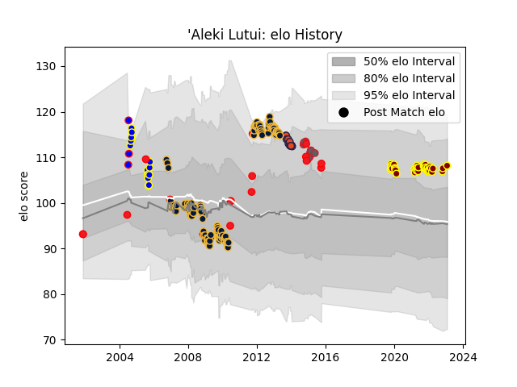

---  
layout: page  
title: 'Aleki Lutui  
date: 2023-02-02 15:50:36.551207  
categories: player  
---
# 'Aleki Lutui

## Positions: H, P

## Country: Tonga

## Current elo: 108.0

## Current Percentile: 83.0

# Elo History

# Match History

| Team               |   Appearances |   Win Rate |
|:-------------------|--------------:|-----------:|
| Worcester Warriors |           132 |   0.337121 |
| Ampthill           |            41 |   0.47561  |
| Bay of Plenty      |            15 |   0.466667 |
| Edinburgh          |            15 |   0.533333 |
| Gloucester Rugby   |            15 |   0.666667 |
| Tonga              |            15 |   0.333333 |
| Pacific Islands    |             5 |   0        |

| Opponent                 |   Matches |   Win Rate |
|:-------------------------|----------:|-----------:|
| Leicester Tigers         |        14 |  0.142857  |
| London Irish             |        14 |  0.321429  |
| Gloucester Rugby         |        13 |  0.461538  |
| Bath Rugby               |        12 |  0.208333  |
| Saracens                 |        12 |  0.375     |
| Harlequins               |        11 |  0.0909091 |
| Wasps                    |        10 |  0.45      |
| Newcastle Falcons        |        10 |  0.7       |
| Sale Sharks              |         9 |  0.444444  |
| Northampton Saints       |         7 |  0.142857  |
| Exeter Chiefs            |         7 |  0.142857  |
| Doncaster                |         5 |  0.2       |
| London Welsh             |         4 |  0.75      |
| Coventry                 |         4 |  0.5       |
| London Scottish          |         4 |  0.875     |
| Ealing Trailfinders      |         4 |  0         |
| Perpignan                |         4 |  0.5       |
| Jersey                   |         4 |  0.125     |
| Leeds                    |         4 |  0.375     |
| Cornish Pirates          |         4 |  0.375     |
| Bristol Rugby            |         4 |  0.375     |
| Nottingham               |         4 |  0.5       |
| Ospreys                  |         4 |  0.5       |
| Bedford                  |         4 |  0.5       |
| Yorkshire Carnegie       |         4 |  0.625     |
| Munster                  |         3 |  0.333333  |
| Fiji                     |         3 |  0         |
| Richmond                 |         3 |  1         |
| Zebre                    |         3 |  1         |
| New Zealand              |         2 |  0         |
| Auckland                 |         2 |  0.5       |
| Scotland                 |         2 |  0         |
| Japan                    |         2 |  0.5       |
| Hartpury College         |         2 |  1         |
| Stade Francais Paris     |         2 |  0         |
| Taranaki                 |         2 |  0.5       |
| Canterbury               |         2 |  0         |
| Waikato                  |         2 |  1         |
| Brive                    |         2 |  1         |
| Wellington               |         2 |  0.5       |
| Otago                    |         2 |  0.5       |
| South Africa             |         1 |  0         |
| Southland                |         1 |  0         |
| Samoa                    |         1 |  0         |
| Ulster                   |         1 |  0         |
| United States of America |         1 |  1         |
| Rovigo                   |         1 |  1         |
| Wales                    |         1 |  0         |
| Argentina                |         1 |  0         |
| Northland                |         1 |  1         |
| North Harbour            |         1 |  0         |
| Australia                |         1 |  0         |
| Benetton Treviso         |         1 |  1         |
| Bizkaia Gernika RT       |         1 |  1         |
| Bourgoin-Jallieu         |         1 |  0         |
| Bucuresti                |         1 |  1         |
| Caldy                    |         1 |  1         |
| Connacht                 |         1 |  1         |
| Dragons                  |         1 |  1         |
| England                  |         1 |  0         |
| France                   |         1 |  1         |
| Georgia                  |         1 |  1         |
| Glasgow Warriors         |         1 |  0         |
| Ireland                  |         1 |  0         |
| Montpellier Herault      |         1 |  0         |
| Namibia                  |         1 |  1         |
| Leinster                 |         1 |  1         |