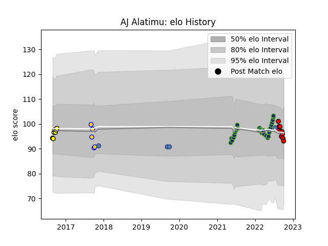

---  
layout: page  
title: AJ Alatimu  
date: 2023-03-17 17:34:08.760522  
categories: player  
---
# AJ Alatimu

## Positions: FH, C

## Country: Samoa

## Current elo: 93.0

## Current Percentile: 45.0

# Elo History

# Match History

| Team              |   Appearances |   Win Rate |
|:------------------|--------------:|-----------:|
| Seattle Seawolves |            29 |   0.448276 |
| Counties Manukau  |            10 |   0.3      |
| Perth Spirit      |             7 |   0.714286 |
| Brisbane City     |             5 |   0.6      |
| Samoa             |             4 |   0.5      |

| Opponent               |   Matches |   Win Rate |
|:-----------------------|----------:|-----------:|
| San Diego Legion       |         5 |   0.8      |
| Houston SaberCats      |         4 |   0.75     |
| L. A. Giltinis         |         3 |   0.333333 |
| Austin Gilgronis       |         3 |   0        |
| Canberra Vikings       |         2 |   1        |
| Utah Warriors          |         2 |   0.5      |
| R.U. New York          |         2 |   0        |
| Rugby New York         |         2 |   0        |
| NOLA Gold              |         2 |   0.5      |
| Queensland Country     |         2 |   0.5      |
| Dallas Jackals         |         2 |   1        |
| Perth Spirit           |         1 |   0        |
| Sydney Rays            |         1 |   1        |
| Toronto Arrows         |         1 |   1        |
| Scotland               |         1 |   0        |
| Taranaki               |         1 |   0        |
| Waikato                |         1 |   0        |
| Russia                 |         1 |   1        |
| Tonga                  |         1 |   1        |
| Rugby ATL              |         1 |   0        |
| Southland              |         1 |   0        |
| North Harbour Rays     |         1 |   0        |
| Otago                  |         1 |   1        |
| Old Glory DC           |         1 |   0        |
| Australia              |         1 |   0        |
| North Harbour          |         1 |   0        |
| New England Free Jacks |         1 |   0        |
| NSW Country Eagles     |         1 |   0        |
| Melbourne Rising       |         1 |   1        |
| Manawatu               |         1 |   1        |
| Hawke's Bay            |         1 |   0        |
| Greater Sydney Rams    |         1 |   1        |
| Fijian Drua            |         1 |   1        |
| Canterbury             |         1 |   0        |
| Brisbane City          |         1 |   1        |
| Bay of Plenty          |         1 |   1        |
| Wellington             |         1 |   0        |