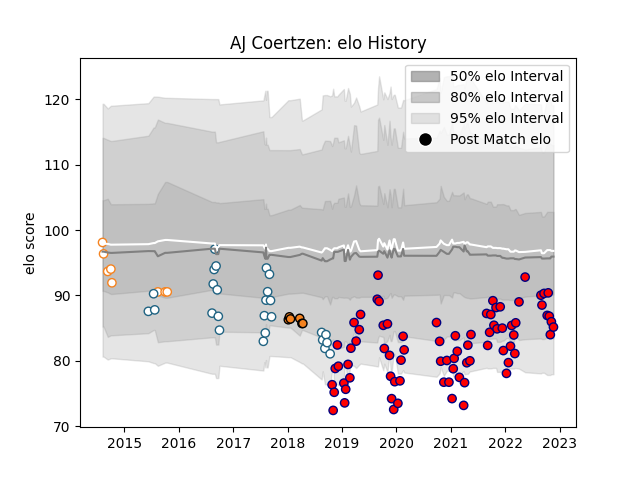

---  
layout: page  
title: AJ Coertzen  
date: 2022-12-09 13:07:33.085898  
categories: player  
---
# AJ Coertzen

## Positions: W, FB

## Current elo: 83.0

## Current Percentile: 14.0

# Elo History

# Match History

| Team                |   Appearances |   Win Rate |
|:--------------------|--------------:|-----------:|
| Aurillac            |            80 |   0.54375  |
| Griquas             |            26 |   0.346154 |
| Free State Cheetahs |             8 |   0.25     |
| Cheetahs            |             6 |   0.666667 |

| Opponent                   |   Matches |   Win Rate |
|:---------------------------|----------:|-----------:|
| Beziers                    |         9 |   0.444444 |
| Colomiers                  |         6 |   0.666667 |
| Provence Rugby             |         6 |   0.833333 |
| Montauban                  |         6 |   0.333333 |
| Golden Lions               |         6 |   0.166667 |
| Mont-de-Marsan             |         5 |   0.2      |
| Vannes                     |         5 |   0.4      |
| Rouen                      |         5 |   0.6      |
| Pumas                      |         5 |   0.3      |
| Nevers                     |         5 |   0.4      |
| Natal Sharks               |         5 |   0.1      |
| Western Province           |         5 |   0.2      |
| Biarritz Olympique         |         5 |   0.2      |
| Oyonnax                    |         4 |   0.75     |
| Blue Bulls                 |         4 |   0        |
| Free State Cheetahs        |         3 |   0.666667 |
| US Bressane                |         3 |   0.666667 |
| Massy                      |         3 |   1        |
| Carcassonne                |         3 |   0.666667 |
| Perpignan                  |         2 |   0.25     |
| Valence Romans Drome Rugby |         2 |   0.5      |
| Soyaux-Angouleme           |         2 |   1        |
| Southern Kings             |         2 |   1        |
| Agen                       |         2 |   0.5      |
| Narbonne                   |         2 |   1        |
| Bayonne                    |         2 |   0.5      |
| Grenoble                   |         2 |   0.5      |
| Border Bulldogs            |         1 |   0        |
| Eastern Province Kings     |         1 |   1        |
| Brive                      |         1 |   1        |
| Boland Cavaliers           |         1 |   1        |
| Munster                    |         1 |   0        |
| SWD Eagles                 |         1 |   1        |
| Griquas                    |         1 |   1        |
| Cardiff Blues              |         1 |   1        |
| Valke                      |         1 |   1        |
| Benetton Treviso           |         1 |   0        |
| Dragons                    |         1 |   1        |