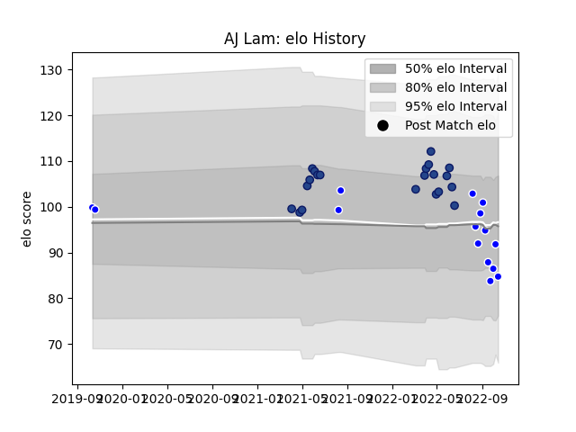

---  
layout: page  
title: AJ Lam  
date: 2023-03-17 17:22:38.052114  
categories: player  
---
# AJ Lam

## Positions: W, C

## Current elo: 91.0

## Current Percentile: 19.0

# Elo History

# Match History

| Team     |   Appearances |   Win Rate |
|:---------|--------------:|-----------:|
| Blues    |            23 |   0.913043 |
| Auckland |            15 |   0.533333 |

| Opponent                 |   Matches |   Win Rate |
|:-------------------------|----------:|-----------:|
| Tasman                   |         3 |   0.333333 |
| Chiefs                   |         3 |   1        |
| Crusaders                |         3 |   0.333333 |
| Highlanders              |         3 |   1        |
| New South Wales Waratahs |         2 |   1        |
| Moana Pasifika           |         2 |   1        |
| Taranaki                 |         2 |   1        |
| North Harbour            |         2 |   1        |
| Brumbies                 |         2 |   1        |
| Western Force            |         2 |   1        |
| Melbourne Rebels         |         2 |   1        |
| Hurricanes               |         2 |   1        |
| Canterbury               |         2 |   0.5      |
| Northland                |         1 |   0        |
| Otago                    |         1 |   1        |
| Queensland Reds          |         1 |   1        |
| Southland                |         1 |   1        |
| Fijian Drua              |         1 |   1        |
| Waikato                  |         1 |   0        |
| Wellington               |         1 |   0        |
| Bay of Plenty            |         1 |   0        |