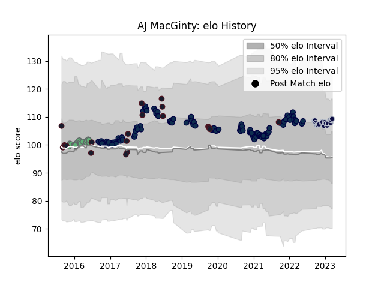

---  
layout: page  
title: AJ MacGinty  
date: 2022-12-09 13:19:55.749251  
categories: player  
---
# AJ MacGinty

## Positions: FH

## Country: United States of America

## Current elo: 99.0

## Current Percentile: 51.0

# Elo History

# Match History

| Team                     |   Appearances |   Win Rate |
|:-------------------------|--------------:|-----------:|
| Sale Sharks              |           102 |   0.539216 |
| United States of America |            23 |   0.434783 |
| Connacht                 |            17 |   0.705882 |
| Bristol Rugby            |             9 |   0.388889 |

| Opponent           |   Matches |   Win Rate |
|:-------------------|----------:|-----------:|
| Worcester Warriors |        12 |   0.708333 |
| Wasps              |        12 |   0.666667 |
| Exeter Chiefs      |        10 |   0.1      |
| Bath Rugby         |         9 |   0.555556 |
| Harlequins         |         9 |   0.555556 |
| Northampton Saints |         8 |   0.5      |
| Leicester Tigers   |         8 |   0.6875   |
| Gloucester Rugby   |         8 |   0.625    |
| Newcastle Falcons  |         7 |   0.285714 |
| Bristol Rugby      |         7 |   0.5      |
| London Irish       |         6 |   0.833333 |
| Saracens           |         6 |   0.166667 |
| Canada             |         5 |   0.9      |
| Glasgow Warriors   |         3 |   0.666667 |
| Leinster           |         3 |   0.666667 |
| La Rochelle        |         3 |   0.333333 |
| Scotland           |         2 |   0.5      |
| Scarlets           |         2 |   0.5      |
| Benetton Treviso   |         2 |   0.5      |
| Cardiff Blues      |         2 |   1        |
| RC Enisei          |         2 |   1        |
| Russia             |         2 |   1        |
| Georgia            |         2 |   0        |
| Sale Sharks        |         1 |   0        |
| Samoa              |         1 |   0        |
| Ulster             |         1 |   0        |
| Tonga              |         1 |   0        |
| Ospreys            |         1 |   1        |
| Portugal           |         1 |   0.5      |
| Argentina          |         1 |   0        |
| Kenya              |         1 |   1        |
| Munster            |         1 |   1        |
| Australia          |         1 |   0        |
| Japan              |         1 |   0        |
| Italy              |         1 |   0        |
| Ireland            |         1 |   0        |
| Germany            |         1 |   1        |
| France             |         1 |   0        |
| England            |         1 |   0        |
| Edinburgh          |         1 |   1        |
| Dragons            |         1 |   1        |
| Connacht           |         1 |   1        |
| Brive              |         1 |   0        |
| Zebre              |         1 |   1        |