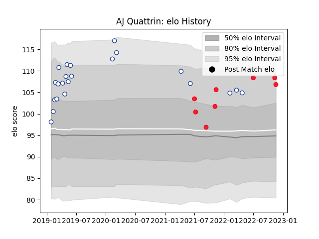

---  
layout: page  
title: AJ Quattrin  
date: 2022-11-15 23:38:32.563831  
categories: player  
---
# AJ Quattrin

## Positions: H

## Country: Canada

## Current elo: 110.0

## Current Percentile: 87.0

# Elo History

# Match History

| Team           |   Appearances |   Win Rate |
|:---------------|--------------:|-----------:|
| Toronto Arrows |            22 |   0.545455 |
| Canada         |             7 |   0.428571 |

| Opponent                 |   Matches |   Win Rate |
|:-------------------------|----------:|-----------:|
| Seattle Seawolves        |         4 |   0.5      |
| Houston SaberCats        |         3 |   0.666667 |
| San Diego Legion         |         3 |   0.666667 |
| NOLA Gold                |         2 |   0        |
| Belgium                  |         2 |   1        |
| Utah Warriors            |         2 |   1        |
| Glendale Raptors         |         2 |   0.5      |
| R.U. New York            |         2 |   0.5      |
| Portugal                 |         1 |   0        |
| United States of America |         1 |   0        |
| Austin Elite Rugby       |         1 |   1        |
| Netherlands              |         1 |   1        |
| Austin Herd              |         1 |   1        |
| L. A. Giltinis           |         1 |   0        |
| England                  |         1 |   0        |
| Colorado Raptors         |         1 |   0        |
| Wales                    |         1 |   0        |