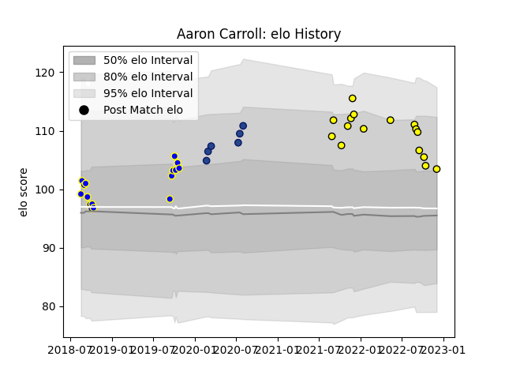

---  
layout: page  
title: Aaron Carroll  
date: 2023-01-13 11:24:29.489036  
categories: player  
---
# Aaron Carroll

## Positions: FL, L

## Current elo: 108.0

## Current Percentile: 83.0

# Elo History

# Match History

| Team          |   Appearances |   Win Rate |
|:--------------|--------------:|-----------:|
| Carcassonne   |            30 |   0.533333 |
| Bay of Plenty |            16 |   0.6875   |
| Blues         |             6 |   0.666667 |

| Opponent         |   Matches |   Win Rate |
|:-----------------|----------:|-----------:|
| Manawatu         |         3 |   0.666667 |
| Beziers          |         3 |   1        |
| Colomiers        |         3 |   0.333333 |
| Provence Rugby   |         3 |   0        |
| Hawke's Bay      |         3 |   0.666667 |
| Montauban        |         3 |   0.666667 |
| Agen             |         2 |   0.5      |
| US Bressane      |         2 |   1        |
| Taranaki         |         2 |   1        |
| Southland        |         2 |   1        |
| Rouen            |         2 |   1        |
| Northland        |         2 |   1        |
| Bayonne          |         2 |   0.5      |
| Mont-de-Marsan   |         2 |   0        |
| Vannes           |         2 |   0.5      |
| Grenoble         |         1 |   1        |
| Bulls            |         1 |   1        |
| Canterbury       |         1 |   0        |
| Stormers         |         1 |   1        |
| Soyaux-Angouleme |         1 |   0        |
| Counties Manukau |         1 |   1        |
| Crusaders        |         1 |   0        |
| Massy            |         1 |   0        |
| Lions            |         1 |   1        |
| Otago            |         1 |   0        |
| Highlanders      |         1 |   1        |
| North Harbour    |         1 |   0        |
| Nevers           |         1 |   1        |
| Narbonne         |         1 |   1        |
| Hurricanes       |         1 |   0        |
| Oyonnax          |         1 |   0        |