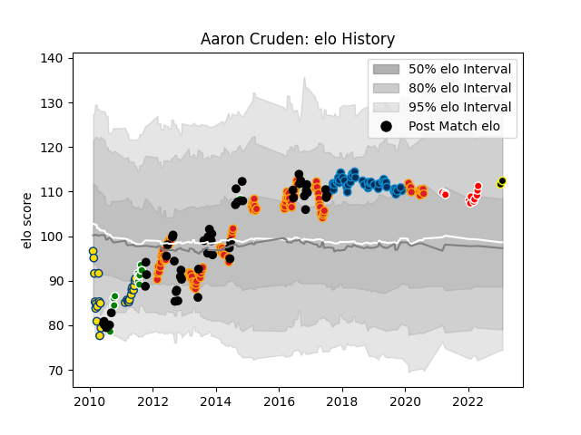

---  
layout: page  
title: Aaron Cruden  
date: 2023-01-13 11:37:50.091561  
categories: player  
---
# Aaron Cruden

## Positions: FH

## Country: New Zealand

## Current elo: 112.0

## Current Percentile: 77.0

# Elo History

# Match History

| Team                  |   Appearances |   Win Rate |
|:----------------------|--------------:|-----------:|
| Chiefs                |           100 |   0.665    |
| New Zealand           |            54 |   0.916667 |
| Montpellier Herault   |            47 |   0.510638 |
| Hurricanes            |            26 |   0.461538 |
| Manawatu              |            15 |   0.6      |
| Kobelco Kobe Steelers |            11 |   0.5      |
| Tokyo Sungoliath      |             1 |   1        |

| Opponent                          |   Matches |   Win Rate |
|:----------------------------------|----------:|-----------:|
| Crusaders                         |        18 |   0.583333 |
| Highlanders                       |        15 |   0.4      |
| Blues                             |        15 |   0.7      |
| Australia                         |        14 |   0.928571 |
| Hurricanes                        |        12 |   0.583333 |
| Brumbies                          |         8 |   0.625    |
| Western Force                     |         7 |   0.857143 |
| Stormers                          |         7 |   0.571429 |
| New South Wales Waratahs          |         7 |   0.428571 |
| South Africa                      |         7 |   1        |
| Ireland                           |         6 |   0.833333 |
| England                           |         6 |   0.833333 |
| Sharks                            |         6 |   0.666667 |
| Cheetahs                          |         6 |   0.75     |
| Bulls                             |         5 |   0.5      |
| Queensland Reds                   |         5 |   0.6      |
| France                            |         5 |   1        |
| Lyon                              |         5 |   0.2      |
| Argentina                         |         5 |   1        |
| Wales                             |         5 |   1        |
| Clermont Auvergne                 |         4 |   0.75     |
| Racing 92                         |         4 |   0.25     |
| Bordeaux Begles                   |         4 |   0.625    |
| Melbourne Rebels                  |         4 |   0.75     |
| Lions                             |         4 |   0.75     |
| Agen                              |         4 |   0.5      |
| Castres Olympique                 |         4 |   0.25     |
| British and Irish Lions           |         3 |   0.5      |
| Saitama Wild Knights              |         3 |   0.166667 |
| Chiefs                            |         3 |   0.833333 |
| La Rochelle                       |         3 |   0.666667 |
| Hawke's Bay                       |         3 |   0.666667 |
| Toulon                            |         3 |   0.5      |
| Otago                             |         3 |   0.333333 |
| Stade Francais Paris              |         3 |   0.666667 |
| Stade Toulousain                  |         2 |   0.5      |
| Pau                               |         2 |   1        |
| Southern Kings                    |         2 |   1        |
| Tasman                            |         2 |   1        |
| Glasgow Warriors                  |         2 |   1        |
| Waikato                           |         2 |   0.5      |
| Taranaki                          |         2 |   0.5      |
| Italy                             |         2 |   1        |
| Kubota Spears Funabashi Tokyo-Bay |         2 |   0.5      |
| United States of America          |         1 |   1        |
| Sunwolves                         |         1 |   1        |
| Tokyo Sungoliath                  |         1 |   0        |
| Urayasu D-Rocks                   |         1 |   0        |
| Leinster                          |         1 |   0        |
| Oyonnax                           |         1 |   1        |
| Northland                         |         1 |   1        |
| North Harbour                     |         1 |   1        |
| Newcastle Falcons                 |         1 |   0        |
| NTT Docomo Red Hurricanes Osaka   |         1 |   1        |
| Jaguares                          |         1 |   1        |
| Hino Red Dolphins                 |         1 |   1        |
| Grenoble                          |         1 |   1        |
| Green Rockets Tokatsu             |         1 |   1        |
| Exeter Chiefs                     |         1 |   0        |
| Counties Manukau                  |         1 |   0        |
| Connacht                          |         1 |   0        |
| Brive                             |         1 |   1        |
| Black Rams Tokyo                  |         1 |   1        |
| Yokohama Canon Eagles             |         1 |   1        |