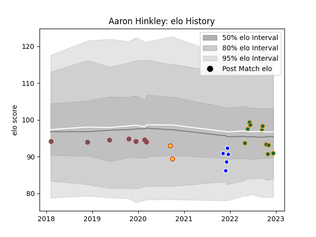

---  
layout: page  
title: Aaron Hinkley  
date: 2022-12-14 11:28:17.752789  
categories: player  
---
# Aaron Hinkley

## Positions: FL

## Current elo: 91.0

## Current Percentile: 39.0

# Elo History

# Match History

| Team               |   Appearances |   Win Rate |
|:-------------------|--------------:|-----------:|
| Northampton Saints |            10 |   0.6      |
| Gloucester Rugby   |             7 |   0.142857 |
| Coventry           |             5 |   0.4      |
| Exeter Chiefs      |             2 |   0        |

| Opponent          |   Matches |   Win Rate |
|:------------------|----------:|-----------:|
| London Irish      |         3 |   0.333333 |
| Newcastle Falcons |         3 |   0.666667 |
| Sale Sharks       |         3 |   0.333333 |
| Exeter Chiefs     |         2 |   0.5      |
| Saracens          |         2 |   0        |
| Bedford           |         1 |   1        |
| Bristol Rugby     |         1 |   1        |
| Connacht          |         1 |   0        |
| Doncaster         |         1 |   0        |
| Harlequins        |         1 |   1        |
| Jersey            |         1 |   0        |
| La Rochelle       |         1 |   0        |
| Leicester Tigers  |         1 |   0        |
| London Scottish   |         1 |   0        |
| Nottingham        |         1 |   1        |
| Wasps             |         1 |   0        |