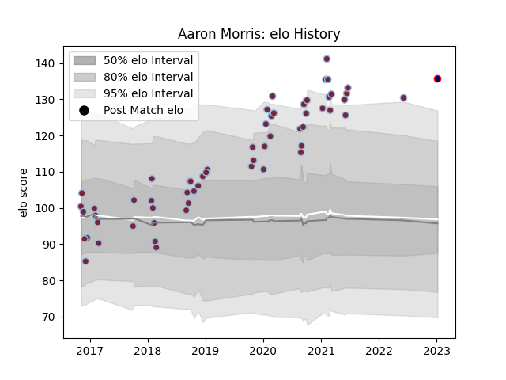

---  
layout: page  
title: Aaron Morris  
date: 2023-02-02 19:06:38.386076  
categories: player  
---
# Aaron Morris

## Positions: FB, W

## Current elo: 136.0

## Current Percentile: 98.0

# Elo History

# Match History

| Team            |   Appearances |   Win Rate |
|:----------------|--------------:|-----------:|
| Harlequins      |            60 |   0.491667 |
| London Scottish |             2 |   0        |

| Opponent           |   Matches |   Win Rate |
|:-------------------|----------:|-----------:|
| Bath Rugby         |         7 |   0.571429 |
| Sale Sharks        |         6 |   0.5      |
| Northampton Saints |         6 |   0.333333 |
| Newcastle Falcons  |         6 |   0.5      |
| Leicester Tigers   |         5 |   0.4      |
| London Irish       |         4 |   0.375    |
| Exeter Chiefs      |         4 |   0.5      |
| Bristol Rugby      |         4 |   0.5      |
| Wasps              |         3 |   0.333333 |
| Gloucester Rugby   |         2 |   1        |
| Grenoble           |         2 |   0.5      |
| Saracens           |         2 |   0.5      |
| Worcester Warriors |         2 |   0.5      |
| Hartpury College   |         1 |   0        |
| La Rochelle        |         1 |   0        |
| Bedford            |         1 |   0        |
| Clermont Auvergne  |         1 |   0        |
| Ospreys            |         1 |   1        |
| Racing 92          |         1 |   0        |
| Benetton Treviso   |         1 |   1        |
| Scarlets           |         1 |   1        |
| Timisoara Saracens |         1 |   1        |