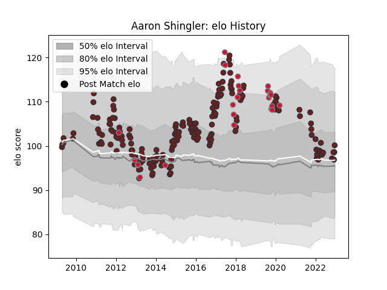

---  
layout: page  
title: Aaron Shingler  
date: 2023-01-06 00:17:06.314250  
categories: player  
---
# Aaron Shingler

## Positions: FL

## Country: Wales

## Current elo: 106.0

## Current Percentile: 55.0

# Elo History

# Match History

| Team     |   Appearances |   Win Rate |
|:---------|--------------:|-----------:|
| Scarlets |           199 |   0.540201 |
| Wales    |            26 |   0.5      |

| Opponent           |   Matches |   Win Rate |
|:-------------------|----------:|-----------:|
| Ospreys            |        18 |   0.416667 |
| Leinster           |        17 |   0.235294 |
| Munster            |        15 |   0.2      |
| Dragons            |        15 |   0.733333 |
| Connacht           |        13 |   0.615385 |
| Ulster             |        13 |   0.5      |
| Glasgow Warriors   |        13 |   0.846154 |
| Cardiff Blues      |        12 |   0.833333 |
| Benetton Treviso   |        11 |   0.818182 |
| Edinburgh          |        11 |   0.681818 |
| Zebre              |         9 |   0.944444 |
| Toulon             |         7 |   0.285714 |
| Northampton Saints |         5 |   0.2      |
| England            |         5 |   0.4      |
| Racing 92          |         4 |   0.375    |
| Clermont Auvergne  |         3 |   0        |
| Sale Sharks        |         3 |   0.333333 |
| Saracens           |         3 |   0.166667 |
| New Zealand        |         3 |   0        |
| Harlequins         |         3 |   0.5      |
| Ireland            |         3 |   0        |
| Australia          |         3 |   0.333333 |
| South Africa       |         3 |   0.333333 |
| London Irish       |         2 |   1        |
| Stormers           |         2 |   0        |
| Scotland           |         2 |   1        |
| Aironi             |         2 |   1        |
| France             |         2 |   1        |
| Bath Rugby         |         2 |   0.5      |
| Cheetahs           |         2 |   1        |
| Castres Olympique  |         2 |   1        |
| Leicester Tigers   |         2 |   0.5      |
| Lions              |         1 |   0        |
| Southern Kings     |         1 |   1        |
| Yorkshire Carnegie |         1 |   1        |
| Uruguay            |         1 |   1        |
| Bayonne            |         1 |   1        |
| Tonga              |         1 |   1        |
| Bordeaux Begles    |         1 |   0        |
| Sharks             |         1 |   0        |
| Bristol Rugby      |         1 |   0        |
| Bulls              |         1 |   0        |
| Samoa              |         1 |   1        |
| Exeter Chiefs      |         1 |   0        |
| Fiji               |         1 |   1        |
| Georgia            |         1 |   1        |
| La Rochelle        |         1 |   1        |