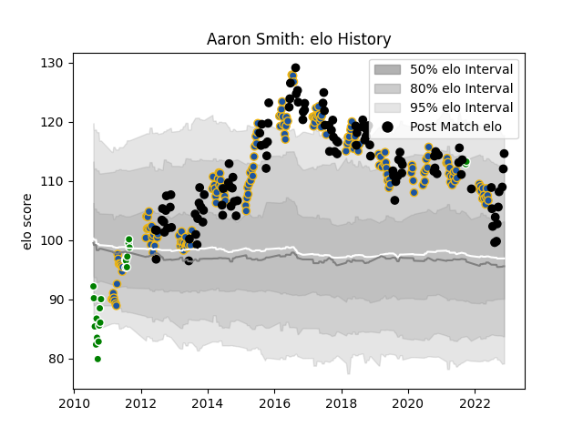

---  
layout: page  
title: Aaron Smith  
date: 2023-03-11 00:15:27.579746  
categories: player  
---
# Aaron Smith

## Positions: SH

## Country: New Zealand

## Current elo: 100.0

## Current Percentile: 53.0

# Elo History

# Match History

| Team        |   Appearances |   Win Rate |
|:------------|--------------:|-----------:|
| Highlanders |           180 |   0.516667 |
| New Zealand |           118 |   0.838983 |
| Manawatu    |            25 |   0.48     |

| Opponent                 |   Matches |   Win Rate |
|:-------------------------|----------:|-----------:|
| Australia                |        32 |   0.859375 |
| Blues                    |        24 |   0.5      |
| Crusaders                |        24 |   0.25     |
| Chiefs                   |        23 |   0.543478 |
| Hurricanes               |        22 |   0.454545 |
| South Africa             |        17 |   0.794118 |
| Argentina                |        15 |   0.866667 |
| New South Wales Waratahs |        11 |   0.545455 |
| Ireland                  |        11 |   0.636364 |
| France                   |        10 |   0.9      |
| England                  |        10 |   0.75     |
| Brumbies                 |         9 |   0.777778 |
| Queensland Reds          |         9 |   0.555556 |
| Melbourne Rebels         |         9 |   0.666667 |
| Wales                    |         8 |   1        |
| Sharks                   |         8 |   0.375    |
| Western Force            |         8 |   0.625    |
| Bulls                    |         8 |   0.6875   |
| Stormers                 |         7 |   0.428571 |
| Lions                    |         6 |   0.333333 |
| Cheetahs                 |         5 |   0.8      |
| Otago                    |         3 |   0.666667 |
| British and Irish Lions  |         3 |   0.5      |
| Hawke's Bay              |         3 |   0.333333 |
| Northland                |         3 |   0.666667 |
| Wellington               |         2 |   1        |
| Waikato                  |         2 |   0.5      |
| Tonga                    |         2 |   1        |
| Tasman                   |         2 |   1        |
| Taranaki                 |         2 |   0.5      |
| Sunwolves                |         2 |   1        |
| Canterbury               |         2 |   0        |
| North Harbour            |         2 |   0.5      |
| Japan                    |         2 |   1        |
| Jaguares                 |         2 |   1        |
| Italy                    |         2 |   1        |
| Fiji                     |         2 |   1        |
| Samoa                    |         1 |   1        |
| Scotland                 |         1 |   1        |
| Namibia                  |         1 |   1        |
| Moana Pasifika           |         1 |   1        |
| Southern Kings           |         1 |   0        |
| Southland                |         1 |   0        |
| Counties Manukau         |         1 |   0        |
| Auckland                 |         1 |   0        |
| Bay of Plenty            |         1 |   0        |
| Fijian Drua              |         1 |   1        |
| Georgia                  |         1 |   1        |