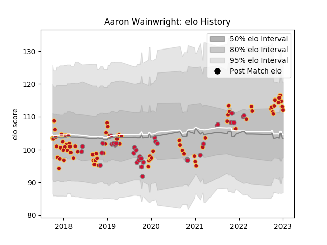

---  
layout: page  
title: Aaron Wainwright  
date: 2022-12-18 16:15:05.803477  
categories: player  
---
# Aaron Wainwright

## Positions: FL, N8

## Country: Wales

## Current elo: 107.0

## Current Percentile: 85.0

# Elo History

# Match History

| Team    |   Appearances |   Win Rate |
|:--------|--------------:|-----------:|
| Dragons |            74 |   0.297297 |
| Wales   |            34 |   0.661765 |

| Opponent           |   Matches |   Win Rate |
|:-------------------|----------:|-----------:|
| Ospreys            |        10 |   0.45     |
| Scarlets           |         9 |   0.333333 |
| Cardiff Blues      |         7 |   0        |
| Ireland            |         5 |   0.2      |
| Leinster           |         5 |   0        |
| Scotland           |         5 |   0.8      |
| Benetton Treviso   |         4 |   0        |
| Southern Kings     |         4 |   0.625    |
| South Africa       |         4 |   0.5      |
| France             |         4 |   0.5      |
| RC Enisei          |         3 |   1        |
| Worcester Warriors |         3 |   0.666667 |
| Munster            |         3 |   0.333333 |
| England            |         3 |   0.666667 |
| Italy              |         3 |   1        |
| Glasgow Warriors   |         3 |   0.166667 |
| Argentina          |         2 |   0.75     |
| Northampton Saints |         2 |   0        |
| Stormers           |         2 |   0        |
| Newcastle Falcons  |         2 |   0        |
| Zebre              |         2 |   1        |
| Bordeaux Begles    |         2 |   0.5      |
| Edinburgh          |         2 |   0.5      |
| Clermont Auvergne  |         2 |   0        |
| Australia          |         2 |   1        |
| Cheetahs           |         2 |   0        |
| New Zealand        |         1 |   0        |
| Canada             |         1 |   1        |
| Uruguay            |         1 |   1        |
| Ulster             |         1 |   0.5      |
| Tonga              |         1 |   1        |
| Bristol Rugby      |         1 |   0        |
| Sharks             |         1 |   0        |
| Connacht           |         1 |   1        |
| Saracens           |         1 |   0        |
| Pau                |         1 |   0        |
| Fiji               |         1 |   1        |
| Georgia            |         1 |   1        |
| Lions              |         1 |   0        |