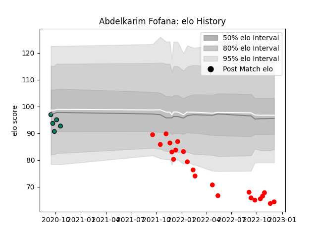

---  
layout: page  
title: Abdelkarim Fofana  
date: 2023-01-13 11:39:40.459689  
categories: player  
---
# Abdelkarim Fofana

## Positions: N8, FL

## Current elo: 70.0

## Current Percentile: 4.0

# Elo History

# Match History

| Team     |   Appearances |   Win Rate |
|:---------|--------------:|-----------:|
| Rouen    |            34 |   0.397059 |
| Suresnes |             5 |   0.6      |

| Opponent                   |   Matches |   Win Rate |
|:---------------------------|----------:|-----------:|
| Agen                       |         3 |   0.333333 |
| Colomiers                  |         3 |   0.333333 |
| Narbonne                   |         3 |   0.666667 |
| Montauban                  |         3 |   0.333333 |
| Carcassonne                |         3 |   0        |
| Mont-de-Marsan             |         3 |   0.333333 |
| US Bressane                |         2 |   0.25     |
| Provence Rugby             |         2 |   0.5      |
| Nevers                     |         2 |   0        |
| Vannes                     |         2 |   1        |
| Beziers                    |         2 |   0.5      |
| Bayonne                    |         2 |   0        |
| Aurillac                   |         2 |   0.5      |
| Aubenas                    |         1 |   0        |
| Cognac Saint Jean d'Angély |         1 |   0        |
| Blagnac                    |         1 |   1        |
| Biarritz Olympique         |         1 |   1        |
| Oyonnax                    |         1 |   1        |
| Soyaux-Angouleme           |         1 |   1        |
| Dijon                      |         1 |   1        |