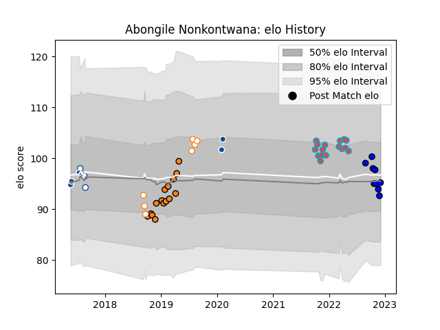

---  
layout: page  
title: Abongile Nonkontwana  
date: 2023-03-17 17:00:17.425305  
categories: player  
---
# Abongile Nonkontwana

## Positions: FL, L

## Current elo: 73.0

## Current Percentile: 10.0

# Elo History

# Match History

| Team                |   Appearances |   Win Rate |
|:--------------------|--------------:|-----------:|
| Bourgoin-Jallieu    |            19 |   0.473684 |
| Cheetahs            |            15 |   0.533333 |
| Free State Cheetahs |            12 |   0.5      |
| Massy               |            10 |   0.2      |
| Blue Bulls          |             6 |   0.333333 |
| Bulls               |             5 |   0        |

| Opponent                   |   Matches |   Win Rate |
|:---------------------------|----------:|-----------:|
| Natal Sharks               |         4 |   0.25     |
| Golden Lions               |         4 |   0.5      |
| Griquas                    |         3 |   0.666667 |
| Southern Kings             |         3 |   1        |
| Cognac Saint Jean d'Angély |         2 |   1        |
| Nice                       |         2 |   0.5      |
| Massy                      |         2 |   0        |
| Albi                       |         2 |   0        |
| Pumas                      |         2 |   0        |
| Connacht                   |         2 |   0        |
| Zebre                      |         2 |   1        |
| Chambery                   |         2 |   0.5      |
| Soyaux-Angouleme           |         2 |   0        |
| Stormers                   |         2 |   0        |
| Suresnes                   |         2 |   0.5      |
| Blagnac                    |         2 |   0.5      |
| Western Province           |         2 |   0.5      |
| Dax                        |         2 |   0.5      |
| Munster                    |         1 |   0        |
| Sharks                     |         1 |   0        |
| Scarlets                   |         1 |   0        |
| SWD Eagles                 |         1 |   1        |
| Rouen                      |         1 |   0        |
| Valence Romans Drome Rugby |         1 |   1        |
| Ospreys                    |         1 |   0        |
| Vannes                     |         1 |   0        |
| Agen                       |         1 |   0        |
| Montauban                  |         1 |   0        |
| Mont-de-Marsan             |         1 |   1        |
| Lions                      |         1 |   0        |
| Glasgow Warriors           |         1 |   0        |
| Free State Cheetahs        |         1 |   0        |
| Edinburgh                  |         1 |   0        |
| Dragons                    |         1 |   1        |
| Dijon                      |         1 |   1        |
| Colomiers                  |         1 |   0        |
| Cardiff Blues              |         1 |   1        |
| Carcassonne                |         1 |   1        |
| Blue Bulls                 |         1 |   1        |
| Biarritz Olympique         |         1 |   0        |
| Beziers                    |         1 |   0        |
| Benetton Treviso           |         1 |   1        |
| Hurricanes                 |         1 |   0        |