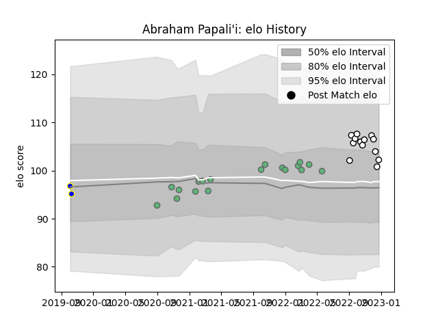

---  
layout: page  
title: Abraham Papali'i  
date: 2022-12-09 13:18:53.633325  
categories: player  
---
# Abraham Papali'i

## Positions: N8

## Current elo: 104.0

## Current Percentile: 73.0

# Elo History

# Match History

| Team          |   Appearances |   Win Rate |
|:--------------|--------------:|-----------:|
| Connacht      |            17 |   0.588235 |
| Brive         |            10 |   0.2      |
| Bay of Plenty |             2 |   1        |

| Opponent             |   Matches |   Win Rate |
|:---------------------|----------:|-----------:|
| Munster              |         3 |   0.333333 |
| Edinburgh            |         3 |   0.333333 |
| Scarlets             |         3 |   0.333333 |
| Zebre                |         2 |   1        |
| Cardiff Blues        |         1 |   1        |
| Castres Olympique    |         1 |   0        |
| Stormers             |         1 |   1        |
| Stade Toulousain     |         1 |   0        |
| Stade Francais Paris |         1 |   0        |
| Southland            |         1 |   1        |
| Bordeaux Begles      |         1 |   0        |
| Racing 92            |         1 |   0        |
| Perpignan            |         1 |   1        |
| Pau                  |         1 |   0        |
| Ospreys              |         1 |   0        |
| Benetton Treviso     |         1 |   1        |
| Montpellier Herault  |         1 |   0        |
| Manawatu             |         1 |   1        |
| Lyon                 |         1 |   0        |
| Bulls                |         1 |   1        |
| Dragons              |         1 |   1        |
| Bayonne              |         1 |   1        |