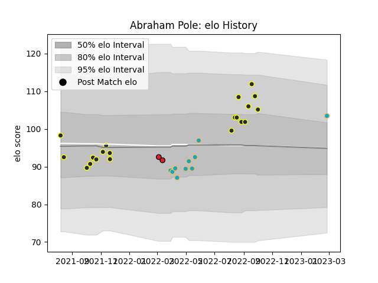

---  
layout: page  
title: Abraham Pole  
date: 2023-03-02 11:27:11.327684  
categories: player  
---
# Abraham Pole

## Positions: P

## Current elo: 104.0

## Current Percentile: 82.0

# Elo History

# Match History

| Team           |   Appearances |   Win Rate |
|:---------------|--------------:|-----------:|
| Otago          |            20 |       0.45 |
| Moana Pasifika |            10 |       0.1  |
| Crusaders      |             2 |       0.5  |

| Opponent                 |   Matches |   Win Rate |
|:-------------------------|----------:|-----------:|
| Manawatu                 |         3 |   0.666667 |
| Taranaki                 |         3 |   0        |
| Blues                    |         2 |   0        |
| Waikato                  |         2 |   0.5      |
| Canterbury               |         2 |   0.5      |
| Fijian Drua              |         2 |   0        |
| Hawke's Bay              |         2 |   0.5      |
| Southland                |         2 |   1        |
| Moana Pasifika           |         1 |   1        |
| Tasman                   |         1 |   1        |
| Queensland Reds          |         1 |   0        |
| Northland                |         1 |   1        |
| New South Wales Waratahs |         1 |   0        |
| Auckland                 |         1 |   0        |
| Melbourne Rebels         |         1 |   0        |
| Bay of Plenty            |         1 |   0        |
| Hurricanes               |         1 |   0        |
| Highlanders              |         1 |   0        |
| Counties Manukau         |         1 |   0        |
| Chiefs                   |         1 |   0        |
| Brumbies                 |         1 |   1        |
| Wellington               |         1 |   0        |