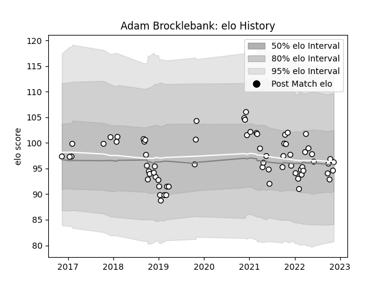

---  
layout: page  
title: Adam Brocklebank  
date: 2022-12-09 13:18:50.961993  
categories: player  
---
# Adam Brocklebank

## Positions: P

## Current elo: 91.0

## Current Percentile: 37.0

# Elo History

# Match History

| Team              |   Appearances |   Win Rate |
|:------------------|--------------:|-----------:|
| Newcastle Falcons |            71 |   0.443662 |

| Opponent            |   Matches |   Win Rate |
|:--------------------|----------:|-----------:|
| Bath Rugby          |         8 |       0.5  |
| Gloucester Rugby    |         6 |       0.5  |
| Worcester Warriors  |         6 |       0.75 |
| Northampton Saints  |         5 |       0.4  |
| Wasps               |         5 |       0.6  |
| Bristol Rugby       |         5 |       0.4  |
| Saracens            |         5 |       0    |
| Exeter Chiefs       |         4 |       0.5  |
| Harlequins          |         4 |       0.25 |
| Sale Sharks         |         4 |       0.5  |
| Leicester Tigers    |         3 |       0    |
| London Irish        |         3 |       0    |
| Dragons             |         2 |       1    |
| Toulon              |         2 |       0.5  |
| Montpellier Herault |         2 |       0.5  |
| Cardiff Blues       |         1 |       0    |
| Jersey              |         1 |       1    |
| Cornish Pirates     |         1 |       1    |
| Bordeaux Begles     |         1 |       1    |
| Grenoble            |         1 |       0    |
| Edinburgh           |         1 |       0    |
| Hartpury College    |         1 |       1    |