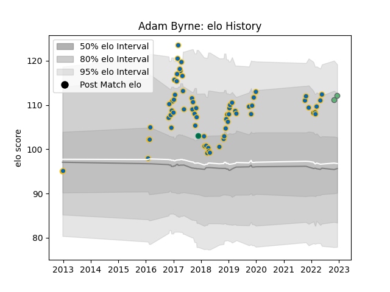

---  
layout: page  
title: Adam Byrne  
date: 2022-12-18 16:24:34.471774  
categories: player  
---
# Adam Byrne

## Positions: W

## Country: Ireland

## Current elo: 113.0

## Current Percentile: 89.0

# Elo History

# Match History

| Team     |   Appearances |   Win Rate |
|:---------|--------------:|-----------:|
| Leinster |            67 |   0.761194 |
| Connacht |             3 |   1        |
| Ireland  |             1 |   1        |

| Opponent            |   Matches |   Win Rate |
|:--------------------|----------:|-----------:|
| Zebre               |         8 |   1        |
| Ulster              |         8 |   0.5      |
| Connacht            |         6 |   0.833333 |
| Cardiff Blues       |         5 |   0.8      |
| Dragons             |         5 |   0.8      |
| Glasgow Warriors    |         5 |   0.6      |
| Scarlets            |         5 |   0.5      |
| Benetton Treviso    |         4 |   0.75     |
| Ospreys             |         4 |   0.75     |
| Munster             |         3 |   1        |
| Northampton Saints  |         2 |   1        |
| Wasps               |         2 |   1        |
| Southern Kings      |         2 |   1        |
| Montpellier Herault |         2 |   1        |
| Edinburgh           |         2 |   0.5      |
| Newcastle Falcons   |         1 |   1        |
| Bath Rugby          |         1 |   1        |
| Lions               |         1 |   1        |
| Stade Toulousain    |         1 |   1        |
| Stormers            |         1 |   0        |
| Castres Olympique   |         1 |   0.5      |
| Brive               |         1 |   1        |
| Argentina           |         1 |   1        |