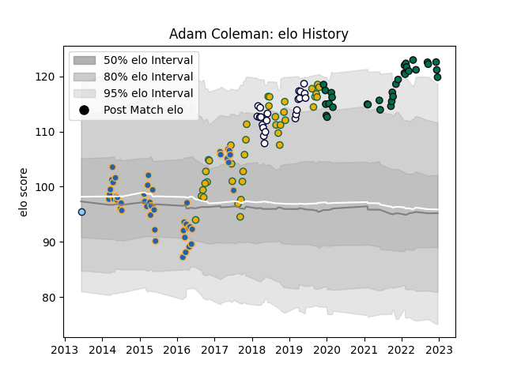

---  
layout: page  
title: Adam Coleman  
date: 2022-12-18 16:28:52.754552  
categories: player  
---
# Adam Coleman

## Positions: L

## Country: Australia

## Current elo: 120.0

## Current Percentile: 96.0

# Elo History

# Match History

| Team                     |   Appearances |   Win Rate |
|:-------------------------|--------------:|-----------:|
| Western Force            |            46 |   0.369565 |
| Australia                |            38 |   0.526316 |
| London Irish             |            32 |   0.421875 |
| Melbourne Rebels         |            22 |   0.5      |
| New South Wales Waratahs |             1 |   1        |

| Opponent                 |   Matches |   Win Rate |
|:-------------------------|----------:|-----------:|
| Queensland Reds          |         9 |   0.777778 |
| New South Wales Waratahs |         8 |   0.375    |
| New Zealand              |         8 |   0.25     |
| Melbourne Rebels         |         6 |   0.333333 |
| Argentina                |         6 |   0.833333 |
| Stormers                 |         5 |   0        |
| South Africa             |         5 |   0.4      |
| Brumbies                 |         5 |   0.4      |
| Sunwolves                |         5 |   1        |
| Highlanders              |         5 |   0.4      |
| Bulls                    |         4 |   0.25     |
| Crusaders                |         4 |   0        |
| Gloucester Rugby         |         4 |   0.5      |
| Wales                    |         4 |   0.5      |
| Saracens                 |         3 |   0.5      |
| Northampton Saints       |         3 |   0.333333 |
| Newcastle Falcons        |         3 |   1        |
| Sharks                   |         3 |   0.333333 |
| Worcester Warriors       |         3 |   0.333333 |
| Blues                    |         3 |   0.333333 |
| Ireland                  |         3 |   0.333333 |
| Hurricanes               |         3 |   0        |
| Chiefs                   |         3 |   0.333333 |
| England                  |         3 |   0        |
| Exeter Chiefs            |         2 |   0.5      |
| Leicester Tigers         |         2 |   0        |
| Wasps                    |         2 |   0        |
| Bristol Rugby            |         2 |   0.75     |
| Cheetahs                 |         2 |   0.5      |
| Scotland                 |         2 |   0.5      |
| Lions                    |         2 |   0.5      |
| Fiji                     |         2 |   1        |
| Harlequins               |         2 |   1        |
| Italy                    |         2 |   1        |
| Jaguares                 |         2 |   0.5      |
| Bath Rugby               |         2 |   0        |
| Samoa                    |         1 |   1        |
| Sale Sharks              |         1 |   0.5      |
| Montpellier Herault      |         1 |   0        |
| Toulon                   |         1 |   0        |
| Uruguay                  |         1 |   1        |
| Western Force            |         1 |   1        |
| Japan                    |         1 |   1        |