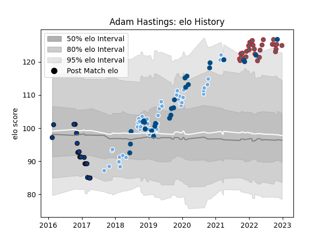

---  
layout: page  
title: Adam Hastings  
date: 2022-12-28 12:55:48.588774  
categories: player  
---
# Adam Hastings

## Positions: FH

## Country: Scotland

## Current elo: 125.0

## Current Percentile: 96.0

# Elo History

# Match History

| Team             |   Appearances |   Win Rate |
|:-----------------|--------------:|-----------:|
| Glasgow Warriors |            51 |   0.607843 |
| Gloucester Rugby |            28 |   0.589286 |
| Scotland         |            27 |   0.648148 |
| Bath Rugby       |            20 |   0.475    |

| Opponent                 |   Matches |   Win Rate |
|:-------------------------|----------:|-----------:|
| Edinburgh                |         9 |   0.333333 |
| Saracens                 |         8 |   0.375    |
| Exeter Chiefs            |         6 |   0.25     |
| Bristol Rugby            |         6 |   0.666667 |
| Cardiff Blues            |         6 |   0.833333 |
| Wasps                    |         5 |   0.4      |
| Sale Sharks              |         4 |   1        |
| Leicester Tigers         |         4 |   0        |
| Harlequins               |         4 |   0.25     |
| France                   |         4 |   0.5      |
| Zebre                    |         4 |   1        |
| Dragons                  |         3 |   0.5      |
| Ulster                   |         3 |   0.666667 |
| Southern Kings           |         3 |   0.666667 |
| Connacht                 |         3 |   0.666667 |
| Georgia                  |         3 |   1        |
| Cheetahs                 |         3 |   1        |
| Italy                    |         3 |   1        |
| Wales                    |         3 |   0.333333 |
| Leinster                 |         3 |   0.333333 |
| London Irish             |         3 |   0.833333 |
| Bath Rugby               |         3 |   1        |
| Northampton Saints       |         3 |   0.666667 |
| Newcastle Falcons        |         2 |   0.5      |
| South Africa             |         2 |   0        |
| Scarlets                 |         2 |   0.5      |
| Worcester Warriors       |         2 |   1        |
| Argentina                |         2 |   1        |
| Munster                  |         2 |   0.5      |
| Lyon                     |         2 |   1        |
| Fiji                     |         2 |   1        |
| England                  |         2 |   0.25     |
| La Rochelle              |         2 |   0.5      |
| Ospreys                  |         1 |   1        |
| Russia                   |         1 |   1        |
| Samoa                    |         1 |   1        |
| Australia                |         1 |   1        |
| Ireland                  |         1 |   0        |
| Gloucester Rugby         |         1 |   0.5      |
| United States of America |         1 |   0        |
| Canada                   |         1 |   1        |
| Brive                    |         1 |   1        |
| Benetton Treviso         |         1 |   0        |