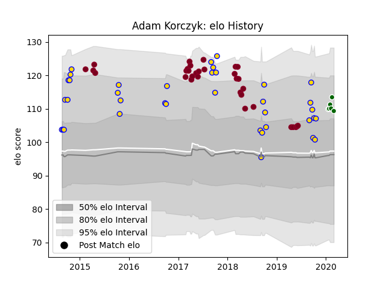

---  
layout: page  
title: Adam Korczyk  
date: 2023-03-12 11:32:36.738119  
categories: player  
---
# Adam Korczyk

## Positions: FL, N8

## Current elo: 109.0

## Current Percentile: 83.0

# Elo History

# Match History

| Team                |   Appearances |   Win Rate |
|:--------------------|--------------:|-----------:|
| Brisbane City       |            37 |   0.635135 |
| Queensland Reds     |            32 |   0.40625  |
| Ealing Trailfinders |             6 |   1        |

| Opponent                 |   Matches |   Win Rate |
|:-------------------------|----------:|-----------:|
| Canberra Vikings         |         6 |   0.666667 |
| Western Force            |         5 |   0        |
| Brumbies                 |         5 |   0.4      |
| Queensland Country       |         4 |   0.5      |
| Melbourne Rising         |         4 |   0.75     |
| Perth Spirit             |         4 |   0.5      |
| NSW Country Eagles       |         4 |   1        |
| Sydney Rays              |         3 |   1        |
| Sunwolves                |         3 |   0.666667 |
| Fijian Drua              |         3 |   0.5      |
| Jaguares                 |         3 |   0.333333 |
| North Harbour Rays       |         2 |   0.5      |
| Sharks                   |         2 |   1        |
| Hurricanes               |         2 |   0        |
| Sydney Stars             |         2 |   1        |
| Lions                    |         2 |   0.5      |
| Bulls                    |         2 |   0.5      |
| Melbourne Rebels         |         2 |   0.5      |
| Blues                    |         2 |   0.5      |
| Greater Sydney Rams      |         2 |   0.5      |
| Stormers                 |         1 |   0        |
| Southern Kings           |         1 |   1        |
| Ampthill                 |         1 |   1        |
| New South Wales Waratahs |         1 |   0        |
| London Scottish          |         1 |   1        |
| Bedford                  |         1 |   1        |
| Highlanders              |         1 |   0        |
| Hartpury College         |         1 |   1        |
| Crusaders                |         1 |   0        |
| Coventry                 |         1 |   1        |
| Chiefs                   |         1 |   0        |
| Cheetahs                 |         1 |   1        |
| Jersey                   |         1 |   1        |