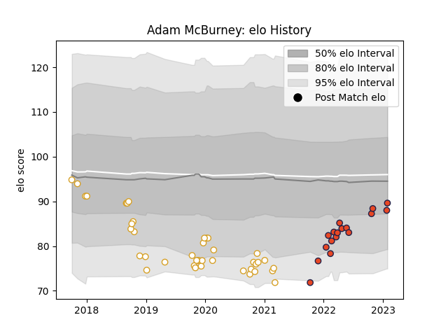

---  
layout: page  
title: Adam McBurney  
date: 2023-01-23 15:33:42.485288  
categories: player  
---
# Adam McBurney

## Positions: H

## Current elo: 88.0

## Current Percentile: 29.0

# Elo History

# Match History

| Team      |   Appearances |   Win Rate |
|:----------|--------------:|-----------:|
| Ulster    |            41 |   0.658537 |
| Edinburgh |            16 |   0.59375  |

| Opponent          |   Matches |   Win Rate |
|:------------------|----------:|-----------:|
| Connacht          |         6 |   0.333333 |
| Leinster          |         5 |   0.2      |
| Munster           |         5 |   0.4      |
| Zebre             |         5 |   0.8      |
| Ospreys           |         4 |   0.5      |
| Glasgow Warriors  |         4 |   0.75     |
| Cardiff Blues     |         3 |   1        |
| Southern Kings    |         3 |   1        |
| Scarlets          |         3 |   0.666667 |
| Stormers          |         2 |   0.25     |
| Clermont Auvergne |         2 |   0.5      |
| Harlequins        |         2 |   1        |
| Dragons           |         2 |   1        |
| Bath Rugby        |         2 |   1        |
| Benetton Treviso  |         1 |   1        |
| London Irish      |         1 |   0        |
| Cheetahs          |         1 |   1        |
| Leicester Tigers  |         1 |   1        |
| Pau               |         1 |   1        |
| Racing 92         |         1 |   0        |
| Saracens          |         1 |   1        |
| Sharks            |         1 |   1        |
| Edinburgh         |         1 |   1        |