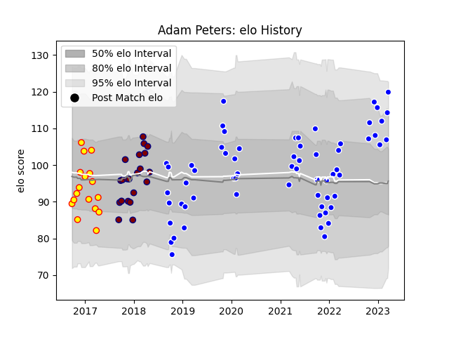

---  
layout: page  
title: Adam Peters  
date: 2022-12-18 16:29:50.602071  
categories: player  
---
# Adam Peters

## Positions: FL, L

## Current elo: 99.0

## Current Percentile: 76.0

# Elo History

# Match History

| Team             |   Appearances |   Win Rate |
|:-----------------|--------------:|-----------:|
| Coventry         |            57 |   0.526316 |
| Rotherham Titans |            20 |   0.1      |
| Richmond         |            15 |   0.333333 |

| Opponent            |   Matches |   Win Rate |
|:--------------------|----------:|-----------:|
| Cornish Pirates     |        11 |  0.545455  |
| Bedford             |        10 |  0.6       |
| London Scottish     |         9 |  0.444444  |
| Yorkshire Carnegie  |         8 |  0.5       |
| Hartpury College    |         8 |  0.25      |
| Doncaster           |         7 |  0.428571  |
| Ealing Trailfinders |         7 |  0.0714286 |
| Jersey              |         7 |  0.285714  |
| Richmond            |         6 |  0.5       |
| Nottingham          |         6 |  0.583333  |
| Ampthill            |         3 |  0.666667  |
| Bristol Rugby       |         2 |  0         |
| Rotherham Titans    |         2 |  0         |
| London Irish        |         2 |  0         |
| London Welsh        |         1 |  0         |
| Newcastle Falcons   |         1 |  0         |
| Caldy               |         1 |  1         |
| Saracens            |         1 |  0         |