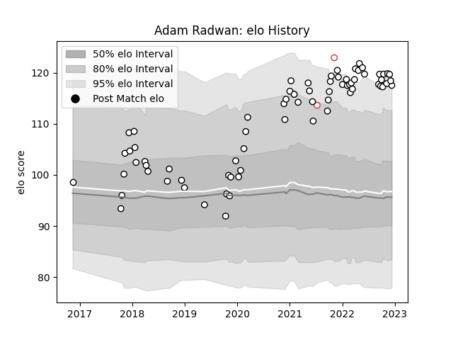

---  
layout: page  
title: Adam Radwan  
date: 2022-12-14 11:32:48.790506  
categories: player  
---
# Adam Radwan

## Positions: W

## Country: England

## Current elo: 118.0

## Current Percentile: 94.0

# Elo History

# Match History

| Team              |   Appearances |   Win Rate |
|:------------------|--------------:|-----------:|
| Newcastle Falcons |            71 |   0.514085 |
| England           |             2 |   1        |

| Opponent            |   Matches |   Win Rate |
|:--------------------|----------:|-----------:|
| Worcester Warriors  |         6 |   0.583333 |
| Bristol Rugby       |         6 |   0.333333 |
| Harlequins          |         5 |   0.2      |
| Saracens            |         5 |   0        |
| London Irish        |         5 |   0.2      |
| Bath Rugby          |         5 |   0.4      |
| Gloucester Rugby    |         4 |   0.5      |
| Wasps               |         4 |   0.75     |
| Northampton Saints  |         3 |   0.333333 |
| Leicester Tigers    |         3 |   0        |
| Bedford             |         2 |   1        |
| Bordeaux Begles     |         2 |   1        |
| Sale Sharks         |         2 |   0.5      |
| RC Enisei           |         2 |   1        |
| Jersey              |         2 |   1        |
| Exeter Chiefs       |         2 |   0.5      |
| Dragons             |         2 |   1        |
| Canada              |         1 |   1        |
| Hartpury College    |         1 |   1        |
| Connacht            |         1 |   0        |
| Edinburgh           |         1 |   0        |
| Brive               |         1 |   1        |
| London Scottish     |         1 |   1        |
| Ealing Trailfinders |         1 |   1        |
| Nottingham          |         1 |   1        |
| Doncaster           |         1 |   1        |
| Coventry            |         1 |   1        |
| Tonga               |         1 |   1        |
| Cornish Pirates     |         1 |   1        |
| Cardiff Blues       |         1 |   1        |