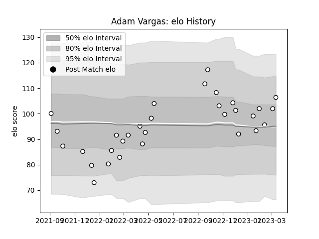

---  
layout: page  
title: Adam Vargas  
date: 2022-12-18 16:22:50.952640  
categories: player  
---
# Adam Vargas

## Positions: W

## Current elo: 104.0

## Current Percentile: 85.0

# Elo History

# Match History

| Team                       |   Appearances |   Win Rate |
|:---------------------------|--------------:|-----------:|
| Valence Romans Drome Rugby |            24 |     0.5625 |

| Opponent            |   Matches |   Win Rate |
|:--------------------|----------:|-----------:|
| Chambery            |         3 |   0.666667 |
| Nice                |         3 |   1        |
| Tarbes              |         3 |   0.666667 |
| Albi                |         2 |   0        |
| Bourgoin-Jallieu    |         2 |   0.25     |
| Dax                 |         2 |   0.5      |
| Dijon               |         2 |   0.5      |
| Massy               |         2 |   0        |
| Aubenas             |         1 |   1        |
| Carqueiranne-Hyères |         1 |   1        |
| Rennes              |         1 |   1        |
| Suresnes            |         1 |   1        |
| US Bressane         |         1 |   0        |