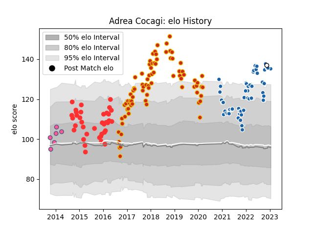

---  
layout: page  
title: Adrea Cocagi  
date: 2023-02-02 18:50:24.598321  
categories: player  
---
# Adrea Cocagi

## Positions: C, W

## Country: Fiji

## Current elo: 133.0

## Current Percentile: 97.0

# Elo History

# Match History

| Team                 |   Appearances |   Win Rate |
|:---------------------|--------------:|-----------:|
| Perpignan            |            79 |   0.56962  |
| Castres Olympique    |            53 |   0.660377 |
| Tarbes               |            37 |   0.418919 |
| Stade Francais Paris |             6 |   0.833333 |
| Fiji                 |             1 |   0        |

| Opponent             |   Matches |   Win Rate |
|:---------------------|----------:|-----------:|
| Biarritz Olympique   |        10 |   0.7      |
| Carcassonne          |         8 |   0.75     |
| Mont-de-Marsan       |         8 |   0.375    |
| Bordeaux Begles      |         7 |   0.214286 |
| Narbonne             |         7 |   0.714286 |
| Montauban            |         7 |   0.785714 |
| Colomiers            |         7 |   0.428571 |
| Albi                 |         6 |   0.333333 |
| Aurillac             |         6 |   0.333333 |
| Stade Toulousain     |         6 |   0.5      |
| Perpignan            |         6 |   0.5      |
| Montpellier Herault  |         6 |   0.666667 |
| Clermont Auvergne    |         6 |   0.5      |
| Agen                 |         5 |   0.4      |
| Pau                  |         5 |   1        |
| Lyon                 |         5 |   0.4      |
| La Rochelle          |         5 |   0.4      |
| Vannes               |         5 |   0.8      |
| Brive                |         5 |   0.6      |
| Bayonne              |         5 |   1        |
| Beziers              |         5 |   0.6      |
| Dax                  |         5 |   0.4      |
| Toulon               |         4 |   0.75     |
| Stade Francais Paris |         4 |   0.5      |
| Soyaux-Angouleme     |         4 |   0.875    |
| Grenoble             |         4 |   0.75     |
| Bourgoin-Jallieu     |         2 |   1        |
| Oyonnax              |         2 |   0.5      |
| Nevers               |         2 |   0.5      |
| Castres Olympique    |         2 |   0        |
| Cavalieri Prato      |         2 |   1        |
| Massy                |         2 |   0.5      |
| Lusitanos XV         |         2 |   1        |
| Harlequins           |         2 |   0        |
| Connacht             |         1 |   0        |
| Provence Rugby       |         1 |   0        |
| Racing 92            |         1 |   1        |
| Rouen                |         1 |   1        |
| Roval Drome XV       |         1 |   1        |
| London Irish         |         1 |   1        |
| Edinburgh            |         1 |   0        |
| Ireland              |         1 |   0        |
| Exeter Chiefs        |         1 |   0        |