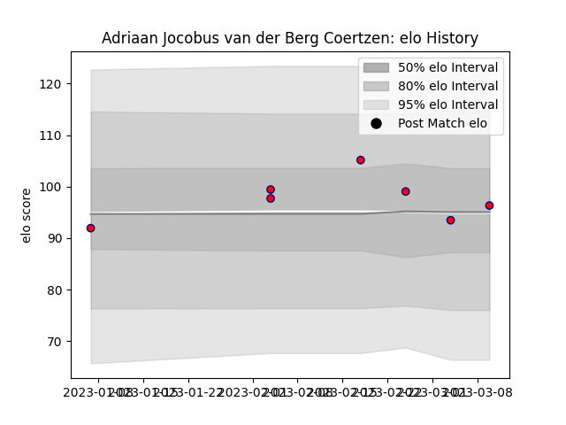

---  
layout: page  
title: Adriaan Jocobus van der Berg Coertzen  
date: 2023-03-17 17:19:44.619155  
categories: player  
---
# Adriaan Jocobus van der Berg Coertzen

## Positions: W, C

## Current elo: 96.0

## Current Percentile: 45.0

# Elo History

# Match History

| Team     |   Appearances |   Win Rate |
|:---------|--------------:|-----------:|
| Aurillac |             7 |   0.285714 |

| Opponent       |   Matches |   Win Rate |
|:---------------|----------:|-----------:|
| Nevers         |         2 |          0 |
| Grenoble       |         1 |          0 |
| Massy          |         1 |          1 |
| Mont-de-Marsan |         1 |          0 |
| Rouen          |         1 |          1 |
| Vannes         |         1 |          0 |