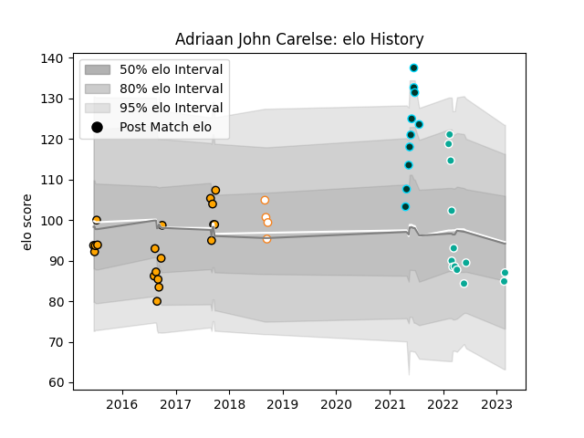

---  
layout: page  
title: Adriaan John Carelse  
date: 2023-03-02 11:24:01.558896  
categories: player  
---
# Adriaan John Carelse

## Positions: FH, FB

## Current elo: 87.0

## Current Percentile: 25.0

# Elo History

# Match History

| Team                |   Appearances |   Win Rate |
|:--------------------|--------------:|-----------:|
| Boland Cavaliers    |            19 |   0.342105 |
| Dallas Jackals      |            13 |   0        |
| Rugby ATL           |            10 |   0.6      |
| Free State Cheetahs |             4 |   0        |

| Opponent               |   Matches |   Win Rate |
|:-----------------------|----------:|-----------:|
| Utah Warriors          |         3 |   0        |
| Griquas                |         3 |   0        |
| Houston SaberCats      |         3 |   0.333333 |
| L. A. Giltinis         |         3 |   0.333333 |
| Austin Gilgronis       |         2 |   0        |
| New England Free Jacks |         2 |   0.5      |
| Valke                  |         2 |   0.5      |
| Seattle Seawolves      |         2 |   0.5      |
| SWD Eagles             |         2 |   0.75     |
| Rugby New York         |         2 |   0        |
| R.U. New York          |         2 |   0        |
| Pumas                  |         2 |   0.5      |
| Natal Sharks           |         2 |   0        |
| NOLA Gold              |         2 |   0.5      |
| Leopards               |         2 |   0        |
| Golden Lions           |         2 |   0        |
| Eastern Province Kings |         2 |   1        |
| Border Bulldogs        |         2 |   0.5      |
| Blue Bulls             |         1 |   0        |
| Griffons               |         1 |   0        |
| San Diego Legion       |         1 |   0        |
| Free State Cheetahs    |         1 |   0        |
| Toronto Arrows         |         1 |   1        |
| Western Province       |         1 |   0        |