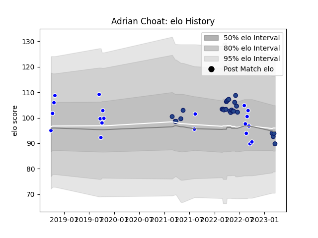

---  
layout: page  
title: Adrian Choat  
date: 2023-03-17 17:06:15.846771  
categories: player  
---
# Adrian Choat

## Positions: FL

## Current elo: 94.0

## Current Percentile: 36.0

# Elo History

# Match History

| Team     |   Appearances |   Win Rate |
|:---------|--------------:|-----------:|
| Blues    |            25 |        0.8 |
| Auckland |            20 |        0.6 |

| Opponent                 |   Matches |   Win Rate |
|:-------------------------|----------:|-----------:|
| Chiefs                   |         4 |   0.75     |
| Highlanders              |         4 |   1        |
| Tasman                   |         4 |   0.25     |
| Southland                |         3 |   1        |
| Crusaders                |         3 |   0.333333 |
| Hurricanes               |         3 |   0.666667 |
| Brumbies                 |         3 |   0.666667 |
| Canterbury               |         2 |   1        |
| Wellington               |         2 |   0.5      |
| Melbourne Rebels         |         2 |   1        |
| Moana Pasifika           |         2 |   1        |
| Taranaki                 |         2 |   1        |
| Otago                    |         2 |   0.5      |
| Bay of Plenty            |         1 |   0        |
| Waikato                  |         1 |   0        |
| New South Wales Waratahs |         1 |   1        |
| Queensland Reds          |         1 |   1        |
| Northland                |         1 |   0        |
| North Harbour            |         1 |   1        |
| Fijian Drua              |         1 |   1        |
| Counties Manukau         |         1 |   1        |
| Western Force            |         1 |   1        |