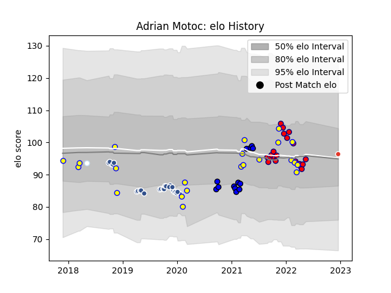

---  
layout: page  
title: Adrian Motoc  
date: 2023-02-02 19:03:08.710171  
categories: player  
---
# Adrian Motoc

## Positions: L

## Country: Romania

## Current elo: 97.0

## Current Percentile: 54.0

# Elo History

# Match History

| Team               |   Appearances |   Win Rate |
|:-------------------|--------------:|-----------:|
| Agen               |            27 |   0.222222 |
| Romania            |            22 |   0.454545 |
| Aurillac           |            20 |   0.65     |
| Massy              |            13 |   0.423077 |
| Biarritz Olympique |             4 |   0.25     |
| Racing 92          |             1 |   1        |

| Opponent                 |   Matches |   Win Rate |
|:-------------------------|----------:|-----------:|
| Agen                     |         4 |   0.5      |
| Portugal                 |         4 |   0.75     |
| Grenoble                 |         4 |   0.625    |
| Georgia                  |         4 |   0        |
| Bordeaux Begles          |         3 |   0        |
| Spain                    |         3 |   0.666667 |
| Russia                   |         3 |   0.333333 |
| Narbonne                 |         3 |   0.666667 |
| Montauban                |         3 |   0.666667 |
| Beziers                  |         3 |   0.333333 |
| Bourgoin-Jallieu         |         2 |   0.5      |
| Racing 92                |         2 |   0.25     |
| Bayonne                  |         2 |   0        |
| Pau                      |         2 |   0        |
| Aubenas                  |         2 |   1        |
| Nice                     |         2 |   0        |
| Carcassonne              |         2 |   0.5      |
| Netherlands              |         2 |   1        |
| Montpellier Herault      |         2 |   0.5      |
| Stade Francais Paris     |         2 |   0.5      |
| Stade Toulousain         |         2 |   0        |
| Lyon                     |         2 |   0.5      |
| La Rochelle              |         2 |   0        |
| Edinburgh                |         2 |   0        |
| US Bressane              |         2 |   0.5      |
| Uruguay                  |         2 |   0.5      |
| Chambery                 |         2 |   0.25     |
| Tarbes                   |         1 |   1        |
| Tonga                    |         1 |   0        |
| Argentina                |         1 |   0        |
| United States of America |         1 |   0        |
| Vannes                   |         1 |   1        |
| Rouen                    |         1 |   1        |
| Nevers                   |         1 |   1        |
| Provence Rugby           |         1 |   1        |
| Oyonnax                  |         1 |   1        |
| Belgium                  |         1 |   1        |
| Albi                     |         1 |   1        |
| Mont-de-Marsan           |         1 |   0        |
| Harlequins               |         1 |   0        |
| Benetton Treviso         |         1 |   1        |
| Dijon                    |         1 |   0        |
| Colomiers                |         1 |   0        |
| Clermont Auvergne        |         1 |   0        |
| Castres Olympique        |         1 |   0        |
| Wasps                    |         1 |   0        |