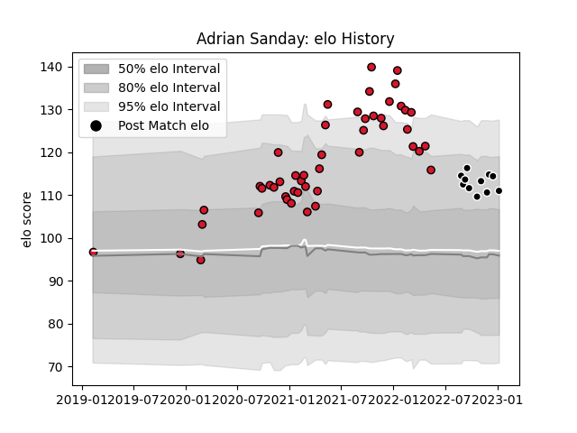

---  
layout: page  
title: Adrian Sanday  
date: 2022-12-18 16:26:51.371165  
categories: player  
---
# Adrian Sanday

## Positions: W, C

## Current elo: 104.0

## Current Percentile: 71.0

# Elo History

# Match History

| Team           |   Appearances |   Win Rate |
|:---------------|--------------:|-----------:|
| Oyonnax        |            28 |   0.553571 |
| Provence Rugby |            10 |   0.3      |

| Opponent                   |   Matches |   Win Rate |
|:---------------------------|----------:|-----------:|
| Colomiers                  |         5 |   0.1      |
| Vannes                     |         4 |   0.5      |
| Carcassonne                |         3 |   1        |
| Soyaux-Angouleme           |         3 |   1        |
| Aurillac                   |         3 |   0        |
| Mont-de-Marsan             |         3 |   0.666667 |
| Beziers                    |         2 |   1        |
| Montauban                  |         2 |   0.5      |
| Nevers                     |         2 |   0.5      |
| Perpignan                  |         2 |   0        |
| Rouen                      |         2 |   0.5      |
| Biarritz Olympique         |         1 |   0        |
| Grenoble                   |         1 |   1        |
| Massy                      |         1 |   0        |
| Narbonne                   |         1 |   1        |
| Bayonne                    |         1 |   0        |
| Valence Romans Drome Rugby |         1 |   1        |
| Agen                       |         1 |   0        |