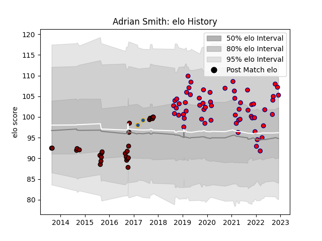

---  
layout: page  
title: Adrian Smith  
date: 2022-12-14 11:13:07.668287  
categories: player  
---
# Adrian Smith

## Positions: H

## Current elo: 108.0

## Current Percentile: 80.0

# Elo History

# Match History

| Team          |   Appearances |   Win Rate |
|:--------------|--------------:|-----------:|
| Aurillac      |            61 |   0.57377  |
| North Harbour |            28 |   0.5      |
| Highlanders   |             3 |   0.333333 |

| Opponent           |   Matches |   Win Rate |
|:-------------------|----------:|-----------:|
| Montauban          |         8 |   0.5      |
| Provence Rugby     |         6 |   0.833333 |
| Beziers            |         5 |   0.4      |
| Nevers             |         5 |   0.4      |
| Soyaux-Angouleme   |         4 |   0.75     |
| Wellington         |         4 |   0.25     |
| Vannes             |         4 |   0.75     |
| Colomiers          |         4 |   0.75     |
| Southland          |         3 |   1        |
| Carcassonne        |         3 |   0.666667 |
| Waikato            |         3 |   0.333333 |
| Bay of Plenty      |         3 |   0.333333 |
| Tasman             |         2 |   0.25     |
| Rouen              |         2 |   1        |
| Oyonnax            |         2 |   1        |
| Otago              |         2 |   0.5      |
| Northland          |         2 |   0.75     |
| Agen               |         2 |   0.5      |
| Mont-de-Marsan     |         2 |   0        |
| Massy              |         2 |   1        |
| Bayonne            |         2 |   0.5      |
| Hawke's Bay        |         2 |   0.5      |
| Biarritz Olympique |         2 |   0        |
| Grenoble           |         2 |   0        |
| Brive              |         2 |   0.5      |
| Counties Manukau   |         2 |   0.5      |
| Canterbury         |         2 |   0        |
| Auckland           |         1 |   1        |
| Taranaki           |         1 |   1        |
| US Bressane        |         1 |   1        |
| Roval Drome XV     |         1 |   0        |
| Chiefs             |         1 |   0        |
| Narbonne           |         1 |   1        |
| Crusaders          |         1 |   0        |
| Perpignan          |         1 |   0        |
| Manawatu           |         1 |   1        |
| Western Force      |         1 |   1        |