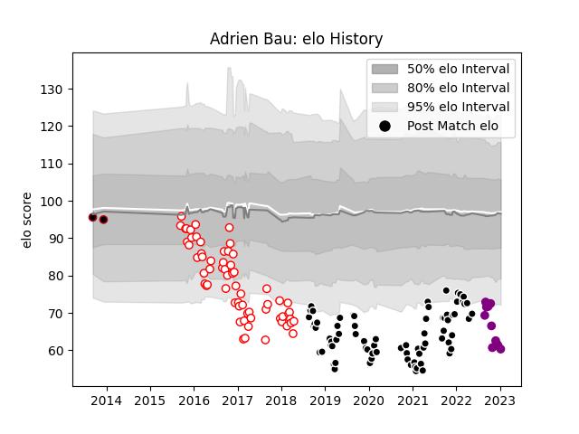

---  
layout: page  
title: Adrien Bau  
date: 2023-01-13 11:27:04.559763  
categories: player  
---
# Adrien Bau

## Positions: SH, FH

## Current elo: 60.0

## Current Percentile: 1.0

# Elo History

# Match History

| Team             |   Appearances |   Win Rate |
|:-----------------|--------------:|-----------:|
| Provence Rugby   |            76 |   0.453947 |
| Dax              |            63 |   0.365079 |
| Soyaux-Angouleme |            11 |   0.363636 |
| Lyon             |             2 |   0.5      |

| Opponent                   |   Matches |   Win Rate |
|:---------------------------|----------:|-----------:|
| Aurillac                   |        12 |   0.5      |
| Beziers                    |        11 |   0.454545 |
| Carcassonne                |        10 |   0.4      |
| Montauban                  |        10 |   0.5      |
| Colomiers                  |        10 |   0.2      |
| Nevers                     |         9 |   0.222222 |
| Mont-de-Marsan             |         8 |   0.375    |
| Narbonne                   |         8 |   0.375    |
| Vannes                     |         8 |   0.625    |
| Perpignan                  |         7 |   0.571429 |
| Biarritz Olympique         |         7 |   0.428571 |
| Grenoble                   |         7 |   0.428571 |
| Oyonnax                    |         6 |   0.333333 |
| Soyaux-Angouleme           |         5 |   0.4      |
| Bayonne                    |         5 |   0.3      |
| Rouen                      |         5 |   0.4      |
| Massy                      |         3 |   0.666667 |
| Albi                       |         3 |   0.166667 |
| Bourgoin-Jallieu           |         3 |   0.333333 |
| US Bressane                |         3 |   0.5      |
| Valence Romans Drome Rugby |         2 |   1        |
| Tarbes                     |         2 |   0        |
| Brive                      |         2 |   0.5      |
| Lyon                       |         2 |   0        |
| Agen                       |         2 |   0        |
| Roval Drome XV             |         1 |   1        |
| Provence Rugby             |         1 |   1        |