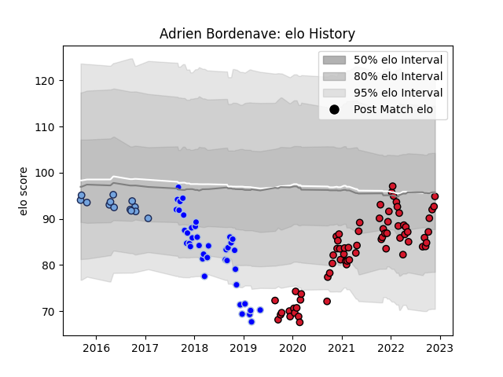

---  
layout: page  
title: Adrien Bordenave  
date: 2023-03-21 18:18:38.216391  
categories: player  
---
# Adrien Bordenave

Last updated: 2023-03-21
## Positions: P

## Current elo: 95.0

## Current Percentile: 26.0

# Elo History

# Match History

| Team      |   Appearances |   Win Rate |
|:----------|--------------:|-----------:|
| Oyonnax   |            69 |   0.666667 |
| Colomiers |            40 |   0.4125   |
| Bayonne   |            13 |   0.230769 |

| Opponent                   |   Matches |   Win Rate |
|:---------------------------|----------:|-----------:|
| Mont-de-Marsan             |        10 |   0.45     |
| Beziers                    |         9 |   0.5      |
| Aurillac                   |         8 |   0.625    |
| Carcassonne                |         7 |   0.714286 |
| Provence Rugby             |         7 |   0.642857 |
| Nevers                     |         7 |   0.571429 |
| Montauban                  |         7 |   0.285714 |
| Vannes                     |         6 |   0.666667 |
| Biarritz Olympique         |         6 |   0.333333 |
| Bayonne                    |         5 |   0.4      |
| Rouen                      |         5 |   0.4      |
| Grenoble                   |         5 |   0.8      |
| US Bressane                |         4 |   0.75     |
| Soyaux-Angouleme           |         4 |   0.75     |
| Perpignan                  |         4 |   0.25     |
| Narbonne                   |         4 |   0.875    |
| Agen                       |         3 |   1        |
| La Rochelle                |         2 |   0        |
| Gloucester Rugby           |         2 |   0        |
| Oyonnax                    |         2 |   0        |
| Dax                        |         2 |   0        |
| Colomiers                  |         2 |   0.25     |
| Brive                      |         2 |   0.5      |
| Valence Romans Drome Rugby |         2 |   1        |
| Albi                       |         1 |   1        |
| Montpellier Herault        |         1 |   0        |
| Roval Drome XV             |         1 |   1        |
| Bourgoin-Jallieu           |         1 |   1        |
| Tarbes                     |         1 |   1        |
| Bordeaux Begles            |         1 |   0        |
| Massy                      |         1 |   1        |