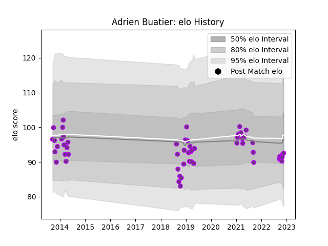

---  
layout: page  
title: Adrien Buatier  
date: 2022-11-22 11:30:43.968652  
categories: player  
---
# Adrien Buatier

## Positions: FL

## Current elo: 93.0

## Current Percentile: 35.0

# Elo History

# Match History

| Team        |   Appearances |   Win Rate |
|:------------|--------------:|-----------:|
| US Bressane |            56 |   0.553571 |

| Opponent                   |   Matches |   Win Rate |
|:---------------------------|----------:|-----------:|
| Narbonne                   |         4 |   0.25     |
| Albi                       |         3 |   0        |
| Beziers                    |         3 |   0.666667 |
| Mont-de-Marsan             |         3 |   0.333333 |
| Massy                      |         3 |   0.666667 |
| Colomiers                  |         3 |   0.333333 |
| Cognac Saint Jean d'Angély |         2 |   1        |
| Tarbes                     |         2 |   0.5      |
| Suresnes                   |         2 |   1        |
| Montauban                  |         2 |   0        |
| Dax                        |         2 |   0.5      |
| Vannes                     |         2 |   0.25     |
| Carcassonne                |         2 |   0        |
| Auch                       |         2 |   0.5      |
| Aurillac                   |         2 |   1        |
| Bourgoin-Jallieu           |         2 |   1        |
| Blagnac                    |         2 |   1        |
| Biarritz Olympique         |         2 |   0.5      |
| Chambery                   |         1 |   1        |
| Provence Rugby             |         1 |   1        |
| Soyaux-Angouleme           |         1 |   0        |
| Rouen                      |         1 |   0.5      |
| Rennes                     |         1 |   1        |
| Nevers                     |         1 |   1        |
| Oyonnax                    |         1 |   1        |
| Nice                       |         1 |   1        |
| Carqueiranne-Hyères        |         1 |   1        |
| Brive                      |         1 |   1        |
| Lyon                       |         1 |   0        |
| Aubenas                    |         1 |   1        |
| La Rochelle                |         1 |   0        |