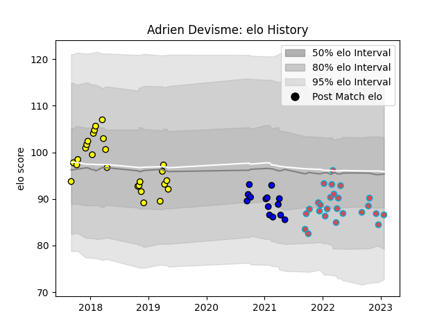

---  
layout: page  
title: Adrien Devisme  
date: 2023-01-23 15:35:09.460389  
categories: player  
---
# Adrien Devisme

## Positions: P

## Current elo: 87.0

## Current Percentile: 22.0

# Elo History

# Match History

| Team             |   Appearances |   Win Rate |
|:-----------------|--------------:|-----------:|
| Carcassonne      |            26 |   0.346154 |
| Bourgoin-Jallieu |            25 |   0.38     |
| Massy            |            14 |   0.464286 |

| Opponent                   |   Matches |   Win Rate |
|:---------------------------|----------:|-----------:|
| Nice                       |         5 |   0.4      |
| Massy                      |         5 |   0.2      |
| Tarbes                     |         4 |   0.25     |
| Soyaux-Angouleme           |         4 |   0.25     |
| Albi                       |         3 |   0        |
| Dijon                      |         3 |   0.333333 |
| Blagnac                    |         3 |   0        |
| Chambery                   |         3 |   0.166667 |
| Aubenas                    |         3 |   1        |
| Valence Romans Drome Rugby |         2 |   0.25     |
| Suresnes                   |         2 |   1        |
| Montauban                  |         2 |   0.5      |
| Mont-de-Marsan             |         2 |   0        |
| Vannes                     |         2 |   0.5      |
| Dax                        |         2 |   1        |
| Colomiers                  |         2 |   0        |
| Cognac Saint Jean d'Angély |         2 |   1        |
| Carqueiranne-Hyères        |         2 |   1        |
| Brive                      |         2 |   0.5      |
| Bourgoin-Jallieu           |         2 |   0.5      |
| Beziers                    |         2 |   0        |
| Narbonne                   |         1 |   1        |
| Nevers                     |         1 |   0        |
| Perpignan                  |         1 |   0        |
| Provence Rugby             |         1 |   1        |
| Biarritz Olympique         |         1 |   0        |
| US Bressane                |         1 |   1        |
| Aurillac                   |         1 |   0        |
| Grenoble                   |         1 |   0        |