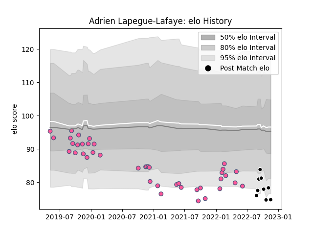

---  
layout: page  
title: Adrien Lapegue-Lafaye  
date: 2022-12-12 15:34:57.587648  
categories: player  
---
# Adrien Lapegue-Lafaye

## Positions: W, FB

## Current elo: 73.0

## Current Percentile: 2.0

# Elo History

# Match History

| Team                 |   Appearances |   Win Rate |
|:---------------------|--------------:|-----------:|
| Stade Francais Paris |            41 |   0.365854 |
| Provence Rugby       |            10 |   0.45     |

| Opponent            |   Matches |   Win Rate |
|:--------------------|----------:|-----------:|
| Toulon              |         5 |   0.6      |
| Pau                 |         4 |   0.75     |
| Bordeaux Begles     |         4 |   0.25     |
| Brive               |         4 |   0        |
| Lyon                |         4 |   0.25     |
| Bayonne             |         3 |   0.333333 |
| Racing 92           |         3 |   0.333333 |
| Agen                |         2 |   0        |
| Clermont Auvergne   |         2 |   0        |
| Montpellier Herault |         2 |   0.5      |
| La Rochelle         |         2 |   0.5      |
| Bristol Rugby       |         2 |   0        |
| Colomiers           |         1 |   0        |
| Connacht            |         1 |   1        |
| Aurillac            |         1 |   0        |
| Carcassonne         |         1 |   1        |
| Massy               |         1 |   0        |
| Mont-de-Marsan      |         1 |   1        |
| Nevers              |         1 |   0        |
| Oyonnax             |         1 |   0.5      |
| Biarritz Olympique  |         1 |   1        |
| Beziers             |         1 |   1        |
| Soyaux-Angouleme    |         1 |   1        |
| Stade Toulousain    |         1 |   1        |
| Benetton Treviso    |         1 |   0        |
| Zebre               |         1 |   0        |