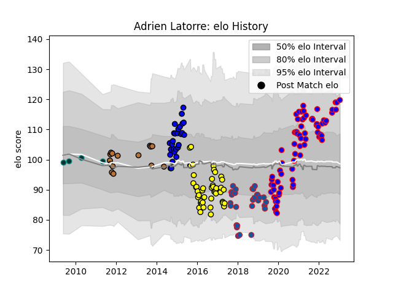

---  
layout: page  
title: Adrien Latorre  
date: 2022-11-22 11:34:53.163180  
categories: player  
---
# Adrien Latorre

## Positions: FH

## Current elo: 110.0

## Current Percentile: 84.0

# Elo History

# Match History

| Team        |   Appearances |   Win Rate |
|:------------|--------------:|-----------:|
| Beziers     |            46 |   0.358696 |
| Carcassonne |            28 |   0.482143 |
| Massy       |            27 |   0.296296 |
| Grenoble    |            22 |   0.409091 |
| Narbonne    |            10 |   0.3      |

| Opponent                   |   Matches |   Win Rate |
|:---------------------------|----------:|-----------:|
| Aurillac                   |         9 |   0.444444 |
| Agen                       |         8 |   0.1875   |
| Perpignan                  |         8 |   0.375    |
| Biarritz Olympique         |         8 |   0.375    |
| Oyonnax                    |         7 |   0.285714 |
| Provence Rugby             |         6 |   0.333333 |
| Mont-de-Marsan             |         6 |   0.5      |
| Carcassonne                |         6 |   0.5      |
| Dax                        |         6 |   0.666667 |
| Colomiers                  |         5 |   0        |
| Montauban                  |         5 |   0.2      |
| Vannes                     |         5 |   0.2      |
| Bourgoin-Jallieu           |         5 |   0.4      |
| Lyon                       |         4 |   0        |
| Narbonne                   |         4 |   0.75     |
| Soyaux-Angouleme           |         4 |   0.5      |
| Beziers                    |         4 |   0.5      |
| Rouen                      |         3 |   0.666667 |
| Grenoble                   |         3 |   0        |
| Albi                       |         3 |   0.166667 |
| Tarbes                     |         3 |   0.666667 |
| Valence Romans Drome Rugby |         2 |   0.75     |
| Stade Toulousain           |         2 |   0        |
| Roval Drome XV             |         2 |   1        |
| Pau                        |         2 |   0        |
| Bayonne                    |         2 |   0.5      |
| Castres Olympique          |         2 |   0        |
| Nevers                     |         2 |   0        |
| Montpellier Herault        |         2 |   0.5      |
| Bordeaux Begles            |         1 |   1        |
| Toulon                     |         1 |   1        |
| US Bressane                |         1 |   1        |
| Massy                      |         1 |   0        |
| Clermont Auvergne          |         1 |   0.5      |