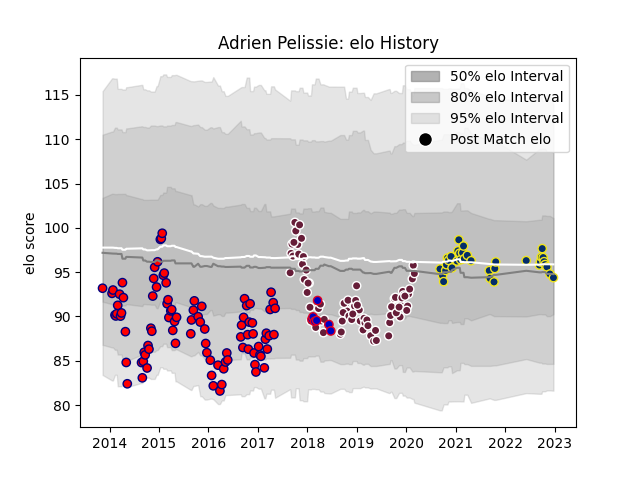

---  
layout: page  
title: Adrien Pelissie  
date: 2023-01-13 11:36:51.608635  
categories: player  
---
# Adrien Pelissie

## Positions: H

## Country: France

## Current elo: 84.0

## Current Percentile: 22.0

# Elo History

# Match History

| Team              |   Appearances |   Win Rate |
|:------------------|--------------:|-----------:|
| Aurillac          |            93 |   0.516129 |
| Bordeaux Begles   |            73 |   0.547945 |
| Clermont Auvergne |            36 |   0.583333 |
| France            |             7 |   0.285714 |

| Opponent             |   Matches |   Win Rate |
|:---------------------|----------:|-----------:|
| Agen                 |        13 |   0.692308 |
| Lyon                 |        12 |   0.5      |
| Pau                  |        10 |   0.6      |
| Perpignan            |        10 |   0.7      |
| La Rochelle          |         8 |   0.5      |
| Stade Toulousain     |         8 |   0.25     |
| Stade Francais Paris |         8 |   0.625    |
| Castres Olympique    |         8 |   0.625    |
| Mont-de-Marsan       |         7 |   0.428571 |
| Bourgoin-Jallieu     |         7 |   0.642857 |
| Carcassonne          |         7 |   0.714286 |
| Montpellier Herault  |         7 |   0.5      |
| Colomiers            |         7 |   0.428571 |
| Racing 92            |         7 |   0.285714 |
| Montauban            |         6 |   0.666667 |
| Biarritz Olympique   |         6 |   0.666667 |
| Albi                 |         6 |   0.5      |
| Clermont Auvergne    |         6 |   0.666667 |
| Tarbes               |         6 |   0.666667 |
| Narbonne             |         5 |   0.4      |
| Dax                  |         5 |   0.4      |
| Toulon               |         5 |   0.6      |
| Brive                |         5 |   0.3      |
| Beziers              |         4 |   0.75     |
| Bordeaux Begles      |         3 |   0.333333 |
| Bayonne              |         3 |   0.666667 |
| Oyonnax              |         3 |   0.333333 |
| Newcastle Falcons    |         2 |   0        |
| Vannes               |         2 |   0.5      |
| Massy                |         2 |   0.5      |
| New Zealand          |         2 |   0        |
| Edinburgh            |         2 |   0.75     |
| Dragons              |         2 |   0.5      |
| Connacht             |         2 |   0        |
| Wasps                |         2 |   1        |
| Italy                |         1 |   1        |
| Ireland              |         1 |   0        |
| Provence Rugby       |         1 |   0        |
| Grenoble             |         1 |   1        |
| Sale Sharks          |         1 |   1        |
| Scotland             |         1 |   0        |
| Soyaux-Angouleme     |         1 |   0        |
| England              |         1 |   1        |
| US Bressane          |         1 |   0        |
| Auch                 |         1 |   1        |
| Wales                |         1 |   0        |