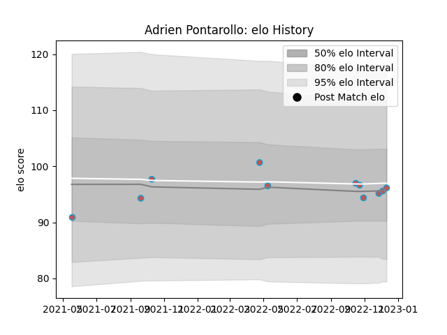

---  
layout: page  
title: Adrien Pontarollo  
date: 2022-12-14 11:28:39.053918  
categories: player  
---
# Adrien Pontarollo

## Positions: SH

## Current elo: 96.0

## Current Percentile: 44.0

# Elo History

# Match History

| Team             |   Appearances |   Win Rate |
|:-----------------|--------------:|-----------:|
| Bourgoin-Jallieu |            11 |   0.227273 |

| Opponent                   |   Matches |   Win Rate |
|:---------------------------|----------:|-----------:|
| Albi                       |         2 |        0   |
| Nice                       |         2 |        0   |
| Blagnac                    |         1 |        0   |
| Cognac Saint Jean d'Angély |         1 |        1   |
| Dijon                      |         1 |        0   |
| Rennes                     |         1 |        1   |
| Soyaux-Angouleme           |         1 |        0   |
| Tarbes                     |         1 |        0   |
| Valence Romans Drome Rugby |         1 |        0.5 |