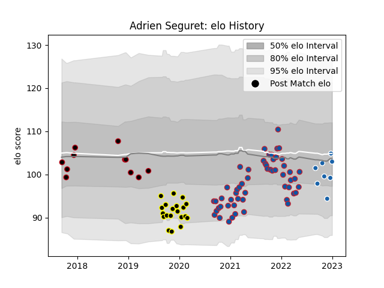

---  
layout: page  
title: Adrien Seguret  
date: 2023-01-06 00:25:09.285573  
categories: player  
---
# Adrien Seguret

## Positions: C

## Current elo: 103.0

## Current Percentile: 53.0

# Elo History

# Match History

| Team              |   Appearances |   Win Rate |
|:------------------|--------------:|-----------:|
| Grenoble          |            55 |   0.490909 |
| Mont-de-Marsan    |            20 |   0.45     |
| Lyon              |            11 |   0.272727 |
| Castres Olympique |             8 |   0.0625   |

| Opponent                   |   Matches |   Win Rate |
|:---------------------------|----------:|-----------:|
| Vannes                     |         6 |   0.333333 |
| Colomiers                  |         6 |   0.333333 |
| Aurillac                   |         6 |   0.666667 |
| Beziers                    |         6 |   0.333333 |
| Provence Rugby             |         6 |   0.333333 |
| Nevers                     |         5 |   0.7      |
| Carcassonne                |         4 |   0.5      |
| Stade Toulousain           |         4 |   0.25     |
| Oyonnax                    |         4 |   0.5      |
| Perpignan                  |         4 |   0.25     |
| Mont-de-Marsan             |         4 |   0.75     |
| Rouen                      |         3 |   0.666667 |
| Biarritz Olympique         |         3 |   0        |
| Montauban                  |         3 |   0.666667 |
| Soyaux-Angouleme           |         3 |   0.333333 |
| US Bressane                |         2 |   0.5      |
| Racing 92                  |         2 |   0.25     |
| Valence Romans Drome Rugby |         2 |   1        |
| Agen                       |         2 |   0.5      |
| Grenoble                   |         2 |   1        |
| Glasgow Warriors           |         2 |   0        |
| Cardiff Blues              |         2 |   0        |
| Bayonne                    |         2 |   0.5      |
| Narbonne                   |         2 |   0.75     |
| Pau                        |         1 |   0        |
| Lyon                       |         1 |   0        |
| La Rochelle                |         1 |   0        |
| Roval Drome XV             |         1 |   0        |
| Sale Sharks                |         1 |   1        |
| Saracens                   |         1 |   0        |
| Edinburgh                  |         1 |   0        |
| Toulon                     |         1 |   0        |
| Bordeaux Begles            |         1 |   0        |