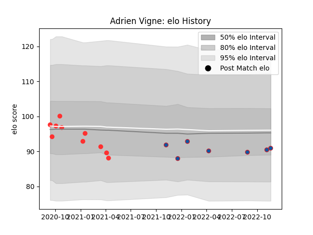

---  
layout: page  
title: Adrien Vigne  
date: 2023-03-21 18:21:51.728108  
categories: player  
---
# Adrien Vigne

Last updated: 2023-03-21
## Positions: L

## Current elo: 93.0

## Current Percentile: 48.0

# Elo History

# Match History

| Team     |   Appearances |   Win Rate |
|:---------|--------------:|-----------:|
| Grenoble |            17 |   0.617647 |
| Tarbes   |            13 |   0.461538 |

| Opponent                   |   Matches |   Win Rate |
|:---------------------------|----------:|-----------:|
| Colomiers                  |         3 |   0.333333 |
| Massy                      |         2 |   0.5      |
| Cognac Saint Jean d'Angély |         2 |   0.75     |
| Soyaux-Angouleme           |         2 |   0.5      |
| Rouen                      |         2 |   1        |
| Narbonne                   |         2 |   0        |
| Montauban                  |         2 |   0.75     |
| US Bressane                |         2 |   0.5      |
| Beziers                    |         2 |   1        |
| Chambery                   |         1 |   0        |
| Dax                        |         1 |   0        |
| Bayonne                    |         1 |   1        |
| Carcassonne                |         1 |   1        |
| Bourgoin-Jallieu           |         1 |   0        |
| Nice                       |         1 |   0.5      |
| Oyonnax                    |         1 |   0        |
| Provence Rugby             |         1 |   0        |
| Blagnac                    |         1 |   1        |
| Suresnes                   |         1 |   1        |
| Agen                       |         1 |   1        |