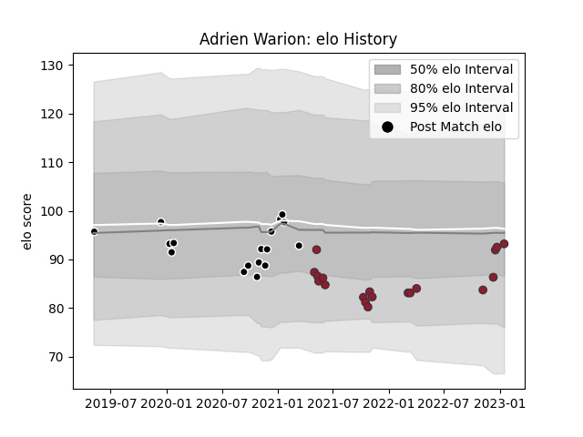

---  
layout: page  
title: Adrien Warion  
date: 2022-11-16 11:33:25.091761  
categories: player  
---
# Adrien Warion

## Positions: L

## Current elo: 93.0

## Current Percentile: None

# Elo History

# Match History

| Team           |   Appearances |   Win Rate |
|:---------------|--------------:|-----------:|
| Toulon         |            14 |   0.5      |
| Provence Rugby |             9 |   0.611111 |

| Opponent                   |   Matches |   Win Rate |
|:---------------------------|----------:|-----------:|
| Montpellier Herault        |         3 |   0        |
| Biarritz Olympique         |         3 |   0.833333 |
| Perpignan                  |         2 |   0        |
| Clermont Auvergne          |         2 |   0        |
| Agen                       |         1 |   1        |
| Valence Romans Drome Rugby |         1 |   1        |
| Stade Toulousain           |         1 |   1        |
| Racing 92                  |         1 |   0        |
| Nevers                     |         1 |   0        |
| La Rochelle                |         1 |   0        |
| Lyon                       |         1 |   1        |
| Aurillac                   |         1 |   1        |
| Carcassonne                |         1 |   1        |
| Brive                      |         1 |   1        |
| Bordeaux Begles            |         1 |   1        |
| Beziers                    |         1 |   1        |
| Vannes                     |         1 |   1        |